# Datawarehouse Architecture Types

## Chapter one: Introduction

In today's world very large amounts of varying data are generated, at high speeds, by different sources ranging from machines, setelites through social platforms like linkedin, X etc., including IoT devices, E-commerce platforms and legacy systems. They are resourcesful as they contain valuable insights that can be used to make impactful decisions, however they are difficult to store, manage, analyse and maintain because they are large and complex. These describe the term **big data**. From the stated description, *big data* has the following characteristics:

+ Volume: The amount of data generated and available for analysis is large requiring special considerations for storage.
+ Velocity: Data ages very quickly because new data is generated much more faster.
+ Variety: Data is heterogeneous in nature as they are generated from different systems often serving different purposes.
+ Value: The Data provides added value or perceived/quantifiable benefits.
+ Varacity: The data contains errors or can be faulty or noisy.

The term *Big Data* is classified in three categories, namely:

1. Structured Data:

This is data that has a *regit schema* as it is primarilly stored in relations or tables. Tables have properties like primary and foreign keys, table name, unique column names,
rows, indices etc. These properties allow structured data to be related with each other, thus optimized for querying operations with SQL. Because they are stored in relations or tables, they can conveniently be stored in Relational Database Management Systems (RDBMS) e.g PostgreSQL. Relational databases ensure data consistency when the structured data in correctly stored. A common technique used to ensure that structured data is correctly stored in relational databases is **Normalization**. In the advent of rapidly growing data (Volume), it becomes challenging to store and manage structured data in relational databases as their performance tend to be strong affected. Typical examples of structured data are financial transactions, customer/employee master data. Data stored in text and spreadsheets are also structured. 

2. Semi-Structured Data

Semi-Structured data are flexible in nature. That is, they do not have a predefined or regit schema. As a result they do not have specific properties that describe them but leverage some features that can be used to infer structural data. Because of their flexibility they are stored and managed by a group of storage systems called **NoSQL** family.This group of systems are classified as *Key-Value stores, Document stores, Column stores and Graph stores*. Each type of these type of store manage semi-structured data that exhibit some known format. Additionally, their flexibility allows them to be stored in large amounts and also makes them suitable for analysis.Their storage systems have distributive capabilities which permits *replication and/or partitioning*. This allows these systems to manage large amounts of semi-structure and unstructured data without performance loss. Examples of semi-structured data are XML, JSON, CSV files etc.

3. Unstructured Data

The last category of *Big Data* is unstructured data which completely lack every property of (semi)-strucured data. They are easilly interpretable by humans and generally heavier than structured and semi-structured data. Because they are unstructured, they are more complex to handle and require processing before they are stored. This means that they are serialized before storage. Serialized means that they are converted to bytes which does not only reduce their size but are optimal for computers to manage. During retrieval they are deserialized to their original format. In cases where data needs to be extracted from unstructured data e.g word file, there are technologies that can be used to read the content and parse them as required. Hadoop tools provide such functionalities. Unstructured data are equally stored in **NoSQL** databases and some examples of unstructured data include: Audios, Videos, Images, social media feeds, Pdf, word files etc.

A major challenge in dealing with big data is *privacy*. When analysing big data, it is very crucial to implement *data protection and security regulations* to protect sensitive data like *Personal Identifiable Information (PII) etc. This is because the integrity of users or critical business information can be damanged in case of data breaches.

### Characteristics of Data Warehouse

*By the initial definition, a data warehouse is a subject-oriented, integrated, non-volatile, time-variant collection*
*of data in support of management's decisions (Inmon, 2005, p.31).*
The four basic properties of a data warehouse are described as follows:

+ **subject-oriented (theme-focuse)**: The data stock of a DWH are organised according to the major business entities of the company. e.g By products, employees, customers, vendors, transactions, departments etc.

+ **Integrated (Unified)**: Integration of data from heterogeneous sources. The data must have a standart structure and format.

+ **Nonvolatile (Persisten)**: Once data is stored it can not be changed or deleted.

+ **Time-Variant (Historicization)**: Comparison of Data over time is possible in the DWH. Data are stored as they were 
recorded at the time of collection.

+ **Aggregated and detailed data**: Detailed data represent atomic transactions while aggregated values summaries of numerical values (e.g sales figures, number of transactions, bonus points etc.) that are meaningful when queried alongside other attributes like state, region, product category etc.

The defintion of a data warehouse has been extended over the years to include **data connection, extraction, transformation,**
**data collection, administration, analysis and representaion of data** with appropriate tools. The extension of the defination
of a **DWH** suggest that a DWH can be observed from two angles, namely: a *narrow and broad view*.

+ DWH in a narrow view implies that a DWH is solely used for **data collection**.
+ DWH in a broad view implies that a DWH can be used to **generate reports, graphs, perform spreadsheet and analytics**.

### Approaches for designing, developing and managing a DWH

#### **Corporate Information Factory**:

In this approach the DWH is designed and developed following a *top-down* workflow. The DWH is composed of a *Central data repository(core dwh)* where data is stored as related tables in *3 Normal Form (normalization)* including the *departmental data marts* that are created and supported by the core dwh. The data marts and associated OLAP cubes are physically separated from the C-DWH. It is considered a *data driven* approach because the the C-DWH is developed on the basis of the *business requirements*. Considering this, there are other *three* organizational dimensions to take into account when implementing this method. These are: *company's cultural orientation, economy viability and technological infrastructure*. See image on page 35 of the course book.

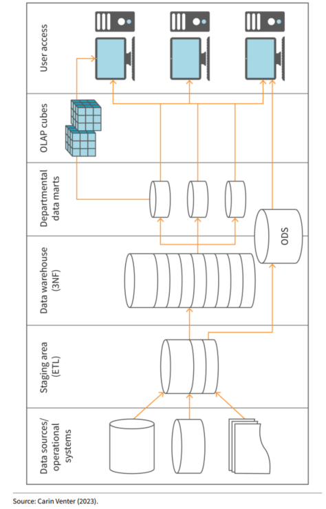

#### **Kimball Lifecycle Methodology**:

This approach follows a *buttom-up* strategy and comprise of program/project and managing activities. These activities are used to guide the *design, development, implementation and maintenance* of the DWH or BI Architecture. A dwh developed following this approach is called a *data mart bus architecture*. The data marts are not physically separated from the c-dwh. The steps included in the project are as follows:

+ Gathering business process requirements (conception phase)
+ Designing the technical architecture (conception phase)
+ Developing a data model (logical phase) 
+ Designing the physical databases (physical phase)
+ Design and implement the ETL process with the selected ETL tool(s)
+ Design and implement the BI application
+ Deploy, expand and maintain the infrastructure

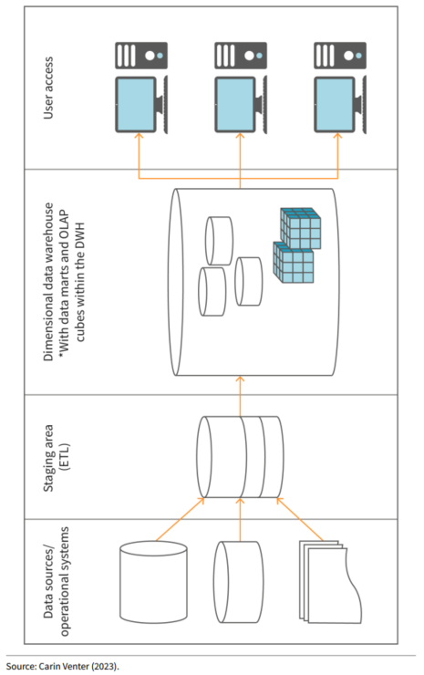

#### **Linstedt's Data Vault(DV)**

A *Data Vault* by definition is a detail oriented, historical tracking and uniquely linked set of normalized tables that support one or more functional areas of a business. A DV is a hybrid of the CIF and Kimball's approaches. It takes the advantages and the strengths of these two approaches to deal with the weaknesses that each of these approaches have. Specifically, it follows the *buttom-up* approach for designing, developing, implementing and maintaining while making use of the *top-down* approach to model the data. 
Through out the DV architecture process, metrics and metadata are collected. The DV employs a *three-tier architecture which separates the raw data from the end user and data mining layers*. This is particularly useful for metadata management e.g source and lineage metadata. A DV is made up of four components, namely:

1. Source Data: Typically from business processes
2. Staging area: Temporal storage
3. DV area: composed of Enterprise DWH (EDWH) and Business DWH(BDWH) which are physically separated from each other to allow flexibility in case of organizational changes.
4. Data marts and cubes: Data segments for departments or group of users.

+ **Advantages**
- Only allows insert operations which is faster than update or merge.
- Supports historization as previous entries are inserted instead of overwriting them.
- Supports simultaneous data upload in several tables which occurs at quickly.

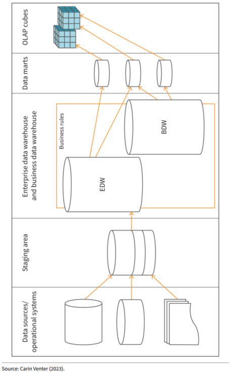

### RDBMS-Based Data Warehousing

Remember the *Atomicity, Consistency, Isolation and Durability (ACID)* principle governing relational database management systems.

#### DWH Holding Components

The components of a DWH include: Central or Core DWH, Operational Data Store (ODS), a data mart, and a staging area. In relational databases, the C-DWH and ODS comprise of a data model in normalised form. Additionally, the data in ODS contain data that is being prepared for the ETL and could also be useful for other components of the DWH. The staging area may also contain a data model. However, the data in the staging area is temporarily stored as it is processed via ETL and moved to the C-DWH. The data marts store data in denormalised form and the data they store can be used to feed multi-dimentional OLAP cubes. 

#### Relational Data Modeling

Start by developing a Entity Relationship Diagram (ERD). An ERD is a visual representation of Entities and the relationship that exist between them. It is thus an abstraction of the real world scenario that should be modelled and implemented at the level of the database. There exist several notations for representing entities and their relationships to other entities. In a ERD, details about the entities are not included. In the context of DWH modelling, Bill Inmon proporses a *three level* step for developing data designing a database model. In the first level, a ERD is designed exclusively only showing entities and their relationships to other entities. In the second level, a data model is developed by identifying all relevant details(e.g feature, cardinalities, primary/foreign keys etc) about each entity and adding these to the entities. When designing the data model, it is important to normalize the data in 3NF to eliminate every possible data storage issues that could compromise the consistency of the data. In the third level, technical details are added to model. This could be data types and contraint like referential integrity. It is important to note that, a ERD is not programming language dependent.

#### Dimensional Modeling

Revisit a *star shape schema* in the course *concepts in data management*. Key take aways are dimensional tables that store data in denormalized form and facts which are numerical values interpretable via dimensions.

Another model used for modeling multidimensional data marts is *Application Design for Analytical Processing Technologies (ADAPT). This allows data to be model in the form of an OLAP System i.e hypercubes. On a hypercube, the dimensions are represented on the Axis. The hypercube allows data to be viewed in different angles by applying various operations like Roll-up, Drill-Down, Slice and Dice. The dimension objects of a cube include:

- Member: This is the value in a dimension e.g If country (e.g Germany) is a dimension, then a dimension value is NRW in the state attribute.

- attribute: This contains information about a dimension value. E.g Information about the president of the state of NRW. The number of industries in each district in NRW would be stored as fact which is a numerical value.

- scope: This is a collection of dimension members e.g specific cordinates like (NRW, June, Sneakers)

A Multidimensional Entity Relationship Model (MERM) is used to model an OLAP cube. A cube is made up of dimensions and facts. The facts are stored in the cells of the cube. The cube is organised in a way that relatable data can be queried together and also allows data aggregation.

#### Data Vault Modeling

DVs are modelled using Visual Data Vaults which employs 3 entities, namely: *Hub entities, Link entities and Setellite entities*. 
- Hub entities: They separate business keys to identify business objects like customer number, product number, invoice number etc. Business keys are used to uniquely identify, track and locate information. When used in dwh, they are often altered i.e replaced by surrogate keys. In this context one can differentiate between *composite and smart keys*. Composite keys are a unique combination of several columns while a smart key is derived by combining different parts of a business key to form a single column. Hub entities also store metadata information.
- Link entities: They model relationships between hubs, not the objects within hubs.
- Setellite entities: Attributes that belong to Hubs and Links are stored in Setellites.

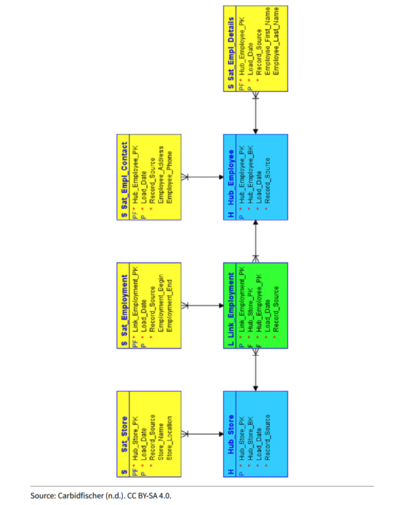

### NoSQL Data Warehousing

The individual classes of non-relational database management systems that belong to the NoSQL family is elaborated in the course *concepts of data management*. Their fundamental purpose is the ability to handle large amounts of data sets. Their advantages are centered around the following:

+ Flexible schema which is infered during read operations.
+ Distributive computing that is distributive storage and processing,. 
+ The *CAP* theorem that enables them to either be available or consistent in case of network failure.
+ Highly scalable at low cost, to manage increasing work loads(e.g increasing amounts of data, several queries) with little or no performance loss.

The Disadvantages are:

+ Does not abide to the ACID principle. Thus can lead to data inconsistencies which can harm the integrity of data. Integrity is largely about correctness.
+ Difficult to query due to the flexible schema that hinders the establishment of relationships between the data.

## Chapter two: Classification

Remember that a DWH is a central repository that stores organization's data necessary to serve different business stakeholders to enable them to fulfil their business activities and make impactful decisions. Given that there is no fix dwh architecture that fits every business scenarios, there are different dwh architecture types than, however, can be used to design and develop a dwh based on the business requirements of a company or organization. In this topic the *layer oriented and component oriented dwh architectures* will be explored.

### Layer Oriented Architectures for DWHs

Basically, there exist 3 categories of layer based architectures. These will be discussed in addition to a layer architecture with 5 layers, which is not unusual to have. The 3 categories of layer based architectures are:

1. *Single layer architecture*

In this type of architecture, *dispositive/analytical system* is not physically separated from the *operational system*. In effect, data acquired from business activities and stored in one or several operative systems is simultaneously used for analytics purposes. This architecture is a real-time system suitable for near real-time data analysis. Disadvantage is that, analytical operations may have an adverse effect on operational activies. Since the same systems are used for both operational activities and analytics, the system cannot effectively handle several concurrent data streams and may rapidly suffer from performance issues when workloads increase.

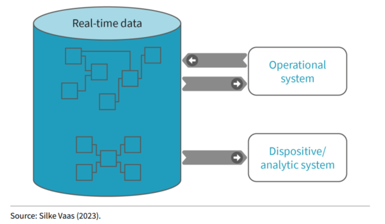

2. *Two Layer architecture*

It is complex to implement than the single layer architecture because the analytical layer is physically separated from the operational layer or source data. Additionally, the analytical layer builds on the operational layer. The data model in the analytical layer could be different from the data model in the operational layer. All analytical activities to support the functional areas of the business are done on the analytical layer. In practice, there is a staging area between the source systems and the analytical layer. A staging area is a temporal storage where data is processed/transformed before it is moved to the data warehouse or data mart. Once data is moved, the staging area is cleared for the next ETL process run. Drawback with this architecture is that it cannot effectively accomodate organizational growth and analytics in not done near real-time.

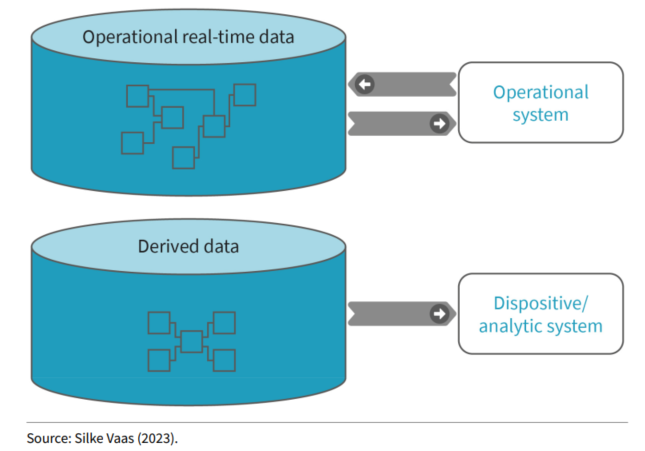

3. *Three Layer architecture*

This is a modern and widely used architectures by large companies. In this architecture, all the 3 layers are physically separated from each other. The first layer is for operational data while the second layer serves as a *reconciliation* layer that serves as a standardized enterprise wide reference model between the first layer(source systems) and the 3rd layer (Analytical system). The 3rd layer is the DWH System which contains data marts and multidimensional dwh layer. The difference between the reconciliation layer and the classical staging layer is that, has a data model and stores data permanently. Furthermore, a three layer architecture employs a 3 tier framework. 

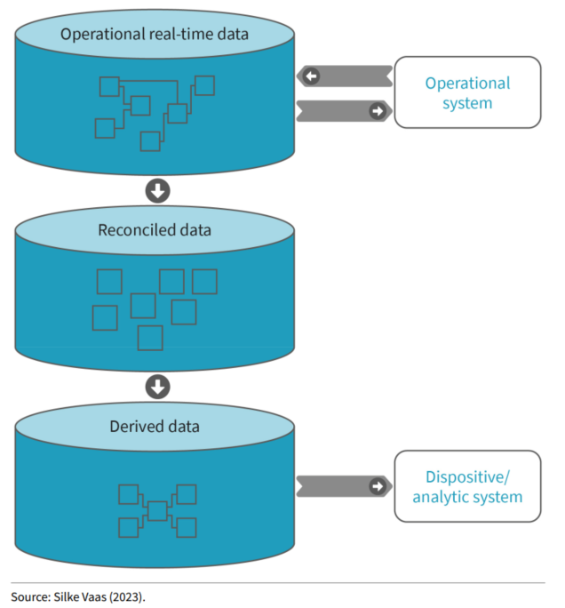

The tiers of the 3 layer architecture are described as follows: The *Bottom, Middle and Top* tiers. 

+ The Bottom Tier

This tier is made up of a relational database system and holds data that has been *cleansed, transformed and loaded* into a staging area from the reconciliatio layer. The bottom tier basically serve as storage and management purposes.
+ The Middle Tier

This tier is the DWH system. It contains data in a structure that is suitable for analytical operations like querying and building reports. Additionally, data marts and MOLAP/ROLAP cubes are equally stored in this tier. This means that operations like summarizing data, slicing and dicing to view data from different perspectives can be performed in this tier.The bottom and middle tier are collectively termed as the *presentation layer*

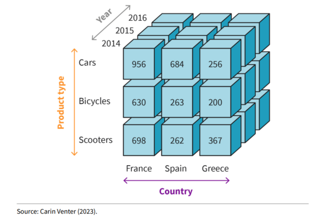

+ Top Tier
This is the front-end side of the dwh. It encompasses all the tools or applications that users leverage to interact with the dwh and access the stored data.Tools and applications include: BI apps, dashboards, reports, query tools, analytical and data mining tools.

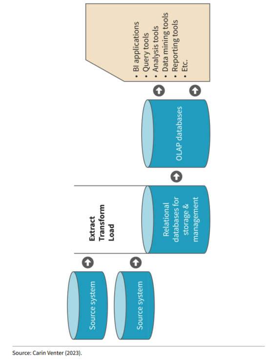

4. *Five Layer architecture**

This is a highly scalable architecture and proposed by Systems, Applications and Products (SAP). This architecture also employs an Operational Data Store (ODS), that stores data near real-time. Four layers in this architecture contain an area for data transformation and the upper layer can directly read data from all the layers beneath them. Beside this, each layer has the following functionality.

- First layer (Staging or Acquisition layer): This is the data acquisition layer that temporarily stores data in the exact form as they are in the source system(s).
- Second layer(Integration layer): It is used for data harmonization to improve data quality and data consistency.
- Third layer(Propagation layer): Stores data in granular form. That is, at the lowest transaction level possible.
- Fourth layer(Transformation layer): Data is transformed according to the needs of the business users i.e applying business rules.
- Fifth layer(Presentation layer): Stores data that is ready for analysis and reporting. It also allows real-time analysis.

### Component Oriented Architecture

As seen in chapter one, there exist three approaches for designing and developing a data warehouses. These are: The corporate information factory (CIF), Kimball Lifecycle and Data Vault. DWH architectures developed from these approaches are classified as *component oriented architectures* and are briefly described as follows:

1. *Central DWH and Independent Data Marts*

This architecture is developed following the *CIF* approach. The core dwh is built based on the organization's *business requirements*. Thus the c-dwh is also known as the Enterprise dwh. The independent data marts that are used to serve different functional units or specific user groups are built based on the data in the core dwh. The aspect of having a core dwh and independent data marts linked to it, allows this architecture to be referred as the *hub-and-spoke* design. Typically, the core dwh stores data in normalized form(3 NF) while the independent data marts can contain data in normalized, denormalized, aggregated or summarized format. The data marts in this architecture are developed iteratively.

2. *The Data Mart Bus Architecture*

This architecture is developed following the Kiball lifecycle approach. Unlike the C-DWH and independent data marts, this architecture is built bases on *business processes* taking its business process requirements into consideration. Every core business process is supplied with its own data mart. The data marts are made up of dimension and store data in (de)normalized, aggregated or summarised form. The dimension tables store descriptive features aranged in hierarchical order. The fact table contains the metrics or quantities that are being measured and the data is in the lowest granularity level defined. The features of the dimension tables are used to describe measures otherwise the measures, which are only numirical values, will be meaningless. Business processes may have shared dimensions at the level of data marts. Through this, a proper view on the entire enterprise data can be achieved.

3. *Data Vault*

It is a hybrid of CIF and data mart bus architecture. 3 NF from CIF and dimensional modeling from data mart bus architecture. Additionally, the structural information used for dwh design are kept separately from the business related contextual and descriptive information.

4. *Big Data Architecture and Data Lake*

Due to the limitations of relational databases and relational dwhs in storing, processing, and analysing large volumes of varying data, big data architectures have emerged to efficiently store, process and analyse huge volumes of semi-structured and unstructured data. To avoid complex structures like having to dispatch several layers, each with its own functionality, big data architectures typically store data in *data lakes*. Data lakes are central repositories that store data in its raw form. The data can be structured, semi-structured or unstructured. Data contained in data lakes can be processed in three stages, namely: bronz, silver or gold stage. Data in the gold stage is usually data ready for analysis and can be queried with big data analytics tools.

## Chapter three: Data Warehouse Architecture

Revisit the *layer oriented architectures for dwh* in chapter two.

## Chapter four: Data Warehouse Components

A DWH is a central repository for storing a company's historical structural data. A full-fleshed DWH is composed of Database(s), ETL process and data marts. Production databases accomplish daily operational transactions of the business. These databases collectively form what is called Online Transaction Processing Systems(OLTP), and serve as sources to the DWH. This means that the data in OLTP Systems are used to feed the DWH. However, a DWH is only fed with cleansed data ready for use by different stakeholders to complete their task and make data driven business decisions. To clean data from OLTP Systems, ETL Tools are used to implement a well thought ETL process. ETL process entails the *extraction* of data from OLTP Systems, the *transformation* iof these data in a format expected by the schema in the target DWH target system, and the *Loading* of the transformed data into the DWH target system. The data schema or model in the DWH target system is always in normalised form. To enhance data analysis, data marts are used to aggregate or summarise data according to departmental needs. The data in data marts, can normalized or denormalized, and contain metrics that are used to evaluate the performance of the business or business process. In this chapter the main components of a DWH will be presented and discussed as follows.

### *Databases*
This is electronically stored data that is collected in a logically organised form. This data can typically be directly retrieved and viewed (Andreas Meier & Michael
Kaufmann, 2019). A database is a component of a database management system which stores and manages data. Dabases are components of OLTP as well as OLAP Systems. Development database are used for development and testing while production databases are used to accomplish the daily operational transactions of the business. In OLAP systems, in this context DWHs, one or a combination of the following databases can be used. Usually databases in OLTP are physically separated from databases in OLAP.

+ Relational database management systems e.g PostgreSQL
+ Analytics databases: Store multidimensional datasets, typically inform of OLAP cubes, used for analytical purposes. e.g Greenplum, Teradata.
+ DWH Applications: Theoritically these are not storage databases as they are built from a combination of *software and hardware* to facilitate the storage and management of data. E.g SAP HANA.
+ Cloud based databases: These are databases fully hosted in the cloud. The provider is responsible for maintenance and security of the hardware while the users focus in the development of their services. E.g Azure SQL, Google Big Query, Snowflake etc.

### *ETL Process Components*
Extract-Transform-Load are the components of an ETL process. Depending on the approach used to design and implement a DWH, these components may be combined slightly differently.

+ *ETL process in CIF* 
It makes use of an Integration and Transformation layer(I&T). The I&T are a set of programs or applications used to *capture, transform and move* data from OLTP systems to the core data warehouse (C-DWH) or ODS. Since I&T is built incrementally, the programs and applications used may change over time. This makes the I&T interface unstable. Additionally, the development ofI&T depends on Metadata. In the case of inconsistencies at the level of metadata, the I&T will be impacted which can affect the development of the implementation of the ETL process.
+ *ETL in Kimball Lifecycle* 
Remember that the DWH is built from Buttom to top when using the Kimball lifecylcle approach. This means that all business requirements must be known before the DWH is implemented. This is equally important to avoid unexpected events that could potentially affect the development and usage of the DWH. ETL in kimball is made up of four components. These are: **Extracting, Cleaning & Conforming, Delivering, and Managing**. The following factors should be considered during the process of gathering requirements necessary for the development of the DWH.

    - Business needs*
    - Compliance*
    - Data Quality*
    - Security*
    - Data Integration*
    - Data latency
    - Archiving and Lineage
    - User delivery Interfaces
    - Available skills
    - Legacy Licenses

The four components of the ETL process suggested by the Kimball approach is detailly discussed as follows.

1. *Extracting Data*

Source systems (e.g RDBMS, ERS etc) form the OLTP systems and are typically physically separated from the DWH. Thus, it is imperative for DWH developers to know and understand all the data sources from which will be extracted, transformed and loaded into the DWH. In a preliminary step, data is extracted from source systems and first of all loaded or writen into the staging system. In this step, data may undergo light transformation. On a broader scope, data extraction consist of *Data Profiling, Change Data Capture (CDC) and Extraction*.

- Data Profiling: In this step, all the data sources are determine and analysed to understand the data, its consistency and structure. Then only the required data sources for the construction of the DWH are considered and further investigated.
- Change Data Capture(CDC): The DWH stores historical records without duplicates. CDC seeks to achieve this by by capturing only the *Delta*(new or altered) records between the source systems and the DWH target system. Once the Delta is determined, it is processed and written to the DWH. CDC can be implemented via several techniques. These include:
    + Audit columns: Additional columns in the source systems used to precisely *track the date and times* when a new record is entered or when an existing record is altered. Audit columns are only populated by **triggers**.
    + Time extracts: *Selecting* all records whose created date or changed date is greater than or equals to the data of the last extraction. This can be inefficient in case of system interruptions, potentially leading to loading duplicate records in the DWH.
    + full diff-compare: The current day's data is compared record-by-record with the previous snapshop to determine the delta. This approach is efficient but resource intensive.
    + Database log scraping: Snapshots of redo logs are taken at regular time intervals. The transactions in the snapshots are *scanned* to determine the records that have an impact on the tables necessary for the ETL process.
    + Message queue monitoring: Message bases transaction systems is constantly monitored to identify transactions that affect tables of interest.
- Extraction: Here is it important to consider data heterogeneity when developing the extraction process. Based on the source system some of the data could be extracted and transformed in *batches* e.g files, while for other systems, data will be extracted in streams and processed on the flight.

2. *Cleaning and Conformity*

The main aim of this step in the ETL Process is to improve the data quality when data undergoes processing before it is loaded in the DWH. Data conformity guarantees that the data should be in the format that is expected in the DWH target system. This is supported by the creation and maintenance of *metadata* throughout the DWH lifecycle. Data cleansing steps include:

- Validation and Quality Control: Data should be accurate and consistent.
- Data Aging: Outdated or Stale data should not be extracted from the source systems as it will not create value for the business. This requires filter conditions set by the business stakeholders.
- Redundant data: Redundant data is identified and only a single unique records are kept.
- Faulty data: Data that are wrongly entered or cause by system errors are identified and corrected.
- Incomplete data: Incomplete data can negatively impact the results of analysis. As such strategies for handling missing data must be set and implemented.

3. *Delivering*

Data is physically loaded into the structured target schema of the DWH. Typically, the schema is in normalised form and contain data in granular and aggregated format. The data is also ready for analysis.

4. *Managing the ETL environment*

This is composed by all processes and activities that ensures that the DWH should function reliably, consistently and produce trustworthy data for analytical purposes. Thus the DWH must:

- be maintained
- be scalable to accomodate changes in the business
- have a backup and recovery mechanism
- provide the possibility to schedule tasks
- have a monitoring system to identify failures and debug errors. Also necessary to reduce down times.

-- I left out the part of ETL tools as this is detaily handled in the course *Extract-Transform-Load Technologies*--

### Data Marts

This is the third component of the DWH. Data marts, usually in denormalized, normalised, aggregated or summarised form, contains portions of Data from the DWH which is used to support specific analytical needs of business departments(e.g marketing). Besides being denormalized, each data mart contains all relevant KPIs of the department using it. The fact table contains transactional data along side the metrics used to evaluate the business process of the department. The dimension tables contain features or contextual data. Contextual data is used to describe the metrics or KPIs in the fact tabel. Usually, the fact table is surrounded by dimension tables. These dimension tables represent different business area e.g customers, products, time. Data marts are useful as they allow data from the organization to be aggregated or summarised, and viewed from different business perspectives. It is possible that the dimensions of the same data mart is used to serve different business departments. The key advantages of a data mart are:

- Control: Each department is responsible for managing and processing data in its data mart.
- Cost: It is cost effective as every department can manage its data out of the DWH.
- Customization: Data marts are customized according to the requirements of the department using it. It allows for summarization, prunning, merging etc.

In data marts, the *primary key (pk)* of the dimension tables are inserted into the fact table as *foreign keys (fk)*. Since the fact table does not have a unique identifier of its transactions, the fk from the dimension tables are combined to form a *surrogate key* that make up the primary key of the fact table. The fact table contain all KPIs which are typically numeric data types. The fact table may also contain *degenerate keys* which uniquely identifies every business event captured by the fact table. An example of a data mart is a *star shape  or snowflake schema*.

### Bus Architecture

Kimball's buttom-up approach suggest a *bus matrix* which should be used to prioritise *business processes and entities*. Business processes are entered as rows while business entities are columns.The bus matrix also enable stakeholders to have an overview of the DWH architecture which is relevant for the design of the architecture. Business processes and entities that relate to each other get an *X* entry in matrix cells. The bus matrix is a simple alternative to the Entity Relationship Diagram (ERD), especially for non-technical stakeholders.

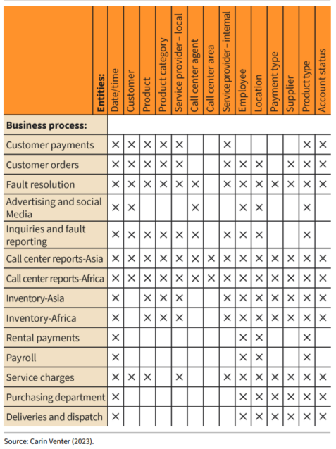

## Chapter five: Big Data Frameworks

Traditional storage solutions like relational database management systems and corresponding relational DWHs are suitable for storing and managing large structural data. However, they quickly reach their limits when handling Big Data (Volume, Variety, Velocity, Varacity and Value) due to its semi-structure and unstructure nature. For this reason, new technologies have evolve to collect, store and analyse big data. A typical example Hadoop Distributed File Systems(HDFS) from Apache Software Foundation and Data Lakes. In addition to these storage frameworks, Apache Hive which is a processing framework that allows the transformation of Big Data using SQL-like syntax will also be discussed. As oppose to Apache MapReduce that is suitable for performing summarizations on huge amounts of data, apache hive is suitable for complex transformation tasks used in machine learning scenarios. Apache Hadoop is an open source project currently being further developed by the Apache Software Foundation (ASF). The following modules are (officially) in development and management by ASF.

1. Hadoop common: All commonly shared libraries and utilities in support of Hadoop modules
2. Hadoop Distributed File System: An open source file based data storage distributed framework that utilizes replication as distribution strategy
3. Hadoop MapReduce: A distributed data processing module for large scale computing and suitable for calculating simple statistics like sum, average etc.
4. Hadoop YARN(Yet Another Resource Negotiator): A resource management framework in distributive computing that also provides the possibility to schedule workloads. For MapReduce it provides scalability and adaptability resources and provide support for managing workloads that are not MapReduce.

Other projects being managed by ASF within the scope of the Hadoop project include: **Pig, ZooKeeper,Spark, Flume, Tez, Mahout, Hive amd HBase**.

### Apache Hadoop

#### HDFS as a distributive storage framework

Replicates data on flexible block sizes of 128 MB. The name node acts as the master in a cluster of nodes. The name node consist of a hardware that contains an operating system and name node software. The master node is responsible for managing the file system, control access to the file system, monitor, redistribute and reschedule tasks in case of partial system failure. The name node has read and write capabilities. Another component of the HDFS beside the blocks and name node is the data node. The data nodes contain an operating system and data node software. They are responsible for storing and replicating data. By default every node keeps three copies of the input files but replication occurs automatically. They are also incharge of fulfiling read and write requests from users, and upon request from the name node, they can delete, resize and replicate blocks. These characteristics of HDFS makes it highly fault tolerant and maximizes throughput but not aimed are reducing latency.

#### Hadoop MapReduce

This a data distributive processing framework suitable for large-scale computing and made up of two main functions namely **Map** and **Reduce**.
- Map: 
Takes a value as inpute, performs a stateless computation and outputs results as a **key-value** pair sorted by keys.
- Reduce: 
Aggregates values according to the sorted keys. Think of MapReduce like *group by x sum y order by x* where Map takes care of order by x sum y while reduce does group by x.

**Disadvantage** of MapReduce: Not suitable for computations requiring complex processing. E.g Machine learning

**Advantage** of MapReduce: Suitable for descriptive statistics like calculating mean, standard deviation, min, max etc.

Also good for aggregations, counting.

**Advantage**: Fault tolerant.

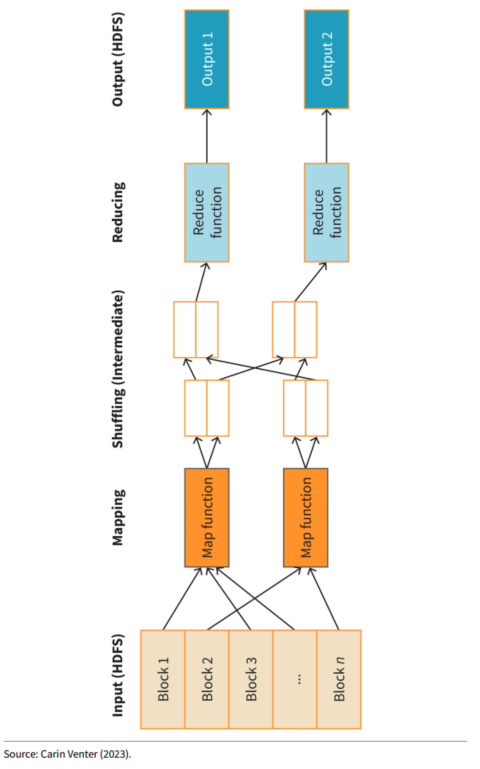

#### Hadoop YARN
The following are brief descriptions of the components of a YARN Architecture:

+ Resource manager
This is the master node that receives requests from cliens and allocates them the cluster of nodes. Also monitors the entire system to ensure load balancing and improve performance.
+ Node manager
Oversees the execution of tasks by nodes within a cluster and reports to the resource manager.
+Application manager
Cordinates the execution of tasks across multiple containers and instruct the node manager to allocate resources to the containers.
+ Containers
This is where data is being processed.

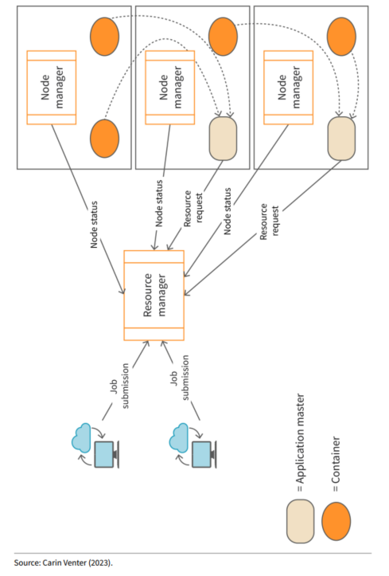

### Hive
Hive is a DWH software that supports CRUD(Create, Read, Update, Delete) operations and the management of large datasets in distributed storage environments. Apache Hive combines the power of SQL with MapReduce to perform complex transformations(e.g ETL, machine learning, reporting etc) of data that resides on distributive storage systems like HDFS, HBase. The aim of Hive is to maximize *performance, scalability, fault tolerance, extendability and loose-coupling* which are the essential factors to consider when designing a DWH. When using Hive, it is not mandatory to store data in a standard format as hive provides connectors to access data in different formats. There exist connectors for csv and tsv. The query language in Hive is HiveQL which is widely similar to SQL and contains several SQL functions. Additionally this language is extenable as it supports **User Define Functions (UDFs), User Define Tables (UDTs) and User Define Aggregate Functions (UDAFs). HCatalog and WebHCat** are the two main components in Hive and are discussed as follows:

+ **Hcatalog**: This is the data storage and data management layer in Hive. On this layer, the data stored in HDFS is presented to users in form of relational tables, which can be queried, though the tables are not related to each other. To facililate data processing like read and write operations, Hcatalog supports tools like MapReduce and Apache Pig.

+ **WebHCat**: This offers Web components to HCatalog. For instance, WebHCat provides HCatalog with a REpresentational State Transfer (REST) application programming interface(API).Through this, MapReduce, YARN, Pig or Hive jobs can be accessed or executed on the internet.

### Data Lake

Data lake is one of the *cost effective* developed and widely used solutions to overcome the limitations of RDBMS in handling Big Data. A data lake is a central repository that *stores data in its raw form*. *Thus it does not impose a rigit schema when storing data*. Most importantly is that *metadata is a major component of data lakes*. As such every data is stored alongside its metadata which has a metadata tag and a unique identifier. This is useful when a particular dataset is being queried by a *stakeholder or an application*. According to Taylor (2023b), a data lake is madeup of the following six (6) layers:

1. Data ingestion layer: Provide links to data sources from which data is loaded in its raw form. Data can be loaded in Batches, Real-time or one-time action.
2. Data Insight layer: Enables the application of data analysis techniques like machine learning, deep learning etc.
3. Data Distribution storage layer: Allows the system to be scalable which is cost effective.
4. Data Distillation layer: Allows structured data to be infered from unstructured or semi-structured data. This facilitates use by stakeholders and applications.
5. Data Processing layer: Data can be processed in parallel and in stages based on the needs of the stakeholders.
6. Data Unified Layer: Allows the system to be monitored, governed and managed. Management of data ensures data *usability, availability, security and integrity*.

Furthermore there is a difference between *data lake pond architecture and data lake zone architecture*. The following are the types of data lake ponds.
- Raw Data: Freshly ingested data in its raw form without metadata.
- Analog Data: Typically processes semi-structured data from social media and IoT applications. Data enters this pond at high speed.
- Application Data: Data from different sources that have been structured are stored in this pond. Data similar to data in relational databases or Retional DWHs.
- Textual Data: Manages unstructured and text data from big data sources.
- Archival Data: Saves data that are not actively being used but might be needed later. Data may be from *analog or textual ponds*.

The following are data lake zone architectures data have been adopted:

+ Transient loading zone: Contains raw data that are being ingested and under quality assurance.
+ Raw data zone: Deals with data from the transient zone.
+ Trusted zone: Stores standardized and clean data.
+ Discovery sandbox: Data from trusted zone ready for data specfic transformations e.g for machine learning
+ Consumption zone: Dashboard and reports displaying data in this zone to support decision making.
+ Governance zone: data governance, management and monitoring. Governance aims to implement and monitor data quality standards.

The **lambda architecture is a popular zone architecture**. This data processing framework is a combination of the batch and stream framwork. It is made up of 3 layers where
the first layer implements batch for handling complex analytical tasks, the second layer implements streaming for generating quick insight at near real time(low latency). The third layer provides an interface where the processed data can be queried with other analytical tools. Microsoft Fabric offers lambda architecture for data processing. An alternative to the lambda architecture is the kappa architecture that combines the batch and stream layers of the lambda architecture into a single layer.  This makes it easier to maintain and provides less possibilities of system attacks.

## Chapter six: Data Warehouse Architecture (DWHA) Types

A DWH Architecture describes the structure of a DWH. It provides guidelines, standards and Services that are needed to effectively link business strategic requirements with the company's systems and applications in order to achieve business objectives. To design the most suitable DWHA for an organization, business requirements, data sources, data types and formats including existing systems must be known. This architecture can also have an *operational data store(ODS)*. An ODS, contains data from transaction systems at atomic level which can be used for real-time analysis and also to feed other components(e.g data mart, OLAP CUBE) of this architecture. A poorly designed DWH will not be scalable and will not serve its purpose in the organization. The following DWHAs will be discussed: hub-and-spoke, bus data mart, centralized, distributed, federated, virtual, independent and big data.

1. **Hub-and-Spoke Architecture**

This architecture is desinged using Corporate Information Factory approach(Top-Down approach), where the Core or Central DWH based on *business requirements* is first of all implemented. The Data model in the C-DWH is usually normalized in 3 Normal Form. Because it is built on business requirements, it is complex and takes time to develope and implement. For this reason it is suitable for large companies who can also aford to disburse the budget required for the complete implementation of this architecture. After the C-DWH is implemented, then any required data mart is built on the C-DWH following an *iterative approach*. Data marts contain consolidated data, from the C-DWH most often in (de)normalized, aggregated or summarised form, to serve the business needs of a department,functional business area and specific use cases like data mining. The historical Data in the DWH are updated at continous(when specific events occur) or regular time intervals(in batches). A data mart can be modeled using dimensional modelin(e.g start schema) or an entity relationship diagram principles. Example tools to use for modeling include *Application Design for Analytical Processing Technologies(ADAPT), ERD, MERD* etc. The following is the structure of a hub-and-spoke dwh architecture:

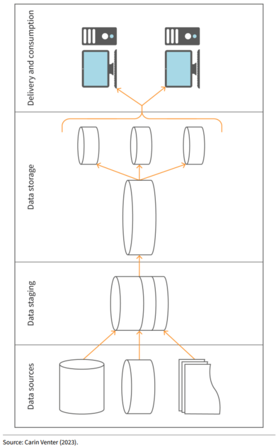

2. **Data Mart Bus Architecture**

This architecture is derived by the implementation of Kimball's lifecycle approach. It is a buttom-up approach whereby the business-process data marts are implemented incrementally and asynchronously. Also this architecture is built based on business processes as opposed to CIF that builds based on business requirements. A data mart bus matrix is used for the development of this architecture. This matrix also helps to identify business processes with shared entities i.e data marts with conformed dimensions.Also there is a document that contains descriptions of the tables in the data marts. As a result an enterprise wide cohesive view of the can be achieved. A data mart serves stakeholders belonging to a particular business process. Transaction data are inserted or updated in the data marts at regular time interval, typically during periods of low activities in the business process. On the other hand, dimension tables are updated base on business events. Slowly changing dimensions are used to update dimension tables. Specifically, *SCD Type1(overwriting), SCD Type2(historization by adding valid_from and valid_to colums) and SCD Type3(Historization by adding one column.). SCD Type3 is suitable for situations where changes are very less expected*. This architecture is fast to implement.

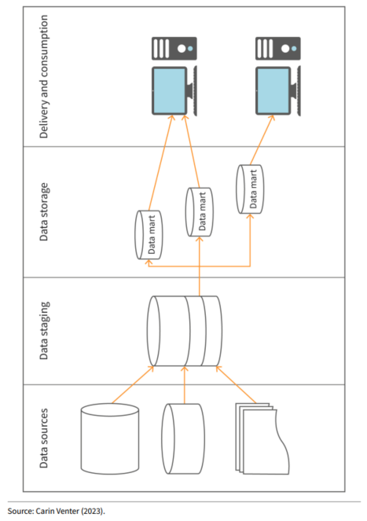

3. **Centralized DWHA**

It does not provide data marts as data from different sources are stored in a *centralized enterprise level cross functional system.* The central DWH contains a unified model considering needs of the various business units. This ensures uniformity and consistency in the data across the organization. Additionally, this architecture is efficient as the data is accessed from the central repository by all business units. It is beneficial to the company on the long term but it takes time to gather requirements from all business units to develop the central model.  

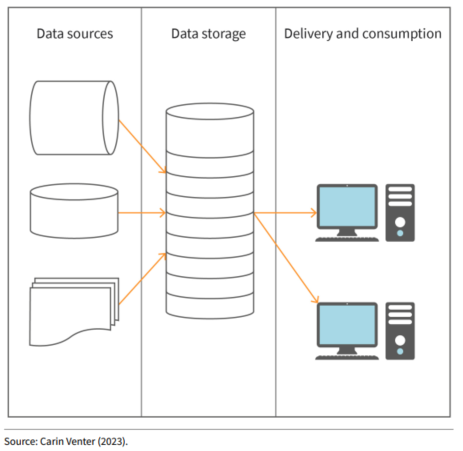

4. **Independent DWHA**

This architecture only contain individual data marts that independently draw data from its source. This means the C-DWH and/or ODS is completely absent.The individual data marts may be loosely linked, perform their operations(e.g updates etc) and analysis independently from each other. This means that the data marts operate independently from each other. This architecture is easy to develop and deploy, which creates quick gains to the company. However, its disadvantage is that it leads to data redundancy and is limited in terms of scalability.

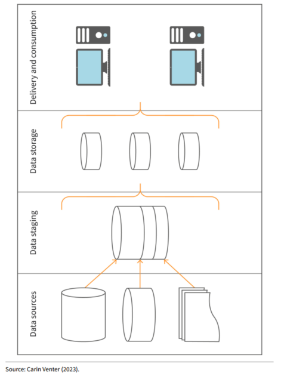

5. **Federated DWHA**

This is the creation of a virtual unique logical view or data model from a combination of data coming from different sources. Usually, data federation does not copy data into any central repository.This is to avoid dealing with the complexity of existing decision support systems as dwhs, data marts, databases, file systems etc. When a users sends a data request, the data sources in concern are accessed via the logical view and the data is retrieved, transformed and integrated on the fly before it is presented to the user.This means that the data are stored autonomousely i.e in their respective original systems with their data formats or structures.This architectures is mostly used by companies that have merged resulting in the creation of complex decision systems.

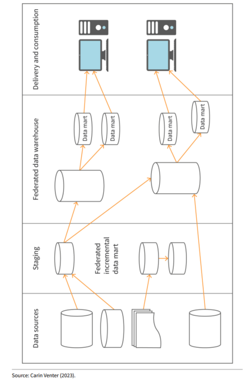

6. **Virtual DWHA**

Typically, a DWH cannot provide functionalities beyond the scope for which it is developed. As a result, DWH might not evolve to take into account changes that occur in the business. For instance, if a dwh is not developed to provide realtime data integration,then it will not be able to do so. For this cases, a Virtual DWHA is suitable as it provides real-time data integration, analytics and decision support. In data virtualization, a unified logical interface is built between source systems, databases and BI tools. A Virtual DWHA is suitable for organizations who have *standardized raw data and who do not perform complex analytics tasks*. Since companies wouldn't like to change their underlying infrastructure, they incure the cost of maintaining multiple data sources used in the development of the unified logical data interface. As such data is not not physically copied from its sources but can be queried via the unified interface. Data virtualization is done is 3 phases name:

+ Abstraction: In this phase, the logical virtual data interface that separates the data from its underlying physical store is created.
+ Virtual data access:The capability of accessing multiple data sources without physically copying the data. This is achievable via pointers on a GUI.
+ Transformation: Converting the data on the fly from one format to an agreed format that is easy to access and analyse. It is possible to implement data virtualization by data federation + use of in-memory database and API endpoints.

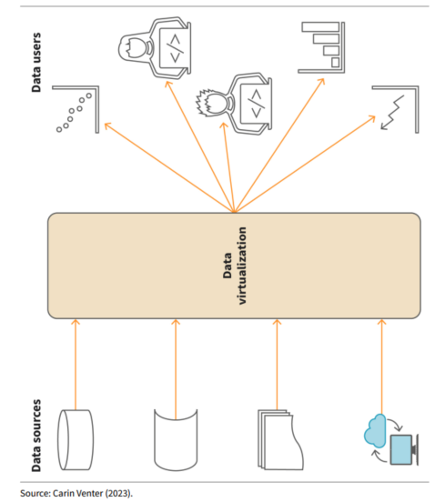

7. **Distributed DWHA**

The DWHs can reside on nodes of a cluster. However, these DWHs including their data marts can be interlinked since they are interconnected via a network. Each data mart is used to serve a particular business area or unit.The data can be stored following replication or partitioning strategies to ensure availability, reliability, reduce latency and improve performance. It is equally scalable and cost effective.

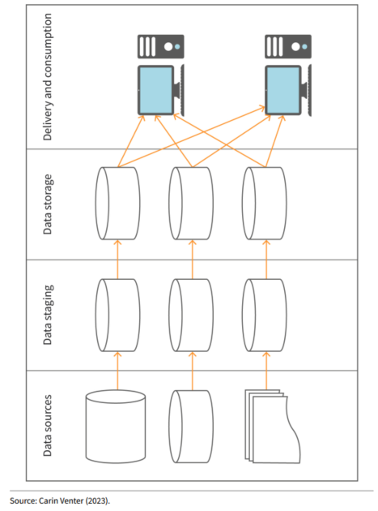

8. **Big Data DWHA**
This architecture is suitable for handling large amounts of structured, semi-structured and unstructured data. The data can be stored in distributive file storage systems like Hadoop and also processed using distributive techniques like MapReduce, Pig, Spark and Hive. Two designs can be develop and implemented following this architecture.

- Structured, Semi-structured and Unstructured Data are all stored in a distributive fileystem like Hadoop. Then the data is processed and further stored in a relational database management system(RDBM). Stakeholders and application only access the data in the RDBM for data analysis.

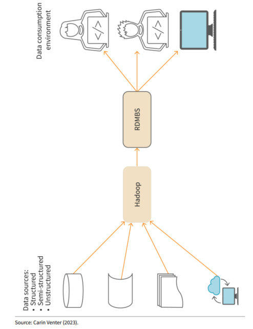

-- Structured data is stored in RDBMs while semi-structured and unstructured data is stored in Hadoop. BI tools can then be used to access data from both systems depending on their needs and choice of analysis.

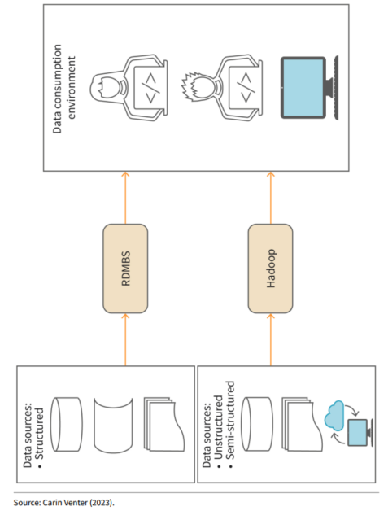

### Architecture Overview and Distribution
This is concerned with Metadata and the data distribution tools provided by chosen cloud platform providers or Hadoop in case Apache Hadoop solutions are used. Metadata covers the aspect of documenting *data elements and their usage, data sources and ETL process, including the calculation and interpretation of the Company's KPIs. Metadata is very important for the development and maintenance of a DWH. Distribution strategies details how data is distributed and managed in a DWH.

1. **Azure Distributions**
Azure Synaps is a massively parallel processing (mpp) database system made of *synaps instances* for data storage. The data is stored in spread accross 60 underlying databases called *distributors*.This ensures data availability and reliability, thus improves performance. The distribution of data in Azure is by the following strategies:

+ Round Robin: This is the default strategy when no other strategy is chosen. It distributes data sequentially and evenly accross all distributors. It provides high performance for data in the staging area especially during the ETL process.
+ Hash: A deterministic algorithm uses a hash function to determine the proportion of data to store across the databases. Provides good query performance for large tables requiring joins and/or aggregations.
+ Replicated tables: Copies of datasets on a synaps instance is duplicated and cached. This method is suitable for small datasets only.

2. **Hadoop Distribution**
When a company decides to use hadoop, it means the company will have to deal with the distribution tools provided by hadoop as well as be responsible for setting up their entire infrastructure since other tools in the hadoop software package will also be used. *Cloudera CDH and Hortonsworks HDP* are two distributions that use open-source hadoop components. As earlier mentioned, many companies are now integrating Big Data DWHAs with Data Vault 2.0 due to its flexibility and scalability.

+ Cloudera CDH: This distribution provides both free, open-source and proprietary software that can be used in combination with hadoop components. For instance, *Cloudera Manager* is used to manage the suit of products, *Impala* provides an interface for processing SQL queries quickly while *Cloudera Search* provides real-time access to products.
+ Hourtonsworks HDP: This distribution is fully open-source. It provides *Ambari* for managing software suites, *Stinger* for handling queries and *Apache Solr* for searching data.However, it partners with Vendors like Teradata to provision DWH capability via propriety software. 

The following is the DWHA of Big Data + Data Vault 2.0.

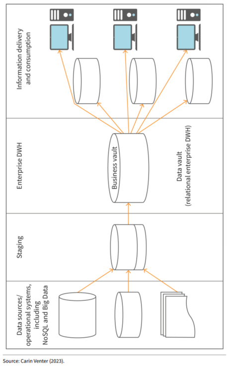

## Chapter seven: Application-Specific Data Warehouses (DWHS)

The efficient functioning of a DWH is non-negotiable to the organization as it serves as a single source of truth for decision making. To overcome latency and shortcomings of relational DWHS, *real-time, closed-loops and active functionalities* can be integrated into the DWH.

1. Real-Time DWH: It strongly reduces latency, to less than a minute, from the moments an event occurs in OLTP systems to the time the data is made available in the DWH. Events are tracked by triggers. Advantages iof Real-Time functionalities include:
+ reduced latency
+ improved data quality and security due to few updates and data reconciliations
+ cost efficient due to automation possibilities
+ Reduced instances of manual errors

2. Closed-Loop DWH: Similar to real-time functionality and in addition, changes made in DWH are also writen in the corresponding OLTP system. Have the advantages of the real-time functionalities plus bidirectional flow of data between OLTP and OLAP can relect the current state of the business. However, drawbacks include:
+ Aggregated or summarized values may not find corresponding tables or location in oltp systems to perform the updates.
+ Operational and Analytical activities serve different purposes in a company. As such integrating data from dwh into operational systems may have a adverse effect.

3. Active: Captures transaction details as they occur and integrates them into the DWH near real-time. As such it is logically consistent data store that provides detail in a single up-to-date view required for strategic, tactical and event-driven decision-making. It supports automated routine task from DWH to OLTP systems. Hence data refreshes can be done in batches or cycles. Tactical queries are short to enable quick actions or decision making in time sensitive environments. Active DWH provide the following functionalities:

- Active Load: Allows data to be loaded continuously in a non-disruptive manner while other workloads continue processing.
- Active Access: Supports fast and consistent tactical queries, providing recurring decision support information for operational business processes.
- Active Events: Automatically detects business events and applies business rules to update current and historical data; operational actions can be triggered automatically or presented to users for manual decision-making.
- Active Workload Management: Ensures that the system efficiently uses its resources to manage workloads near real-time.
- Active Enterprise Integration: Simplifies coordination of applications and business processes across the enterprise.
- Active Availability: Assesses enterprise-wide downtime impacts and identifies application-specific requirements for availability, recoverability, and performance.

### Practical use cases of DWHs
Use cases include: 
- Tactical reporting
- Integration with big data
- Natural language processing
- Auditing and Compliance
- Data mining Analytics
