# **Motivation and Introduction of Business Intelligence**

Business Intelligence (BI) is the process used to infer information from Company data to enable managers
to make data driven decisions and to optimize business activities. The techniques, procedures and models,
analysis and information distribution of data will be discussed in this module. At the end of this course,
one shoud be able to independently design and prototype business intelligence applications based on specific
given requirements of a business situation or use case.

### What does the term Business Intelligence (BI) mean

With the ever growing need to globalise and dynamise markets, company managers strive to establish competitive 
advantage by leveraging information extracted from their data to position themselves strategically. BI plays
a vital role as it seeks to **integrate** *strategies, processes and technologies* to generate critical knowledge
about the current state of affairs from the different departments of the company. Integration is done at the 
level of **decision support systems** which present acquired knowledge in such a way that it can be used directly
for ***analysis, planning and control*** purposes. A key component that drives business intelligence is the term
**data warehouse**. This terminology is complex as it is often interpreted or understood based on the context
within which it is used. As we go through the historical development of business intelligence, we'll explore 
**data warehouse** within the context of business intelligence.

#### Motivation and Historical Development of the Field Business Intelligence

Business intelligence has seen its birth through the creation of *information systems* that date back to the **60s**.

1. **Management Information Systems (MIS)**

>The MIS was created in the late 90s with the aim to serve company managers with the information they need to make
>decisions. However, these Systems were strongly constraint by the technological infrastructure of that time. As a
>result Time, content and presentation of information needed to be optimized as a secondary factor.

2. **Decision Support Systems (DSS)**

>The DSS was created in the mid 70s and with its introduction the MIS was largely replaced. This was due to technical
>development in hardware which allowed DDS to bring forth the act of storing data in a structural manner for decision
>making. Additionally, the DSS introduced Models and Methods as well as scenarios that made it possible to analyse data
>for some departments in the company. However, the DSS did not meet its high expections as Companies Managers did not
>trust computers to be able to make correct business decisions with changing business conditions.


3. **Executive Information System (EIS)**

>The EIS was created in the mid 80s as it became possible to own personal computers, the EIS was introduce specifically
>for the upper management an those in controling positions. With this system it was possible to serve these group of 
>people with up to date data in the form of multidimensional cube. With the previous systems, this was not possible. 
>However, with the presence of Personal PCs, the EIS could only be used within single department which made it also
>expensive in the event of changes or updates. The EIS eventually suffered the same faith as the DSS.

4. **Data Warehouse (DWH)**

>With the globalisation of markets in the early 90s, companies started decentralising their systems of operation. As a
>result managers started facing the challenge of making decisions from heterogenous data, sometimes inconsistent,and often 
>arising from different sources. These forced company managers to be information dependent and as such they became obliged
>to trust informations systems which they were initially skeptical towards. This is when information systems made a breakthrough
>in the business environment. As the amount of data even grew the need for making decentralised decisions i.e decision made at
>different locations or sites not neccessarilly from a central location became more petinent. In order to handle large amounts
>of heterogenous data arising from inconsistent and non-compartible systems, and effectively make decisions the need to create
>a new system became inevitable. As such a centralised database was developed to bring together data from different sources or
>systems throughout the company. Thus the birth of the term data warehouse.

#### Business Intelligence as a Framework
Nowadays several companies are faced with increasing amount of heterogeneous data from different systems. This challenge can
be handled with data warehouses. However, another significant challenge is that the right information is often not delivered
in the right quantity, at the right place, and at the right time to enable effective decision making by company managers. To
address this issue, business intelligence is the right solution. This impliese that Business intelligence can leverage the
power of data warehouse to ensure that information is retrieved and delivered at the right place at the right time to enhance
decison making.

##### Definations and Features of a DWH and BI
*By the initial definition, a data warehouse is a subject-oriented, integrated, non-volatile, time-variant collection*
*of data in support of management's decisions (Inmon, 2005, p.31).*
The four basic properties of a data warehouse are described as follows:

+ **subject-oriented (theme-focuse)**: The data stock of a DWH are selected and organised according to profession or business 
criteria.

+ **Integrated (Unified)**: Integration of data from heterogeneous sources. The data must have a standart structure and format

+ **Nonvolatile (Persisten)**: Once data is stored it can not be changed or deleted.

+ **Time-Variant (Historicization)**: Comparison of Data over time is possible in the DWH. Data are stored as they were 
recorded at the time of collection.

The defintion of a data warehouse has been extended over the years to include **data connection, extraction, transformation,**
**data collection, administration, analysis and representaion of data** with appropriate tools. The extension of the defination
of a **DWH** suggest that a DWH can be observed from two angles, namely: a *narrow and broad view*.

+ DWH in a narrow view implies that a DWH is solely used for **data collection**.
+ DWH in a broad view implies that a DWH can be used to **generate reports, graphs, perform spreadsheet and analytics**.

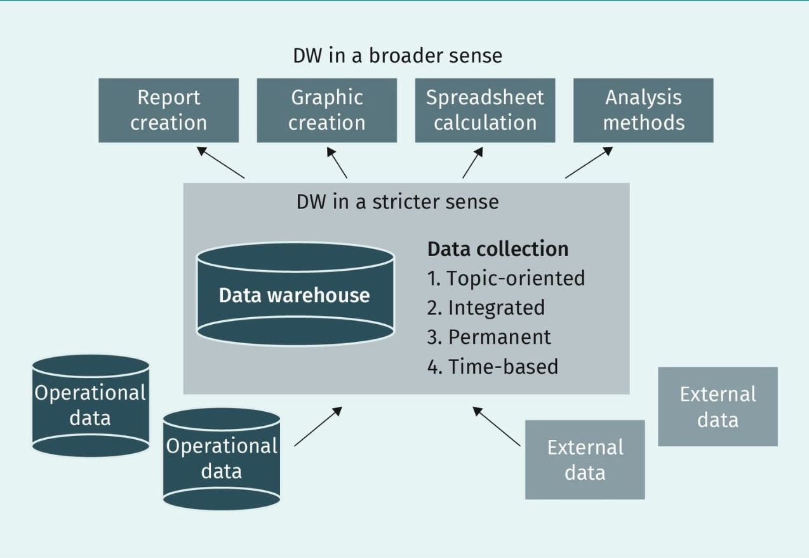

```
Since data collection and aggregation alone does not provide analysis of the data, business intelligence is thus the process
of transforming data into information and, through discovery, into knowledge (Muksch & Behme, 1996, p.37).
```

Business Intelligence can be classified in 3 orientations, namely: narrow, analysis and broad.

+ BI in a narrow orientation or sense refers to core applications that support decision-making without the need for additional
methods or models. Examples of these applications include **Online Analytical Processing (OLAP), MIS and EIS**.
+ BI in a analysis sense refers to applications that company managers can use to analyze data directly on the 
system. Typically these applications have a user interface, and provide methods and models that can be used for analysis. 
Examples of these applications include OLAP, MIS & EIS, text mining, data mining and ad hoc reporting.
+ BI in a broad sense covers all applications that are used directly or indirectly in making decisions. These include
**presentation functions as well as data preparation and storage (Gluchowski et al., 2008;Kemper et al., 2010)**.

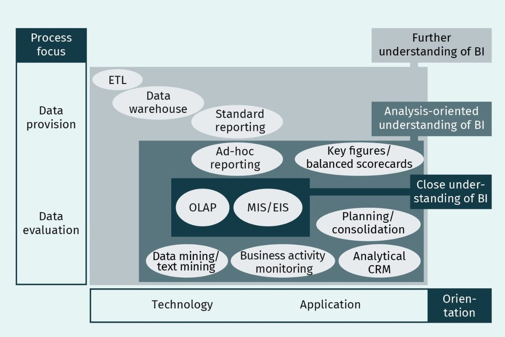

# **Data Provisioning**

In order to leverage powerful BI tools to analyse data for decision making, a basic requirement that must be
fulfilled to ensure that the data is consistent is **data preparation and storage**.

### Operational and Dispostive Systems

According to Modern business studies, a firm's activities are categorized in **operational or dispositive**.
**Operational activies include the provision of goods and services, utilization of goods and services**,
and the *performance of financial tasks* that are not of a planning nature. On the other hand, dispositive
activities are related to the *management and control of operational processes*. A key property of *operational*
*Systems* for the implementation of operational activities is that **they capture and record data** where as
*Dispotive Systems* only **analyse data**.

#### Operational Systems

As mentioned above operational systems are used to capture and record data. Addtionally, they are use to manage
the information needed for the daily operations of a firm, e.g., customer database or employee directory. The
data in these systems can regularly be changed, updated, deleted and freequently queried.This is to ensure that
Data in these systems are always up to date. Models used to set up these systems must be optimized for a high
number of transactions or queries,especially during business hours. since these systems usually have a high 
number of users. Most queries on these systems are read requests. The processsing method for these systems is 
**online transactional processing (OLTP)**.

#### Dispositve Systems

These Systems use data from operational Systems and are highly optimized for complex queries.Typically they
don't store data and queried by few individual experts in the organisation who seek to address complex issues,
e.g., aggregate data by regions of a country to find the sum of sales of sneakers in a given period of time.This
information could be used to design marketing campaignes. A **DWH** falls under dispositive systems and the
processing method used by these systems is **online analytical processing (OLAP)**. Due to the difference in
the objectives that both the operational system (OLPT) and dispositive system (OLAP) seek to address, in
practice they are also **physically separated from each other**.

### Data Warehouse Concept

In practice companies build their DWH with regards to the requirements they have. To avoid developing DWH from
scratch there are some *architechtures* which companies pick from and customise according to their needs. 
Typically, DWH can include different process phases, architectures and BI Components.

#### Process Phase and Reference Architecture

A process phase refer to the **stages through which data passes** while a reference architecture refers to the
**template that can be used to design the collection and storage** of data using a DWH. In literature one can
find numerous suggestions of process phases and reference architectures. Examples of process phases include:

+ data provision
  - In this step, data from heterogeneous source systems e.g., CRM,ERP, SCM, Transaction Processing systems (TPS) 
  e.g Point of Sales Systems (POS) and Order Processing Systems, or external source are merged into the DWH.
+ information generation, storage, and distribution
  - In this step stored data is analysed using OLAP and data mining tools.
+ information access(Kemper et al., 2010)
  - Insights gained from analysis is communicated in the form of recommendations or actions.

The following BI reference architecture is suggested by Gansor et al. (2010),p.56

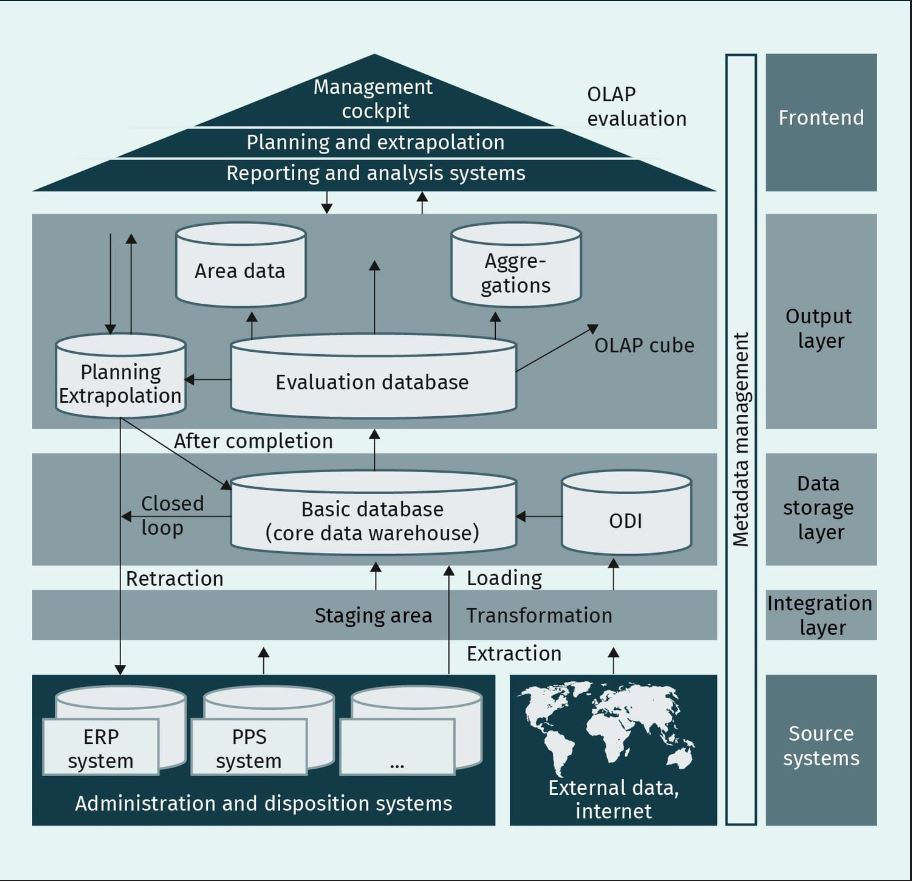

The components of this reference architecture are explained as follow:

+ **Source systems**:
  - Data from heterogeneous sources both internal(e.g ERP) and external(websites) sources are imported in their 
  respective formats or structures. This data can be in form of text, numbers etc. and could be structured, 
  semi-structured or unstructured.
+ **Staging area**:
  - Area where data is storage temporally. The is important as it can relieve downstream systems when processing
  large amounts of data (Inmon, 2005). Storage is typically done in a database.
+ **Operational data store (ODS)**:
  - Data stored at a preliminary stage for supplying data for conventional DWH approaches. Data in this store is
  usually **not** aggregated nor does it contain historical data for longer periods.
+ **Basic database (core data warehouse)**:
  - This is the central database with the DWH. After the initial transformation, data is made available for various
  evaluation purposes or for downstream systems.
+ **Evaluation database (data mart)**
  - From a technical point of view, these databases are usually based on relational databases and store data with
  the help of a multidimensional model. This makes it possible to divide data with regards to analysis requirements
  or organizational units (Bauer & Günzel, 2008).
+ **Extracting, Transforming, and Loading (ETL) process**:
This is the process of integrating data from different source systems with ETL Tools into the DWH.
  - Extract: Extracting and converting data according to the company's requirements.
  - Transforamtion: Possibly changing the structure and content of the data into the unified agreed format. It is
  possible to check the state of the data to improve its quality if neccessary.
  - Loading: Transfer the data into the central database in the target schema. (Bauer& Günzel, 2008).
+ **Aggregation**:
  - Reducing the amount of data by summarising the data to lower *granularity* as agreed.
+ **Front end**:
  - These are data mining and OLAP tools used to analyse data to infer information. These tools vary in complexity
  according to their applications. It is in the analysis phase that some unknown relationship within the data
  can be uncovered. 

### **Architecture Variants or Types**

In practice there are several architecture types. They stem from the area of data management and others from the
field of Business intelligence. These architectures can be used as templates to be customized to meet up the 
requirements that a company has. Some of these architectures are listed and explained as follows:

+ **Independent Data Marts**:
They are created as a result of every department in a company building their DWHs independently from each other.
The underlying data sources are often the same. This architecture makes it easy for every department to make their
decisions easilly and faster as aquiring results from calculations and analysis occurs within a short time frame.
It reduces the complexity of working with a central DWH but then creating a central DWH from independent data
marts is quite challenging (Kemper et al., 2010).

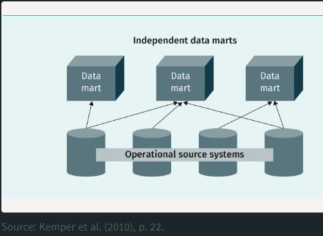

+ **Data Marts with Coordinated Data Models**:
Conceptually coordinated data models ensure the consistency and integrity of the dispositive data model. Thus
making it easier, as compared to the independent data marts, to build a central or company-wide DWH
(Kemper et al., 2021).

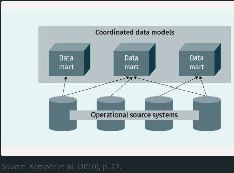

+ **Central C-DWH (No Data Marts)**:
This BI Solution is recommended for situations where the number of users and the volume of data is small but
there is interest in having a company-wide DWH.

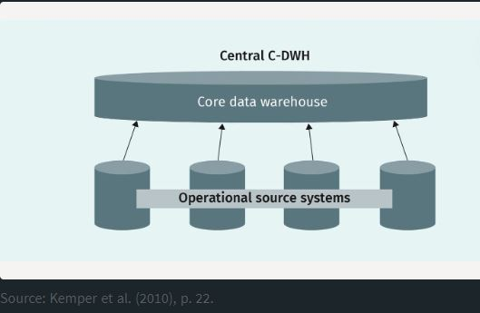

+ **Multiple C-DWHs**:
If it is determined from the company's requirements that there are different products or market structures, then
it is recommendable to set up several core DWHs.

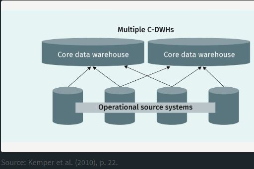

+ **C-DWH and Dependent Data Marts**:
This is the most presented architecture in literature and it is built by extending the core data DWH with one or
more data marts. The data marts are fed with data and transformation processes from the core data warehouse. In 
this architecture, the department-specific data is extracted from the C-DWH.

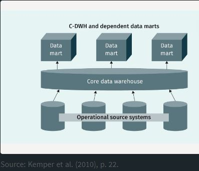

+ **DWH Architecture Mix**:
This is a common architecture in practice and it consists of *C-DWHs, dependent and independent data marts*.
It also provides the possibility to have direct access to the data i.e virtual DWH with its own data transformation.

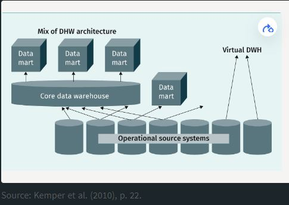

# Data Warehouse
In practice, business intelligence applications require data to be *arranged* according to **topics** i.e theme focused.
The organised data is usually **aggregated** according to *business management perspective*. To achieve this, **ETL**
Tools are used to **integrate** the *provisioned data (data storage and data management)* from different operational Systems. 
The aggregated data is persistently stored in a timely manner according to specific-topics e.g customer, product, or 
organizational unit. Thus, the need of a **DWH**.

The ETL-Tools are used to design and implement an **ETL** Process for Extracting, transforming and storing operational
data from heterogeneous source systems into a DWH, so that it can be used for further analysis. This transformation process 
prepares data for analysis in *four sub-processes* namely: **Filtering, Harmonisation, Aggregation and Enrichment**. 

### ETL Process
In order to integrate data from different operational systems so as to be able to infer relevant information that 
business managers can use to steer the business or strive to achieve business goals, an ETL Process must be implemented.
The development of an ETL-Process is the most challenging task in data integration, as it solely rely on the nature of
the operational Systems from which data should be extracted. Once such a process has been designed, its implementation
can be done programmatically or with a set of available tools. Kimball & Caserta, 2004 recommend the use of available
ETL Tools because of the complex nature of ETL Processes.
The following is an illustration of the ETL Process

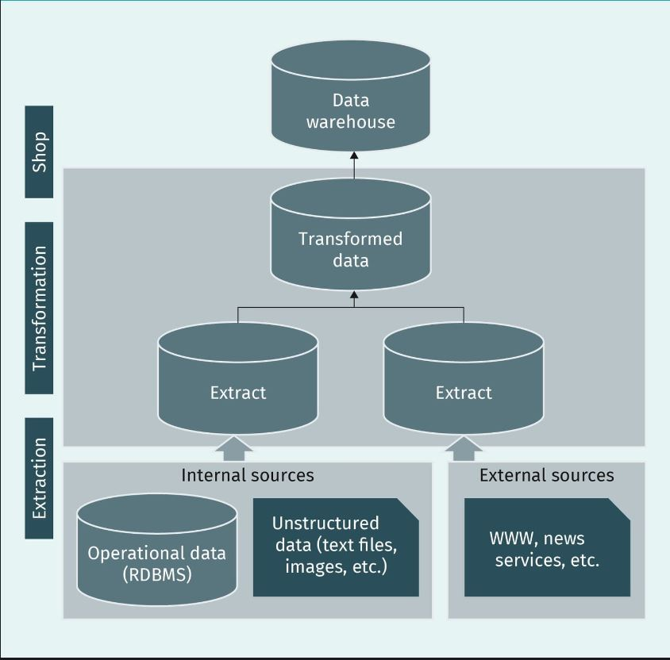

#### Components of the Transformation Process
This step of the ETL-Process consist of four sub-processes whiche are: **Filtering, Harmonisation, Aggregation and**
**Enriching**. As a result of this, it is the most elaborate and complex part of the ETL-Process.

+ **Filtering**

This step of the transformation process aims at *extracting and removing syntactic(technical) and semantic(content)*
defects from the data before it is moved to the DWH. The process occurs in two steps; **extraction and Cleansing**.
In the extraction step, data from operational systems e.g., ERP-Systms, and external sources e.g., *Website for*
*exchange rates* are stored in the staging area. The staging area is a special temporal storage for source data in the
form, format or structure in which it comes. In the cleansing step, technical defects e.g., numeric values in a date field
and content defects e.g., inaccurate sales values are handled. Defects that are automatically detected and fixed during extraction are first class defects, while those that are automatically detected but manually fix after extraction are second class errors. Other errors are only manually determined and fixed. Those are third class errors. Once the filtering process
is completed, of course with regards to the business objectives, the *filtered data is ingested in the data warehouse*.
+ **Harmonization**

Harmonization in other words is **normalization** of *filtered data*. In this step, the data, most often from different
source systems is reconcilled or unified into an agreed format. For instance, data from the sales department recording
sneaker sizes as **S, M or L** where the procurement department be recording these entries as **Small, Medium,**
**Large**. These data can be reconcilled by agreeing to store the entries as **S, M or L**. This means that in the
harmonization or normalization step, the data entries from the procurement department will be transformed to **S, L or M**.
When this transformation is done, then the data from these two departments can be consolidated or merged into one before
storage in DWH. Currency conversions can also be done in this step(Kimball & Caserta, 20024).
  - Syntactic harmonization: When data from different source systems is being merged together, it is a common practice
    to assign or create primary key for the merged data. This is often done through a map table, that contains this
    primary key, and the primary keys of the individual tables from the various sources. This primary key is referred to
    as a global key and is used in the basic database, DWH and data mart. Some ETL Tools can help generate this key
    during data transformation. The term used for this key is **surrogate keys**.
  - Semantic harmonization: This is to ensure that business terms have the same meaning and well understood by those
    who will be using them.
+ **Aggregation**

In this step of the transformation process, *harmonized and filtered data* is summarised or condensed into an agreed
granularity or hierarchical level. In this phase, functions that are required to calculate key business figures are
prepared for later use. It is also in this step where dimensions that will be used for analysing the data is set.
+ **Enrichment**

This is the final step in the transformation process. It is in this phase that **key business figures** are actually
created or calculated and stored.
>The bulk of the work in the ETL process lies in the Extraction and Transformation steps. Specifically the Sub-Processes
>of the transformation process are the key components of the ETL Process. Once the data has been enriched; the data
>is **written** in the target system. This occurs in the last step of the ETL Process which is *Loading*.

### DWH and Data-Mart Concepts
In a narrower sense, the functions of a data warehouse includes data storage. To leverage this functionality, the
components of a data warehouse play very important roles. These components include:**staging area, basic database or**
**C-DWH, data mart, ODS, and metadata**. 

+ **Staging area**
This is a working area where data is extracted to, transformed before it is loaded into the data warehouse. This acts
as a relieve area for downstream systems, particular when working with large amounts of data that require alot
of cleansing and harmonization. Typically, data is loaded into this area periodically and later on discarded once
the data has been transformed and loaded into the data warehouse. Thus, it is a **temporal store** for raw data.
(Inmon,2005).
+ **C-DWH**
Located between the staging area and the avaluation database is the basic database. This database is particular in
its function in the sense that the transformed data it receives from the staging area is stored by topic, historically,
consistent, permanently,by dimenssion and in a normalized form. This is why modelling is a very important aspect of setting-up
a DWH. The data in the C-DWH is then served to the evaluation database for calculating key business figures or metrics.
Depending on the business goals, data are also historicized, that is, they are kept track of over time(Bauer & Günzel,2008).
+ **Data Mart**

Data marts or *evaluation databases* are sections of the C-DWH that are served with specific data from the C-DWH for a 
particular department or users with specific responsibilities within the firm. For instance the marketing department is
often more interested in *payback points* of customers to use this information for developing marketing campaigns. These
databases are useful in situations of complex C-DWH and have the advantage that the entire data in the C-DWH is not mapped,
i.e only the required data is mapped. For data marts that use data from C-DWH as their source system, the data in them is
usually aggregated and enriched. Thus front end BI-Tools can connect to them to use their data for analysis purposes.
If the data marts are not linked to a C-DWH then the data must be cleansed during transformation in the ETL-Process before
it is loaded in them for evaluation. As measures to *secure or protect* data, it is recommended to
distribute data accross several data marts(Bauer & Günzel, 2008).

### ODS and Meta-Data
The Operational Data Store (ODS) is a preliminary stage of a DWH that is integrated in new designs of a data warehouse. 
It contains **current or up-to-date** transaction-based data that originates from various operational source system and 
it is characterised by the following features:
+ subject-oriented
+ integrated
+ time referenced
+ volatile, and
+ high level of detail.

**Meta data** is information that is used to describe the data stored in a data warehouse and how these data has been 
processed. Without this, it will be challenging to perform analysis on the data. It is equally important in the effective
development and operation of the BI System. Meta Data is classified into **active, passive, technical** and **business metadata** with each type having its specificities.
+ *Passive Meta Data*: A document that contains the description of the data and its relationship to the environment. The
content includes structure of the data, development process and how the data should be used. This document is relevant
for users who are active in the BI environment e.g end users, administrators and developers (kemper et al,2010).
+ *Active Meta Data*: This is a document that contains explanations how methods in the ETL-Process are executed.
(Kemper et al., 2010).
+ *Technical metadata*: Based on the filtering sub-process of transformation in the ETL-Process, this document contains
details on the data as it is in the source system.
+ *Business Meta Data*: This document contains additional information like business keywords and specificities of the meta
objects. The content is derived from the harmonization, aggregation and enrichment sub-processes of the transformation
step in the ETL-Process.

Due to the fact that an ETL-Process can be very complex depending on the nature of the source systems, transformations and
tools involved to implement this process, it can be complicated to handle metadata effectively. In practice, there are
architectures that are being used to manage metadata. These include:
+ Central metadata management: Meta Data for all components and authorization structures are stored in a the database.
This method is less used. This reduces redundancy and everyone has access to the same information but it is difficult
to manage or maintene as the metadata grows.
+ Decentralized metadata management: Meta Data is stored in the various tools or components involved the ETL-Process.
The risk of redundant metadata is high but users only have access to metadata based on their needs and roles. 
+ Federated metadata management: It is a mix of central -and decentralised metadata management. Its advantages include:
  - uniform presentation of shared metadata
  - autonomy of the local repository
  - reduced number of interfaces between repositories and
  - controlled redundancy

### Authorization structures:
In practice, companies follow a role-based access control system as this allows users or individuals to access only the
information they need to perform their duties.

### Administration Interfaces
There are two administrative interfaces name; **technical administrative interface and business administrative interface**
- Technical administrative interface: Applied at the *filter* level of the ETL-Process, to allow authorized users to make
actions like data manipulation, extraction and cleansing.
- Business administrative interface: Applied at the levels of data harmonization, aggregation and enrichment to allow
authorized users to make syntactic and semantic changes.

# Modeling Multidimensional Dataspaces
We've seen that, with the help of data marts, data from a DWH can be served to users or group of users in a particular
department or with specific responsibilities according to their needs. With multidimensional models, this can be achieved
with C-DWH. This makes DWH powerful than relational databases where data is stored in two dimensions. Beside learning
how to create multidimensional dataspaces in a DWH, we'll also learn how multidimensions are stored physically.

### Data Modeling

#### Relational and Multidimensional Models
Both relational data models and multidimensional data spaces play an important role in business intelligence. Star and
Snowflake schemas can be used to enhance the performance of multidimensional spaces. Basically, data models can be described
in 3 stages which are:
+ Semantic: This is a user friendly way to describe data models by using a technology-neutral approach. An example of this
approach is the Entity-Relationship-Model (ERM). It is used to facilitate the communication between users and developers,
as well as it forms the basis of database design. ERM is equally used to model two dimensional spaces as well as multidimensional
spaces. The Author of this approach is **Peter Chen**.
+ Logical: This stage is built on the semantics and describes all the data in a logical level irrespective of the manner
in which it is stored. This is where a schema for the semantic model is developed including stating primary keys, column
names and data types that are contained in the various tables involved.
+ Physical: This is where the model is technically implemented and specifies how the data is physically stored.

#### Redundancies and Normal Forms
Redundancy occurs when an entity or an entry with same information accross all other columns of the same table is stored
more than once in the same table. When creating a relational database it is important to do this in accordance with the 
qualities (Maintenance, Re-usability, Scalability, Consistency, Portability,Interoperability,Understandable) of a software.
Unfortunately these software qualities cannot be guaranteed when creating a database from a ERM Model. Redundant data is 
an issue to watch out for when modeling databases as it can compromise the consistency, in the **ACID principle**, of 
relational databases. To solve the issue of redundancy to avoid inconsistencies in the database, the concept of data 
**Normalization** can be applied. When normalising data, the **relationships in ERM** are desolved stepwise to the simplest 
form that will make it easy to understand the **functional relationship** that exist between data.

#### Primary Key and First Normal Form,
+ First Normal Form: A Table row may only contain one attribute value i.e column or attribute values must be atomic. 
This implies that, if there are repeating groups or entries in a table, then every line for the non-repeating groups must
be created with entries for the repeating groups.
+ Second Normal Form: Must be in a first normal form and all non-key columns or attributes must depend functionally
or completely on the entire key. That is, every entry of non-key attributes should be identifiable only via a primary key 
otherwise the table is not in a second normal form. If the table is not in the second normal form then another table must
be created to reduce redundancy.
+ Third Normal Form: A relation must be in second normal form and no functional dependencies must exist between non-key 
attributes. This means that there should not be non-key attributes that are related to the primary key via a non-key attribute.
Once the third normal form is achieved, all primary keys of the resulted normalization are put in a separate table. Then,
a new ERM is developed from the normalised tables. This ERM can now be used to create a relational database.

### OLAP Cubes

OLAP cubes in other words multidimension models are used to *describe quantitative values called **facts** (e.g sales, cost)* 
across a set of attributes called **dimensions**. For instance, a **time** attribute i.e **time dimension** can be broken 
down into different time components like **year, quater, month, week and day**. The representation of an attribute or attributes
into a single dimension forms a **hierarchy** and the components of the hierarchy are usually related to each other to
enable *aggregation and navigation through the data*. OLAP cubes offer several operations that can be used to aggregate or
navigate through the data. These operations include: *roll-up and drill-down, slice and dice, drill-across, pivot and rotate.*
In simple terms an OLAP cube is a multidimensional data space approach in storing data in a DWH.

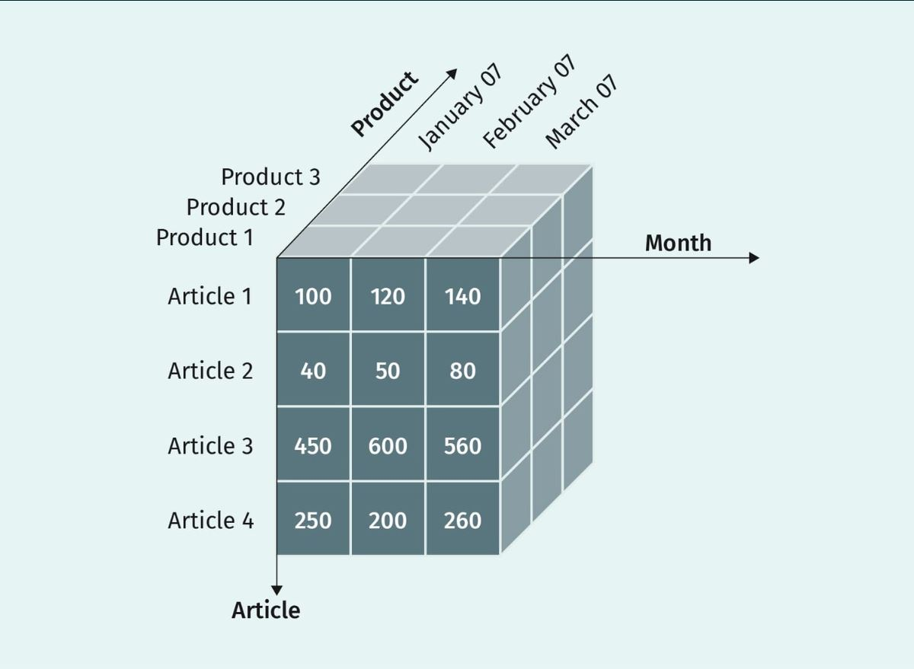

#### Drill-Down and Roll-up

Roll-up is used to aggregate or summarise the data while drill-down is used to deep dive into the data, along a single dimension.

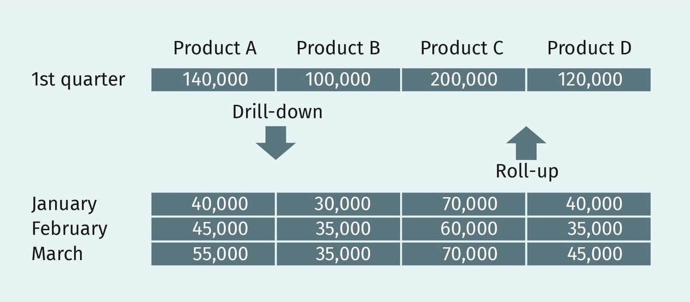

#### Slice and Dice
With the slice operation one can bound the analysis to a single plane of the cube. For instance, one can slice the product
dimension to view the sales of products by category. On the other hand, the dice operation extracts a smaller cube from
the entire cube. This enables users to view facts for a specific combination of dimension elements. Drill-across ease 
navigation between different dice.

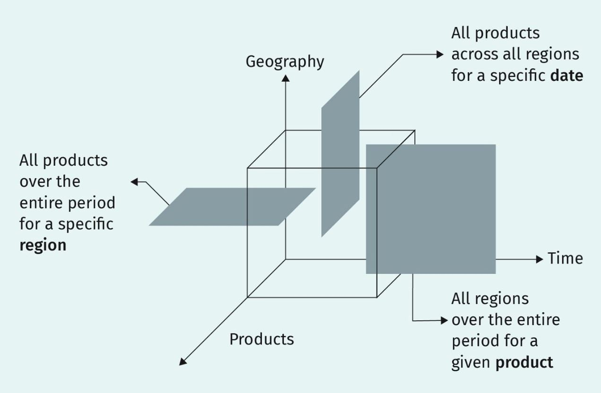

#### Pivoting

With a pivote one can rotate data cubes to view facts from different angles. Note should be taken that the order of
the dimensions are reversed when the cube is pivoted.

### Physical Storage Concepts

The fact that a company decides to use an OLAP Cube model, does not necessarily mean that data must be stored in a multidimensional data management system. In reality most companies store their data in a **relational storage model(ROLAP) than in a multidimensional storage model (MOLAP)**. It is also possible to store data using the combination of both storage models. This is called the **hybrid storage model (HOLAP)**. 

#### Relational Storage (ROLAP)
In this storage model, data for the DWH data storage is stored in two-dimensional tables but then retaining the
multidimensional interface for the entire system.

#### Multidimensional Storage (MOLAP)

In this model data is stored physically in a multidimensional data management system. This approach is highly efficient when
working with small amounts of data, possibly aggregated values. This storage model is suitable for data marts. Howevery,
experience has shown that its performance for executing queries reduces when it is used to store large amounts of data.
In multidimensional storage model, the data for the dimensions and its components are stored in arrays.

#### Hybrid Storage (HOLAP)

Aimed at exploiting the advantages of ROLAP and MOLAP of both relational and multidimensional databases. Aggregated values are 
stored in MOLAP whereas unaggregated values are stored in ROLAP. Access to the data is typically done with a multidimensional
query tool.

### Star Schema and Snowflake Schema

The physical implementation of a multidimensional data space or OLAP Cube model can be implemented either with a **star schema**
**or snowflake schema**.

#### Star Schema

In this schema a central table consisting the keys of the dimensions and the quantitative value e.g sales are stored. This 
table is called **fact table** and it is used to manage the keys of the entire OLAP cube. Around this fact table are the
dimension tables. There only exist relationships between the fact table and the individual dimension tables. This relationship
is achieved by inserting the **primary key of the fact table into the each dimension table as a foreign key**.

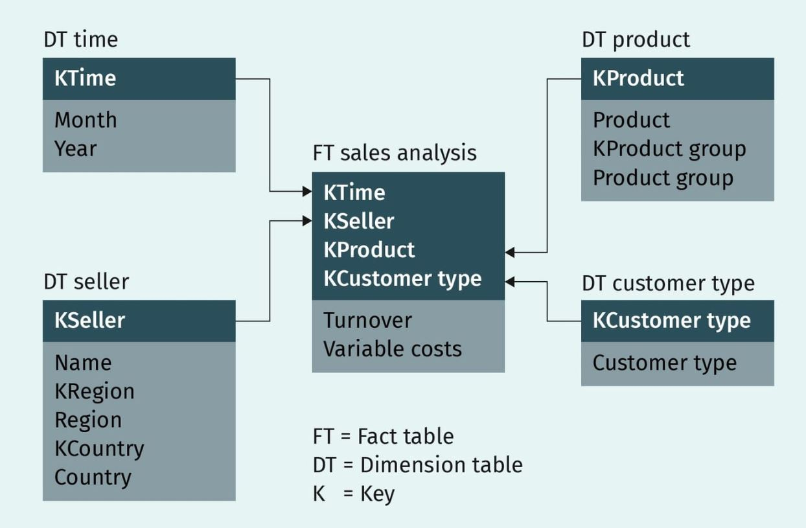

#### Snowflake Schema
Unlike the star schema, the snowflake schema contains a fact table which is surrounded by dimensions and these dimensions
are further surrounded by other dimensions. To created a snowflake schema, the data must be **normalized** taking functional
dependencies into consideration. As a result, the snowflake schema tend to have more tables to query than the star schema.

```find and insert image of snowflake schema here.```

### Historicization

Historicization of Data in a multidimensional data space is not trivial especially when it concerns dimension tables. To
historise facts or quantitative values, the foreign key relationship of the time dimension is used. On the other hand,
to deal with the complex situation of historizing dimension data the concept of **slowly changing dimensions SCD** is applied.
This concept offers 3 approaches namely: *SCD Type 1, SCD Type 2,SCD Type 3*

#### SCD Type 1
During historicization as a result of changes made in the data of dimension tables, the affected entries are overwritten by
teh new entry. This type of historicization keeps the volume of data low but then causes loss of information as it becomes
impossible to determin when a change was made.

#### SCD Type 2
In this type of historicization two attributes are added to the dimension where the change is or will be made. These attributes
or columns are **ValidFrom and ValidTo**. The ValidFrom get the a date entry when a value was originally entered and the 
ValidTo gets the Date when this entry is or will lastly be used. On the Row Level, an entry is added when the new entry
starts being used i.e ValidFrom is when the Changed entry comes into effect and ValidTo is set to infinity. With thi type
of historicization the Volume of increases with respect to the rate at which changes are made but then it effectively tracks
when changes to entries where made. This is suitable for scenarios where changes often occure in the data.

```find and insert image here.```

#### SCD Type 3
In this type, a new attribute or column named **NewXGroup** is added to the dimension(s) in question. This attribue stored
the new entry. However information about the period the changed occured is lost. Additionally, information is further lost
when changes are made several times as the previous entries in this attribute will be overwritten. This historicization 
approach is only used where changes are rarely made or expected e.g change in place of birth. It is important to note that
both **SCD Types 2 and 3** are complex to implement.

```find and insert image here.```

# Analytical Systems
Once data, in an agreed format, is physically stored in an OLAP cube model or multidimensional data space, special systems
can then be used to perform analysis with the aim to infer information rich enough to make data-driven decisions. The 
choice of teh System used for analysis depends on several factors including the IT know-how of the users. The different 
types of systems that can be used for analysis include:
+ free data research,
+ ad-hoc analysis systems (e.g OLAP)
+ report systems,
+ model-based analysis systems and
+ concept-oriented systems.

The above mention systems can be categorised into **concept oriented systems and generic basic systems**.

```find and insert image for concept_and_generic_systems here.```

### OLAP - Online Analytical Processing

As already seen, OLAP cubes model offers methods and technologies that users can use to aggregate and navigate data.
This enables users to analyse data insearch of information. To analyse the performance of OLAP systems some rules 
have be developed which are summarised in the acronym **FASMI**. The meaning of this acronym is **Fast Analysis**
**Shared multidimensional Information**.
+ Fast: Queries should be process within a time frame of maximumly twenty seconds.
+ Analysis: Complex analysis should be achievable with less programming effort.
+ Shared: Multiple users should be able to access data parallely without hindernis.
+ Multidimensional: Data should be stored in dimension in a hierarchichal manner
+ Information: Data evaluated during analysis should be transparent to all users to avoid inconsistencies.

As a result, OLPA Systems are highly performant and easy to use. Thus reports generated from these Systems are 
presented in form of graphics and tables. Example of OLAP System is SAP Business Warehouse.

### Reporting Systems
These are systems which users can use to create and design reports based on company data. These data is the underlying
source for calculating **Key performance indicators (KPIs)**. KPIs are key business metrics that can be measured to
evaluate the performance of a business against its business goals. These systems or tools usually provide users with a 
**GUI and drag-and-drop operations** to furster analysis. Examples of such toolsinclude power bi, cognos, tableau, QLik.

#### Scorecards and Dashboards
+ Scorecards: They provide a snapshop of the current business performance based on key performance indicators. This
can help business managers to quickly evaluate the business against it goals. The data in score in scorecards are
usually summarised based on the desired level of granularity that is enough to quickly assess the business. These data
is often represented in form of **charts, graphs, traffic lights, speedometers, and thermometer displays**.
+ Dashboard: They provide real-time performance of a business based on data from different parts of the company. 
Performance is measured by means of key performance indicators which are consolidated in a single uniform view. In
Dashboards it is possible to set threshholds for KPIs so that alerts can be triggered whenever a threshhold is reached.
Additionally, dashboards can scorecards, other measures and filters and the data must not be in summary form.

#### Generated Reports

+ Management information systems (MIS)
+ Executive information Systems(EIS)


