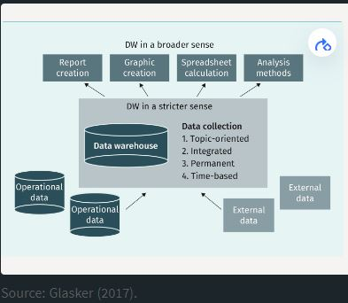

# **Motivation and Introduction of Business Intelligence**

Business Intelligence (BI) is the process used to infer information from Company data to enable managers
to make data driven decisions and to optimize business activities. The techniques, procedures and models,
analysis and information distribution of data will be discussed in this module. At the end of this course,
one shoud be able to independently design and prototype business intelligence applications based on specific
given requirements of a business situation or use case.

### What does the term Business Intelligence (BI) means

With the ever growing need to globalise and dynamise markets, company managers strive to establish competitive 
advantage by leveraging information extracted from their data to position themselves strategically. BI plays
a vital role as it seeks to **integrate** *strategies, proceses and technologies* to generate critical knowledge
about the current state of affairs from the different departments of the company. Integration is done at the 
level of **decision support systems** which present acquired knowledge in such a way that it can be used directly
for ***analysis, planning and control** purposes. A key component that drives business intelligence is the term
**data warehouse**. This terminology is a complex as it is often interpreted or understood based on the context
within which it is used. As we go through the historical development of business intelligence, we'll explore 
**data warehouse** within the context of business intelligence.

#### Motivation and Historical Development of the Field Business Intelligence

Business intelligence has seen its birth through the creation of *information systems* that date back to the **60s**.

1. **Management Information Systems (MIS)**

>The MIS was created in the late 90s with the aim to serve company managers with the information they need to make
>decisions. However, these Systems were strongly constraint by the technological infrastructure of that time. As a
>result Time, content and presentation of information needed to be optimized as a secondary factor.

2. **Decision Support Systems (DSS)**

>The DSS was created in the mid 70s and with its introduction the MIS was large replaced. This was due to technical
>development in hardware which allowed DDS to bring forth the act of storing data in a structural manner for decision
>making. Additionally, the DSS introduced Models and Methods as well as scenarios that made it possible to analyse data
>for some departments in the company. However, the DSS did not meet its high expections as Companies Managers did not
>trust computers to be able to correct business decisions with changing business conditions.


3. **Executive Information System (EIS)**

>The DSS was created in the mid 80s as it became possible to own personal computers, the EIS was introduce specifically
>for the upper management an those in controling positions. With this system it was possible to serve these group of 
>people with up to date data in the form of multidimensional cube. This the previous systems, this was not possible. 
>However, with the presence of Personal PCs, the EIS could only be used within single department which made it also
>expensive in the event of changes or updates. The EIS eventually suffered the same faith as the DSS.

4. **Data Warehouse (DWH)**

>With the globalisation of markets in the early 90s, companies started decentralising their systems of operation. As a
>result managers started facing the challenge of making decisions from heterogenous data, sometimes inconsistent,and often 
>arising from different sources. These forced company managers to be information dependent and as such they became obliged
>to trust informations systems which they were initially skeptical to. This is when information systems made a breakthrough
>in business environments. As the amount of data even grew the need for making decentralised decisions i.e decision made at
>different locations or sites not neccessarilly from a central location became more petinent. In order to handle large amounts
>of heterogenous data arising from inconsistent and non-compartible systems, and effectively make decisions the need to create
>a new system became inevitable. As such a centralised database was developed to bring together data from different sources or
>systems throughout the company. Thus the birth of the term data warehouse.

#### Business Intelligence as a Framework
Nowadays several companies are faced with increasing amount of heterogeneous data from different systems. This challenge can
be handled with data warehouses. However, another significant challenge is that the right information is often not delivered
in the right quantity, at the right place, and at the right time to enable effective decision making by company managers. To
address this issue, business intelligence is the right solution. This impliese that Business intelligence can leverage the
power of data warehouse to ensure that information is retrieved and delivered at the right place at the right time to enhance
decison making.

##### Definations and Features of a DWH and BI
*By the initial definition, a data warehouse is a subject-oriented, integrated, non-volatile, time-variant collection*
*of data in support of management's decisions. (Inmon, 2005, p.31)*
The four basic properties of a data warehouse are described as follows:

+ **subject-oriented (theme-focuse)**: The data stock of a DWH are selected and organised according to profession or business 
criteria.

+ **Integrated (Unified)**: Integration of data from heterogeneous sources. The data must have a standart structure and format

+ **Nonvolatile (Persisten)**: Once data is stored it can not be changed or deleted.

+ **Time-Variant (Historicization)**: Comparison of Data over time is possible in the DWH. Data are stored as they were 
recorded at the time of collection.

The defintion of a data warehouse has been extended over the years to include **data connection, extraction, transformation,**
**data collection, administration, analysis and representaion of data** with appropriate tools. The extension of the defination
of a **DWH** suggest that a DWH can be observed from two angles, namely: a *narrow and broad view*.

+ DWH in a narrow view implies that a DWH is solely used for **data collection**.
+ DWH in a broad view implies that a DWH can be used to **generate reports, graphs, perform spreadsheet and analytics**.



```
Since data collection and aggregation alone does not provide analysis of the data, "business intelligence is thus the process
of transforming data into information and, through discovery, into knowledge." (Muksch & Behme, 1996, p.37)
```

Business Intelligence can be classified in 3 orientations, namely: narrow, analysis and broad.

+ BI in a narrow orientation or sense refers to core applications that support decision-making without the need for additional
methods or models. Examples of these applications include **Online Analytical Processing (OLAP), MIS and EIS**.
+ BI in a analysis sense refers to applications that company managers can use to analyze data directly on the 
system. Typically these applications have a user interface, and provide methods and models that can be used for analysis. 
Examples of these applications include OLAP, MIS & EIS, text mining, data mining and ad hoc reporting.
+ BI in a broad sense covers all applications that are used directly or indirectly in making decisions. These include
**presentation functions as well as data preparation and storage (Gluchowski et al., 2008;Kemper et al., 2010)**.

"Insert image here"

# **Data Provisioning**

In order to leverage powerful BI tools to analyse data for decision making, a basic requirement that must be
fulfilled to ensure that the data is consistent is **data preparation and storage**.

### Operational and Dispostive Systems

According to Modern business studies, a firm's activities are categorized in **operational or dispositive**.
**Operational activies include the *the provision of goods and services, utilization of goods and services*,
and the *performance of financial tasks* that are not of a planning nature. On the other hand, dispositive
activities are related to the *management and control of operational processes*. A key property of *operational*
*Systems* for the implementation of operational activities is that **they capture and record data** where as
*Dispotive Systems* only **analyse data**.

#### Operational Systems

As mentioned above operational systems are used to capture and record data. Addtionally, they are use to manage
the information needed for the daily operations of a firm, e.g., customer database or employee directory. The
data in these systems can regularly be changed, updated, deleted and freequently queried.This is to ensure that
Data in these systems are always up to date. Models used to set up these systems must be optimized for a high
number of transactions or queries,especially during business hours. since these systems usually have a high 
number of users. Most queries on these systems are read requests. The processsing method for these systems is 
**online transactional processing (OLTP)**.

#### Dispositve Systems

These Systems use data from operational Systems and are highly optimized for complex queries.Typically they
don't store data and queried by few individual experts in the organisation whoseek to address complex issues,
e.g., aggregate data by regions of a country to find the sum of sales of sneakers in the last 12months. This
information could be used to design marketing campaignes. A **DWH** falls under dispositive systems and the
processing method used by these systems is **online analytical processing (OLAP)**. Due to the difference in
the objectives that both the operational system (OLPT) and dispositive system (OLAP) seek to address, in
practice they are also **physically separated from each other**.

### Data Warehouse Concept

In practice companies build their DWH with regards to the requirements they have. To avoid developing DWH from
scratch there are some *architechtures* which companies pick from and customise according to their needs. 
Typically, DWH can include different process phases, architectures and BI Components.

#### Process Phase and Reference Architecture

A process phase refer to the **stages through which data passes** while a referench architecture refers to the
template that can be used to design the **collection and storage** of data using a DWH. In literature one can
find numerous suggestions of process phases and reference architectures. Examples of process phases include:

+ data provision
  - In this step, data from heterogeneous source systems e.g., CRM,ERP, SCM or external source are merged into
  the DWH.
+ information generation, storage, and distribution
  - In this step stored data is analysed using OLAP and data mining tools.
+ information access(Kemper et al., 2010)
  - Insights gained from analysis is communicated in the form of recommendations or actions.

The following BI reference architecture is suggested by Gansor et al. (2010),p.56
"insert image here"

The components of this reference architecture are explained as follow:

+ **Source systems**:
  - Data from heterogeneous sources both internal(e.g ERP) and external(websites) sources are imported in their 
  respective formats or structures. This data can be in form of text, numbers etc. and could be structured, 
  semi-structured or unstructured.
+ **Staging area**:
  - Area where data is storage temporally. The is important as it can relieve downstream systems when processing
  large amounts of data (Inmon, 2005).
+ **Operational data store (ODS)**:
  - Data stored at a preliminary stage for supplying data for conventional DWH approaches. Data in this store is
  usually **not** aggregated nor does it contain historical data for longer periods.
+ **Basic database (core data warehouse)**:
  - This is the central database with the DWH. After the initial transformation, data is made available for various
  evaluation purposes or for downstream systems.
+ **Evaluation database (data mart)**
  - From a technical point of view, these databases are usually based on relational databases and store data with
  the help of a multidimensional model. This makes it possible to divide data with regards to analysis requirements
  or organizational units (Bauer & Günzel, 2008).
+ **Extracting, Transforming, and Loading (ETL) process**:
This is the prcess of integrating data from different source systems with ETL Tools into the DWH.
  - Extract: Extracting and converting data according to the company's requirements.
  - Transforamtion: Possibly changing the structure and content of the data into the unified agreed format. It is
  possible to check the state of the data to improve its quality if neccessary.
  - Loading: Transfer the data into the central database in the target schema. (Bauer& Günzel, 2008).
+ **Aggregation**:
  - Reducing the amount of data by summarising the data to lower *granularity* as agreed.
+ **Front end**:
  - These are data mining and OLAP tools used to analyse data to infer information. These tools vary in complexity
  according to their applications. It is in the analysis phase that some unknown relationship within the data
  can be uncovered. 

### **Architecture Variants or Types**

In practice there are several architecture types. They stem from the area of data management and others from the
field of Business intelligence. These architectures can be used as templates to be customized to meet up the 
requirements that a company has. Some of these architectures are listed and explained as follows:s

+ **Independent Data Marts**:
They are created as a result of every department in a company building their DWHs independently from each other.
The underlying data sources are often the same. This architecture makes it easy for every department to their
decisions easilly and faster as aquiring results from calculations and analysis occurs within a short time frame.
It reduces the complexity of working with a central DWH but then creating a central DWH from independent data
marts is quite challenging. (Kemper et al., 2010).
"insert image here!"

+ **Data Marts with Coordinated Data Models**:
Conceptually coordinated data models ensure the consistency and integrity of the dispositive data model thus
making it easier, as compared to the independent data marts, to build a central or company-wide DWH.
(Kemper et al., 2021).
"insert image here!"

+ **Central C-DWH (No Data Marts)**:
This BI Solution is recommended for situations where the number of users and the volume of data is small but
there is interest in having a company-wide DWH.

+ **Multiple C-DWHs**:
If it is determined from the company's requirements that there are different products or market structures, then
it is recommendable to set up several core DWHs.
"insert image here!"

+ **C-DWH and Dependent Data Marts**:
This is the most presented architecture in literature and it is built by extending the core data DWH with one or
more data marts. The data marts are fed with data and transformation processes from the core data warehouse. In 
this architecture, the department-specific data is extracted from the C-DWH.
"insert image here!"

+ **DWH Architecture Mix**:
This is a common architecture in practice and it consists of *C-DWHs, dependent and independent data marts*.
It also provides the possibility to have direct access to the data i.e virtual DWH with its own data transformation.
"insert image here!"

# Data Warehouse
In practice, business intelligence applications require data to be *arranged* according to **topics** i.e theme focused.
The organised data is usually **aggregated** according to *business management perspective*. To achieve this, **ETL**
Tools are used to **integrate** the *provisioned data (data storage and data management)* from different operational Systems. 
The aggregated data is persistently stored in a timely manner according to specific-topics e.g customer, product, or 
organizational unit. Thus, the need of a **DWH**.

The ETL-Tools are used to design and implement and **ETL**Process for Extracting, transforming and storing operational
data from heterogeneous source systems into a DWH, so that it can be used for further analysis. Ths transformation process 
prepares data for analysis in *four sub-processes* namely: **Filtering, Harmonisation, Aggregation and Enrichment**. 

### ETL Process
In order to integrate data from different operational systems so as to be able to infer relevant information that 
business managers can use to steer the business or strive to achieve business goals, an ETL Process must be implemented.
The development of an ETL-Process is the most challenging task in data integration, as it solely rely on the nature of
the operational Systems from which data should be extracted. Once such a process have been designed, its implementation
can be done programmatically or with a set of available tools. Kimball & Caserta, 2004 recommend the use of available
ETL Tools because of the complex nature of ETL Processes.
The following is an illustration of the ETL Process
"Insert image of ETL_Process here!"

#### Components of the Transformation Process
This step of the ETL-Process consist of four sub-processes whiche are: **Filtering, Harmonisation, Aggregation and**
**Enriching**. As a result of this, it is the most elaborate and complex part of the ETL-Process.

+ **Filtering**
This step of the transformation process aims at *extracting and removing syntactic(technical) and semantic(content)*
defects from the data before it is moved to the DWH. The process occurs in two steps; **extraction and Cleansing**.
In the extraction step, data from operational systems e.g., ERP-Systms, and external sources e.g., Online portal for
exchange rates are stored in the staging area. The staging area is a special temporal storage for source data in the
form, format or structure in which it comes. In the cleansing step, technical defects e.g., numeric values in a date fiel
and content defects e.g., inaccurate sales values. Defects that are automatically detected and fixed during extraction
are first class defects, while those that are automatically detected but manually fix after extraction are second class
errors. Other errors are only manually determined and fixed. Those are third class errors. Once the filtering process
is completed, of course with regards to the business objectives, the *filtered data is ingested in the data warehouse*.
+ **Harmonization**
Harmonization in other words is **normalization** of *filtered data*. In this step, the data, most often from different
source systems is reconcilled or unified into an agreed format. For instance, data from the sales department recording
sneaker sizes as **S, M or L**. On the other hand, procurement department be recording these entries as **Small, Medium,**
**Large**. These data can be reconcilled by agreeing to store the entries as **S, M or L**. This means that in the
harmonization or normalization step, the data entries from the procurement department will be transformed to **S, L or M**.
When this transformation is done, then the data from these two departments can be consolidated or merged into one before
storage in DWH. Currency conversions can also be done in this step(Kimball & Caserta, 20024).
  - Syntactic harmonization: When data from different source systems is being merged together, it is a common practice
    to assign or create primary key for the merged data. This is often done through a map table, that contains this
    primary key, and the primary keys of the individual tables of the various sources. This primary key is referred to
    as a global key and is used in the basic database, DWH and data mart. Some ETL Tools can help generate this key
    during data transformation. The term used for this key is **surrogate keys**.
  - Semantic harmonization: This is to ensure that business terms have the same meaning and well understood by those
    who will be using them.
+ **Aggregation**
In this step of the transformation process, *harmonized and filtered data* is summarised or condensed into an agreed
granularity or hierarchical level. In this phase functions that are required to calculate key business figures are
prepared for later use. It is also in this step where dimensions that will be used for analysing the data is set.
+ **Enrichment**
This is the final step of in the transformation process. It is in this phase that **key business figures** are actually
created or calculated and stored.
>The bulk of the work in the ETL process lies in the Extraction and Transformation steps. Specifically the Sub-Processes
>of the transformation process are the key components of the ETL Process. Once the data has been enriched; the data
>is **written** in the target system. This occurs in the last step of the ETL Process which is *Loading*.

### DWH and Data-Mart Concepts
In a narrower sense, the functions of a data warehouse includes data storage. To be leverage this functionality, the
components of a data warehouse play very important roles. These components include:**staging area, basic database or**
**C-DWH, data mart, ODS, and metadata**. 

+ **Staging area**
This is a working area where data is extracted to, transformed before it is loaded into the data warehouse. This acts
as a relieve area for downstream systems, particular when working with large amounts of data that alos require alot
of cleansing and harmonization. Typically, data is loaded into this area periodically and later on discarded once
the data has been transformed and loaded into the data warehouse. Thus, it is a **temporal store** for raw data.
(Inmon,2005).
+ **C-DWH**
Located between the staging area and the avaluation database is the basic database. This database is particular in
in its function in the sense that the transformed data it receives from the staging area is stored bytopic, historically,
consistent, permanently,by dimenssion and in a normalized form. This is why modelling is a very important aspect of setting-up
a DWH. The data in the C-DWH is then served to the evaluation database for calculating key business figures or metrics.
Depending on the business goals, data are also historicized, that is, they are kept track of over time(Bauer & Günzel,2008).


