# Data modelling and Reporting

A great course to learn the fundamental concepts and practical applications of Data Modelling and Reporting.

## Chapter one: Basic Concepts

A data model is an abstraction of the reality that is composed of the representation of entities, the structural relationshit that exist between them and the interpretation of of the of interaction between the entities with regards to the real world. Data modelling is the process of developing a data model. This usually occurs via several iterations or stages primarilly based on business requirements from concerned business stakeholders as input. Data modelling is a central part of online processing systems, online analytical systems and data stocks. Understanding data and its different types are vital aspects of data modelling. Another important aspect of data is reporting which is a process of presenting data in a structured format to facilitate information retrieval and insights. The following image present the different types of analysis in Business Intelligence, however, the focus of this course is on *report oriented analyses*.

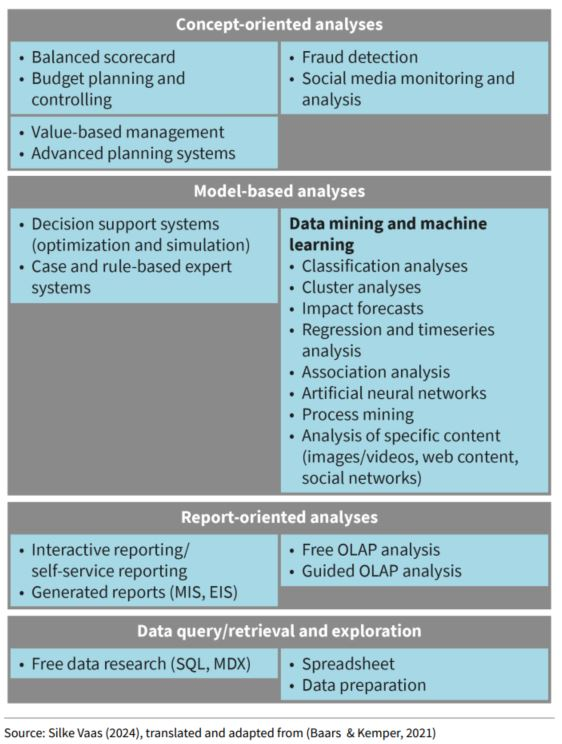

### Types of Data

1. *Structured Data*

This is data that can be stored by both relational and non-relational database management systems. In relational databases, structured data is stored in relations. On the other hand, NoSQL family of databases store structured data based on their individual properties. For instance, structured data is stored in Dcoument stores as documents where each document is a key-value pair that could be nested. Example of structured data is: User master data stored in a relational database.

2. *Semi-structured Data*

These data do not fit into a table structure without prio transformation. Typically, they contain details, like tags, that allow them to be described and converted into a format that can be stored into a relational database. As such, semi-structured data are basically stored in NoSQL databases because of their flexible structure. Because of their flexible structure and light weight, they can be stored in large amounts which is perfect in big data scenarios. Examples of semi-structured data include XML, JSON, YAML, csv. 

3. *Unstructured Data*

These data completely lack a structure that describes them and do not provide any details that allow them to be converted into (semi)-structured data.Because of their lack of structure they cannot directly be stored in relational databases. They are readable and easy to understand by humans, however, they require special transformations before they can be stored. Beside their complexity, they are heavier than (semi)-structured data. As such they require much storage capacity and processing capacity. For these reasons they are mostly stored in NoSQL databases that provide features like scalability to handle large work loads. For efficient data storage management, unstructured data are serialised before they are stored. During retrieval, they are deserialized into their original format. Example of unstructured data include: images, videos, audios, feeds, files like pdf, word, jpg etc.  

### Big Data

Visit course book for details on the 5Vs of data. These are:

1. Variety: Different types of data from hetegeneous data sources
2. Volum: Data being generated in large amounts
3. Velocity: Data being generated and transmitted very fast
4. Varacity: Noise in data that need to be ignored or removed. That is unwanted data.
5. Value: Quantifiable insight derived from data to support decision-making.

### Batch Data Processing

In production, this is a type of processing that handles several tasks simultaneously. However, batch processing can be split into *simultaneous, sequential and concurrent*.

+ Simultaneous batch processing: When a particular resorce e.g a node, is used to perform several tasks simultaneously.
+ Sequencial batch processing: A node handles similar cases of an activity almost at the same time.
+ concurrent batch processing: A node handles cases of an activity that may overlap.

Batch data processing has the following general charaterisitics

- Suitable for ETL processes in the context of Data warehousing
- The amount of data to be processed is large but can be estimated
- Processing is scheduled to ensure it occurs regularly at given times
- It is suitable for complex data transformation or calculations.

### Stream Data Processing

The following are key characteristics of stream data processing.

- Data processing occurs at near real time
- Size and nature of data is not known
- Suitable suitable for applications requiring quick data processing and analysis.

## Chapter two: Data Modeling Life Cycle

Data modeling is the process of identifying a business problem, then gather and explore details, which is usually implicit and unstructured, related to the problem and developing and explicit model for this problem where the model must be validated, tested before it is deployed and documented.Thus, data modelling is the first step towards the development of any information system. The transformation of implicit knowledge to explicit knowledge occurs is three phases, namely: *conceptual, logical and physical*. Knowledge management in itself is the contineous generation of new knowledge, sharing this accross the organization and directly embedding this into technoligies, systems and products. The conceptual, logical and physical phases involved in data modelling form the data model life cycle covering *five* steps which are: **Business understanding, Acquire and Explore data, Model & Validate, Build & Deploy, and Test, Release and Document**. The following is an illustration of the data modeling life cycle.

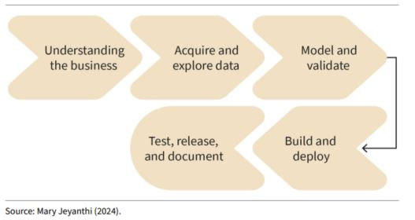

Regardless on the type of data(structured, semi-structured or unstructured), data modeling strongly depends on the storage system(operational, dispositive or data lakes) where the data model will be deployed. Additionally, data modeling considers the IT infrastructure, strategic planning and business activities.

### Business Understanding

This first step in data modeling involves consulting the customer to understand the business which is necessary to scope the problem and gather business requirements. Knowledge about the business and efforts are crusial factors for both the consultant and the customer in this step. In busines understanding the following sub-steps must be covered:

#### Define Objectives

The activities undertaken in this step include:
- The identification of key business elements alonside side their measurements. E.g sales projection
- The identification of challenges as perceived by the customer
- Setting up teams and assigning roles and responsibilities.
- Defining success factors e.g reducing churn rate by X percent.

#### Formulate Questions

The questions should clear, coincise, relevant and explicit with regards to the business objectives. Think of the 4 Ws i.e *Who, What, Why and When*. Some of the questions could be:

- What is the business aim, such as a business activity, decision, or action, that must be
improved in efficiency or effectiveness?
- Can the business objective be achieved using existing tools, software, people, and process? If not, do we need to consider purchasing new tools, and software, or hiring a consultant?
- What model performance criteria are desired for business acceptance?
- When the business criteria are met, how will the model be used?

#### Identification of Various Data Sources

All internal and external sources related to the business and the objectives to be achieved must be identified and described. This also include all those responsible for the management of the data sources. This acitvity is crucial as it is a requirment for performing data profilling.

### Acquire and Explore Data

In this phase, data sources and destination must be described in a technical specification document like a *data definition report*. The knowledge in this document is later transferred to a data dictionary which are documents contain descriptions of the information provided by the recipient. Additionally, the descriptions in the data dictionary include schema information such as data types and validation rules, and in possibly entitiy relationship diagrams. As Anayst or project manager collect all information, from the client, necessary for the development of the data model, it is important that all ambiguities should be handled. The core activities in this step are:
- Understand the data related to the business objectives.
- Explore the data and assess its quality and completeness against the business objectives. This is because real world data may contain missing values, may suffer from aging and may also contain errors.

At the end of this step, *a data quality report and interim decision* must be produced and made respectively. While a data quality report contain information like summary statistics about features and relationships that exist between the data etc, an interim decision is about the progress of the project to develop a data model. Based on the results of the evaluation of the project, the data modeling process can continue or be halted. Basis for evaluation include: internal/external data sources, data extraction approach, data types, data inputation criteria for missing values, data enrichment etc.

### Model and Validate

In this step, entities and their relationships are determined and in an iterative process, conceptual up to an including the physical model is developed.

1. Identifying entities and relationships
2. Create a conceptional data model. Entities and their relationships are visualised in an entity relationship diagram. 
3. Validate the data model with the business department, data owner, and other stakeholders. This ensures that the conceptual model alligns with the business objectives and also receive endorsement from the all parties involved.
4. Create a logical data model. The model includes features, data types and constraints related to the entities.
5. Validate this model with the data analyst, data owner, demand IT, and other stakeholders
6. Create a physical data model. The technical implementation of the model is done and this is where real world data will be physically stored.
7. Validate with the IT department and other stakeholders. This ensures that the data model fulfils all expected criteria and constraints as well as seamlessly integrate with other systems in the company.

#### Different approaches in modeling

There are 4 approaches to modeling data. Each approach is suitable for a particular use case and leverage both advantages and disadvantages. These are approaches are: *function-driven approach, data-driven approach, object oriented approach and prototyping approach*. 

+ *Function driven approach*

Data model is designed based on the expected functionalities of the system. It is often used in software engineering and system design where emphasis is on the specific functionalities of the systems i.e what the system should do. 

+ *Data-driven approach*

The data model is designed based on the entities and relationships that exist between them. As such its focus is on the the data that it processes. This approach is suitable for data analytics and machine learning scenarios.

+ *Object-oriented approach*

The model is designed based on objects and relationships that exist between them. Usually, each object has its particularities and is reusable. This approach is commonly used in software development e.g in the development of an application where the application is built from a combination of different components or objects. Think of a class in python as an object.

+ *Prototyping approach*

In this approach, the model is iteratively built by improving the previous one. Based on the requirements, a basic data model is built and enriched in subsequent iterations. This approach is used in product design and developments. 

#### Challenges

The model and validate step is critical in data modeling as it sets the foundation for the system that is to be built. Model and validate in this context is related to database designing and validation. However, understanding entities and their relationships could be challenging especially for large systems. Misrepresentation of entities and relationships can lead to data storage issues which will affect the quality of the data being generated and thus have an adverse effect on the accuracy of results from the data of the developed system.

### Build and Deploy

This step is part of the physical phase and involves the implementation of the designed model. During implementation of the data model on a chosen database management system, a database schema is physically created. *A database schema is a data structure that defines the logical and physical organization of the data in the database*. This schema includes tables, views, functions, procedures, indexes and other objects designed in the logical phase. Additionally, data security and access controls measures are also implemented. Once the system is deployed and configured, it can be populated with data manually or automatically via data migration processes. The following are the 3 major activities done in the model and deploy steps.

1. Creating the physical data model
2. Data population
3. Setting Security and access controls

#### Challenges

Ensuring the following in the model and deploy step is not trivial:

+ Entity and referential integrity to guarantee data consistency and accuracy.
+ Implementing data security measures like encryption.
+ Assigning and monitoring roles and responsibilities to control access to the system and data.
+ Implemnting and maintaining data masking when the system and data grows.

### Test, Release, and Document

In this final step of data modeling life cycle, quality assurance of the product and correctness of the decoment is performed before the product is released with everything being equal. Four primary activities are done in this step. These include:

1. *Complete the project devliverables*: Every associated requirment defined in the project objectives related to the data model must be delivered. In the context of data analytics, other requirements could be Dashboards or Reports, development of ETL/ELT process etc.
2. *Run system validation test*: This ensures that the system fulfils the business objectives and behaves as expected in different business events. Functionality test ensures that the system yields expected results while performance test ensures system's reliability and scalability in increasing workloads. After successful test of the system, it is deployed in the production environment.
3. *Assess the quality of all created documents*: Important for model maintenance and expandability. There are different types of documents containing distinct information related to the database design or modelling. These documents include:
- The Requirement Specification which is provided by the business departments in charge of the project. It specifies the project scope and contain all the business objectives.
- The Specification sheet is provided by the IT department. It is built on the requirement specifications and describes how the business objectives are implemented. It is also the document that guides the development process to ensure that the resulting solution meets the business objectives.
- The technical architecture and components of the system is documented in the system design. It also contains information regarding integrations points and adjustments made based on the business objectives. This document is provided by the IT department and is used by IT professionals and/or developers.
- The user manual describes how the systems is used. It contains trouble shooting information, reset techniques, as well as configurations that can be made to fine tune the system. Also recovery methods and expected downtimes, if at all there are any, are document in the user manual.
4. *Hand over the project*: At the end of the project, the system is handed over to the customer that will continue running and maintaining it via its dedicated department.

## Chapter three: Data Model Types

Data models are used to define and visualise data and also determine how data is stored and access in databases within database management systems. Four different types of data models will be elaborated in this chapter. These include:

### Hierarchical Data Models

It is the oldest form of data model and stores data in a tree-like structure. As such it is characterised by the following:

- A root node representing the highest level of the tree. A root node in the context of a company is the company itself.
- Inner nodes are located between the leaf nodes and the root. They could be departments of an organization.
- The leaf nodes are the last level of the tree. These could be the employees of the company.
- Roots, inner nodes and leafs are connected via parent-child(1:n) relationships where each inner node or leaf is associated with one parent only. However, a parent node can have several child nodes or entities. The parent-child relationship is guaranteed via referential integrity.
- There exist no direct links between inner nodes as well as between leaf nodes.

This models organizes data structurally. Entities with the same value or similar category are stored on the same level and in the same nodes respectively. Retrieving information from the model is fast which improves the performance of the system. Consider a company providing physical products and digital services. Assume that the digital services are in 3 tiers as in tier1, tier2 and tier3. If the company wants to know the number of users who have explicitly subscribed tier2 services, then the will access the digital service and tier2 nodes. After which they will count the number of unique subscriptions in tier2. Challenges in using this model include: 
- Organizing data in a structural manner makes the data model inflexible
- Cannot handle complex n:m relationships
- Deleting the parent node automatically deletes all its inner and leaf nodes.
- Insertions are not allowed if there is no defined parent-child relationship.

### Relational Model

In a relational model, data is stored in relations or tables. Each table has a unique name and unique columns. Every columns is an attribute and collects data of a predefined type and/or range. The row entries are tuples of atomic values that are related to each other. Every row has a unique identifier called a primary key. A primary key could be made up of a single column or a combination of several columns in a table. A combination of columns to form a unique identifier is called a composite key. Relationships between tables are established via primary and foreign keys described as referential integrity. Referential integrity ensures data consistency and accuracy and are controlled by cardinalities. Cardinalities determine the number of entities in one table that are related to entries of another table. In a relational model, data can be normalised to prevent data storage issues like redundancy that can lead to update, delete and insert anomalies. Storing data in relations allows retrieval of data via simple to complex joins. The major language used for *insert,select,update and delete(CRUD)* operations in a relational model is SQL.

**Advantages**

- Relational data model is more convenient to implement in DBMS than a hierachical or network model.
- Focus is on data than structure which has a positive impack on performance
- The table structure is simple to understand and use.
- The model can be adjusted without need to make changes on the application
- It supports a dedicated language (SQL) used for querying them.

**Disadvantages**

- It has a predefine schema i.e data must be stored in tables thus making it inflexible which hinders scalability when implemented in DBMS.
- Has performance limitations as it can only be scaled vertically.Scalling requires thorough planning and considerations of the DBMS design.
- Complex queries may adversely affect performance
- Larger models may have complex relationships which are difficult to maintain.
- Inadequate modeling will lead to data inconsistencies or redundancy, thus creating data storage issues.
- Only handles structured data.

### Network Model

This model was developed to handle the limitations of the hierachical model. Specifically, the network model supports a many-to-many relationship unlike the hierarchical model. This means that, a parent node can have many children just as much as a child can have many parents. Beside this, other types of relationships like 1:n, 1:1 etc can exist in a network model. As a result, different types of networks can coexist within a network model, thus making this highly flexible. In this (un)-directed graph model, nodes represent objects of different kinds while the edges represent the relationship between objects. As such a network model is suitable for describing relationships between objects.

**Advantages**

- Suitable for modeling or visualizing relationships in social networks.
- It can accomodate different types of relationships due to its flexibility.
- It is data independent that hierarchical models

**Disadvantages**

- Each record is retained via references thus complicating the database structure. What does this even mean?
- Since a record may have several references, performing update, insert and delete operations becomes complex.
- The application must be change whenever the model is altered. As such making this model structurally regit.

**explore and explain the following network models**

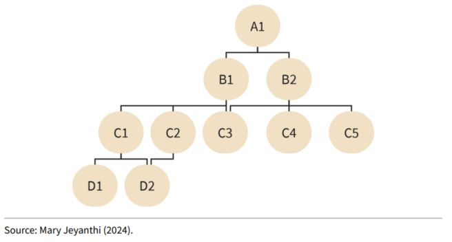

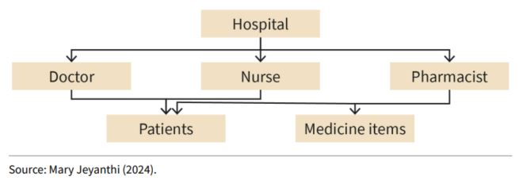

**Difference between Hierarchical Data Model and Network Data Model**

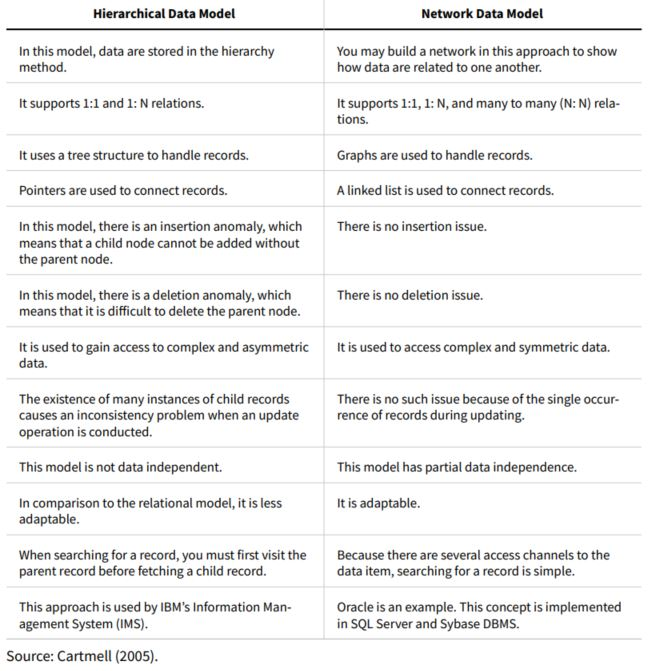

### Object Oriented Model

Also refered as object-oriented database model(PostgreSQL is an example of a DBMS that supports Object-oriented models), it uses objects and classes to represent data. While objects are real-world entities with *structure, porperties, states and behaviours, classes are used to group objects. Real-world scenarios are abstracted into objects and incorporated into classes. As such real-world situations are the foundation of object-oriented models. This models also supports the implementation of instructions via procedures. Being an object related model, it makes use of the concept object oriented programming(e.g inheritance, polymorphism) in the data model development life cycle.

--insert image here--

**Purpose of Object-Oriented Model**
The purpose of this model is to levarage the possibility to test a physical entity before building it. Through visualization, the structure and behaviour of the objects can be examined before it is implemented. The following images show the construct of an object-oriented model and an example of an object-oriented model.

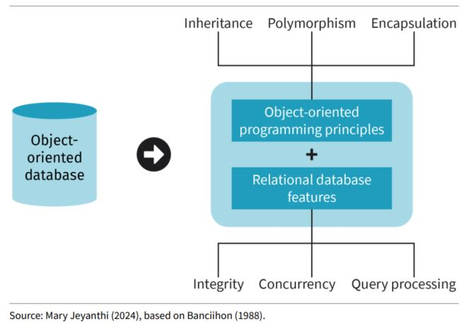

The fundamental features are elaborated as follows:
+ Encapsulation: Technical details are separated from the information required by the user.
+ Polymorphism: The ability to access objects of different types through the same interface.
+ Inheritance: The ability of a child objects to import extra properties from its parent class.
+ integrity: A feature of relational databases that allows allows data to be stored in tables that can be connected and used in numerous ways.
+ concurrency: A property that allows databases to handles multiple queries, at the same time, from different users.
+ Query processing: The compilation and execution of SQL queries.

The following diagram is an example of an object-oriented data model

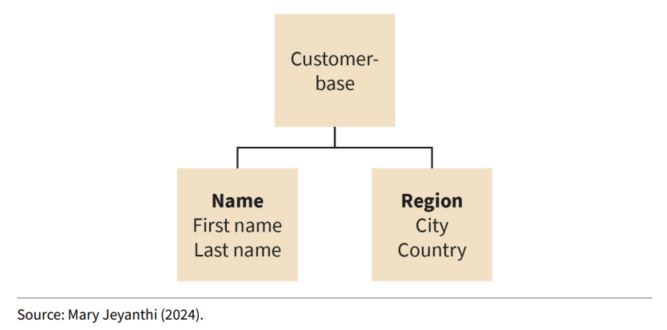

- The customer base, name and region are entities
- The customer base is the parent class while the name and region are child classes
- First name and Last name are features of the name object while City and Country are features of the region object.
- Both name and region objects can inherit properties of the customer base object.

## Chapter four: Relational Modeling

In an era where data plays a crucial role in decision-making for businesses, relational modeling leverages an approach for *structuring and interconnecting entities*. Relational modeling is strongly linked to the mathematical set theory explaining the relational concepts as developed by Codd in the 1970s. The relational concept allows complex real-world scenarios and interdependencies to be captured and presented in relations or tables where features are captured in columns and instances are recorded in rows in form of tuples. To ensure data consistency and eliminate redundancy, normalization can be applied to the tables and their relations. The relational concepts provides SQL as the query language for CRUD operations. As already mentioned in a previous chapter, creating a data model involves three active phases, which are: *Conceptual, Logical and Physical*.

### Conceptual Phase

This first phase in relational database design is primarily concerned in *providing* a clear and understandable visualization of the *System's structure and requirments*. The structure is an abstract representation of the real-world which is being modelled while the requirments include the system's capabilities and functionalities regarding the defined business objectives. An Entity Relationship Diagram (ERD) is a tool that is widely used to visualise the structure of the system or conceptualise the system. An ERD is also refered to as an Entity Relationship Model (ERM). Through Visualization, an understanding of the existing entities, their relationships and interdependencies in the system is enhanced. Thus this is the common ground for all parties involved in the development of the relational database model. Additionally, an ERD is software independent and provide the foundation for the logical development of the relational model. The main components of an ERD are: *entities, attributes and relationships* and the following symbols are used to differentiate these components.

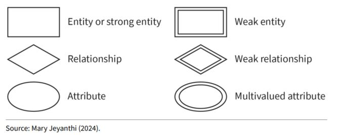

+ Entities are represented by rectangles
+ Relationships are represented by diamonds
+ Attributes are represented by elipses. Double elipses model attributes with multiple values e.g the flag attribute could have black, red and yellow as entry.
+ Lines connect entities to attributes or entities to relationships. It is not allowed to connect entities directly to each other without relationships.
+ Primary keys are part of attributes and must be underlined.

#### Description ERD Components

1. **Entity**

Entities are real-world objects or concepts that are identifiable. E.g Student, Football Club etc. Usually, real-world objects have porperties that can be used to describe them. Entities are differentiated into strong and weak. Weak entities are not identifiable via attributes and are completely dependent on the strong attributes. This means that once a strong entity is eliminated, a weak entity is implicitely eliminated where as the opposite is not true.

2. **Attributes**

These are characteristics or features that describe an entity. There exist *simple, key, composite, multivalue and derived* attributes. Each attribute is of a particular data type(e.g string, boolean, numeric etc) and must be distinct from other attributes. For each attribute, there is a set of values that it can take. In an ERD, entities are modeled with their attributes to facilitate understanding ease structural representation.

+ Simple attributes are those whose values cannot be divided any further. e.g The attribute gender can have male as value. Male cannot further be divided into other attributes. This imply that gender is a simple attribute.
+ key attributes in relational modeling are used to uniquely identify the smallest entity and for establising relationships between entities.E.g In a student table (student being an entity), a student id is used to uniquely identify a particular student(instance).
+ composite attributes are formed by combining several attributes. E.g The first_name and last_name attributes can be combined to form a name attribute. The name attribute in this case becomes a composite.
+ multivalued attributes can contain several values in an entry. E.g the flag attribute could have black, red and yellow for the german flag.
+ derived attributes are often not provided in the model but can be determined from existing attributes through data manipulation or processing. E.g The bodyMass Index (BMI) is a person's attribute that is not directly collected but can be calculated from the weight and height of a person.

The following is a visual representation of the student entity with its attributes.

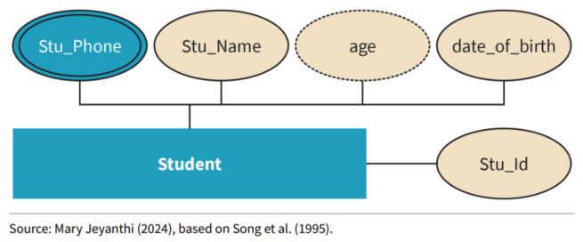

3. **Relationships**

The connections that exist between entities or data tables in a relational database are represented by relationships. These relationships also indicate dependencies between the entities. Using an ERD the following relationships can be represented:
- one-to-one
- one-to-many or many-to-one
- many-to-many

Example ERDs modeling these relationships can be found in the course book.The following image shows an ERD modeling a many-to-many relationship. 

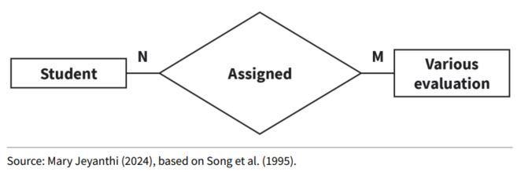

The later present upper bounds of cardinalities. Cardinalities in a relationship determine the number of instances of an entity that is associated to other instances of other entities. However, it is important to specify lower bounds or minimun cardinalities in relational modeling. *Minimum cardinalities can only be zero or one, where zero stands for optional and one for mandatory*. In a model between a person and number of registered vehicles, a person *can* have zero or many registered vehicle but a vehicle *must* be registered to a person. This is an example of a optional-mandatory minimum cardinalities relationship. The word *can* implies optional while the word *must* imply mandatory.

An alternative tool to an ERD is the Unified Modeling Language (UML). The following image is a relational model conceptualised using ULM.

The transition from business objectives or requirements to ERD require collaboration between all stakeholders involved in the development project of the relational model. A key activitiy in during the translation of business objectives into an ERD is the identification of entities, their attributes and the relationship that exist between them. Stakeholders involved may include among others: end users, business analysts, database designers etc. The ERD serves as basis in the logical and physical phase.

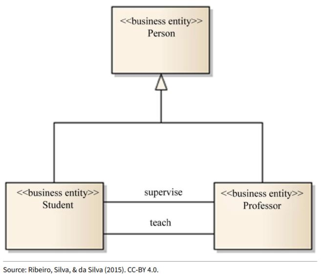

### Logical Phase

In this phase, the ERDs developed in the conceptual phase is translated into a structured and implementable format that is independent of the Database Management System. The following activities should be done in this phase:

1. Refinement of entities and attributes: Identify every entity and all its attributes then convert every entity into a relation/table. Examine every attribute of an entity to drop duplicated attributes and reduce every attribute to its smallest atom or in a way that it cannot be subdivided any further.

2. Establishing relationships: Specifine the type of relationship between entities and establish the relationships taking cardinalities and constraints into consideration.

3. Define keys: Identify primary keys used to uniquely identify every instance in a table and establish relationships using foreign keys.

4. Create ERDs: Based on the refined entities, attributes and relationships, create a logical ERDs that contains primary and foreign key specifications.

5. Ensuring integrity constraints: Define constrainst like min cardinality, referential integrity, rules, checks, datatypes etc. This is to ensure data validity and accuracy.

6. Normalization: Implement normalization to handle data redundancy with the aim to avoid data storage issues. Consider the different levels of normalization and the kind of storage issues it treats. In some cases consider using denormanlised tables for increased performance.

7. Documentation: Document the logical ERD detaily. This includes precise description of tables, attributes, relationships and constraints. This is useful for the development team during the physical implementation of the model.

The following image is an example of a model developed in the logical phase.
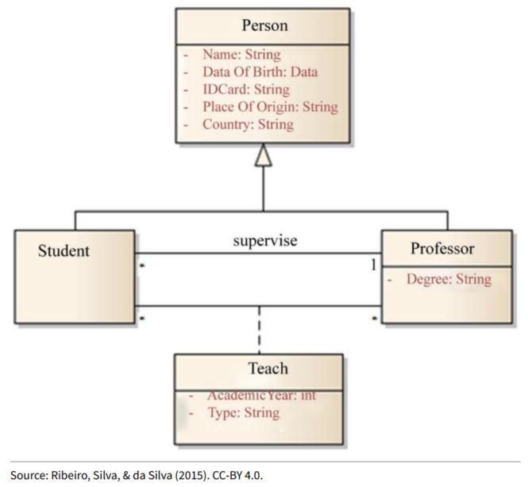

### Physical phase:

It is in this phase that the logical model is technically implemented on a specific database management system. It is concern with the physical storage of the data and how the data is accessed. Beside this, the following activities should be highly considered.

1. Data types: Every attribute must be assigned a datatype. Example datatypes include: boolean, string, small int, char, double, float etc.

2. Indexes: These are datastructures built on tables spefically referencing columns that are frequently used during data retrieval or transformation. Indexes provide a good mechanism for speeding up search queries.

3. Contraints: Relationships via primary and foreign keys must be correctly implemented. Other constraints include checks and other business rules. This is to ensure the integrity of data. i.e validity and accuracy.

4. Normalization and Denomalization: Depending on the situation one of these or both should be implemented. Normalization handles data redundancy and improves storage while Denormalization improves query performance. Snowflake schema prioritises normalization while Star schema prioritises dernomalization.

5. Partitioning: Based on the size and amount of data that will be stored and processed, consider chosing the partition strategy that will optimize the potential of the data management system or the processing framework. In partioning, data is chunked into small fractions. Data can be chunked horizontally or vertically. Partition strategies include: Round robin, range, hash and composite.

6. Physical design characteristics: Choose the optimal storage allocation and disk layout strategy to improve data storage and retrieval. This includes factors like tablename spaces, file groups etc.

The steps to follow when creating a physical model are listed on the following image.

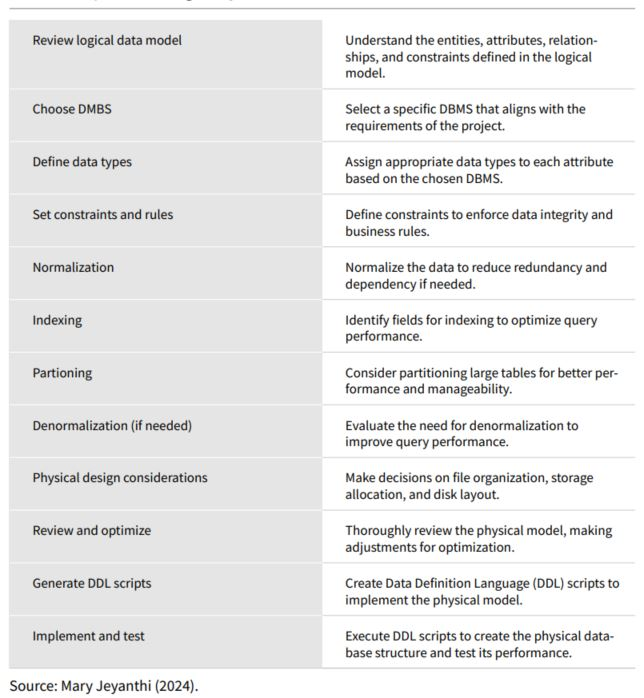

The following is an example of a physical model that can be implemented in a specific database management system.

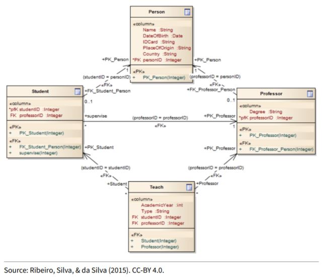

## Chapter five: Data Extraction Using SQL

SQL is a uniserval computer language used to manipulate and retrieve data in relational database manaement systems(PostgreSQL, Oracle, Snowflake etc.), each having its specifities or dialect or flavour. Through modules, libraries and compilers, SQL can be integrated in other programming languages. It is versatile tool used by data professionals and end users, in companies or organizations, to perform Create, Read, Update and Delete (CRUD) operations depending on their roles or permisions. SQL provides different keywords that can be combined to implement simple to very complex CRUD tasks. In SQL it is possible to create custom functions, stored procedures, views, indexes and roles. This makes it a powerful data manipulation and retrieval, and security control tool in the context of data management and analytics. For instance, in data analytic, SQL can be used to retrieve valuable information from interconnected data that will enable end users or managers to have a profound understanding on the performance of the business, which is essential in decision-making. Additionally, SQL offers the possibility to control the execution of transactions. SQL is the mother term that can be split into the following categories:

+ Data Definition Language (DDL): This is the component of SQL that is concerned with the structure of the database. As such it provides commands that are used to **create** *Tables, Indexes, Views and Triggers*. Howerver, it does **not modify the content** of these data structures. These commands include: **CREATE, ALTER, DROP, RENAME and TRUNCATE**. 

+ Data Manipulation language (DML):  This component is concerned with the **content** in the data structures initialised using DDL. This means that, it provides commands used to manipulate content. Manipulation could be in the form of adding new entries, updating existing entries or deleting unwanted records. The commands used include: **INSERT, UPDATE and DELETE**

+ Data Query Language (DQL): The component used for data retrieval. Useful for finding and retrieving desired records, typically based on given criteria. The command used is **SELECTE**.

+ Data Control Language (DCL): Mostly used by administrators to control access to the database and also manage concurrent requests. The commands used in this component are **GRANT and REVOKE**.

+ Transaction Control Language (TCL): Sometimes a task is implemented by combining different SQL statements from DDL, DML and DQL. Handling these statements individually can be error prone. To ensure consistency, these SQL statements can be group into what is called *Transactions* and executed altogether. This is done in this component of SQL. Commands that are used in TCL include: **COMMIT, ROLLBACK, SAVE, SAVEPOINT**.

The following image summarises the SQL components.

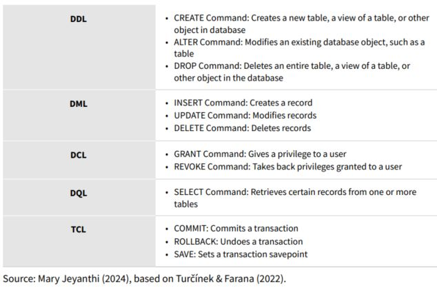

### SQL Constraints

Remember that relational databases are governed by the ACID principle which relational database management systems must adhere to. The SQL commands discussed in the later and other SQL keywords including **PRIMARY KEY, FOREIGN KEY, CHECKS* NOT NULL etc.** play a vital role in the enforcement of the ACID principles. SQL constraints ensure data consistency, validity and reliability of the system. Beside SQL constraints, it is important to know that, the data management system determines how SQL statements or queries are effectively processed. This means that in the execution process, the system can deploy *query dispatcher, optimization engines, classic query engine and SQL query engine*. In addition, a classic query engine can handle all types of query including sql queries, whereas sql query engines cannot do the same. The following image shows a simple architecture how SQL quseries are processed.

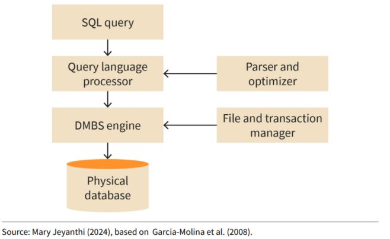

SQL processing is linked to SQL query performance. Higher performance is of utmost importance to organization especially when dealing with large amounts of data. There are 3 ways that can be used to improve sql query performance.

1. Internal tuning: In this approach, the company can create indexes on frequently search columns, optimizes buffer size and adjusting database protocol size.

2. Hardware tuning: The company can purchase better CPUs, faster storage systems or adding more main memory.

3. SQL tuning: Monitory and optimize SQL queries to improve performance. There are applications that can be used to monitor the execution of SQL queries.

### SQL Data Types

When creating objects like tables on a database, eacht attribute or column must be assigned a data type. Usually, data types are assigned based on the business requirments. Note that, data types may vary between different database management systems. SQL server provides the following six data types:

1. Exact numeric data
2. Approximate numeric data
3. Date and time
4. Character strings
5. Unicode character strings
6. Binary code
7. Miscellaneous (misc) data types

The following images show data types supported in SQL server.

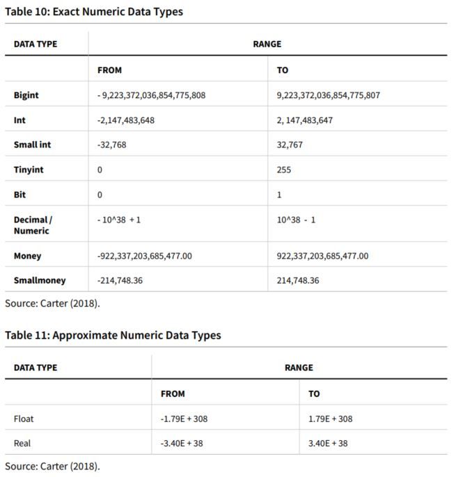

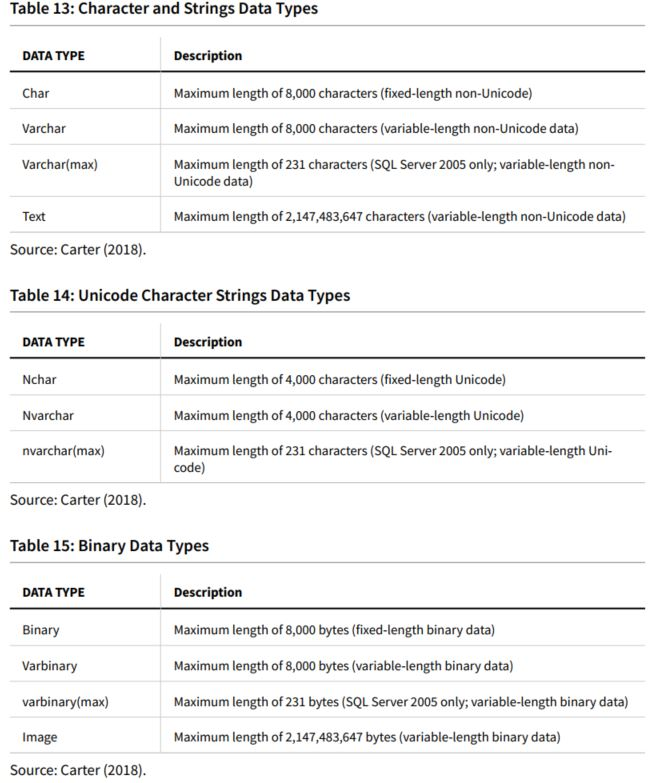

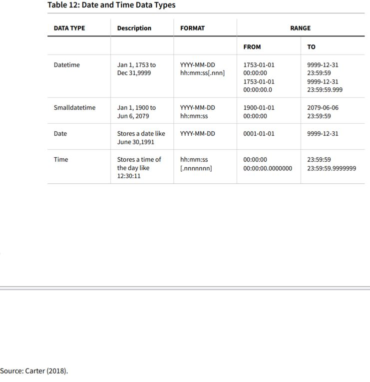

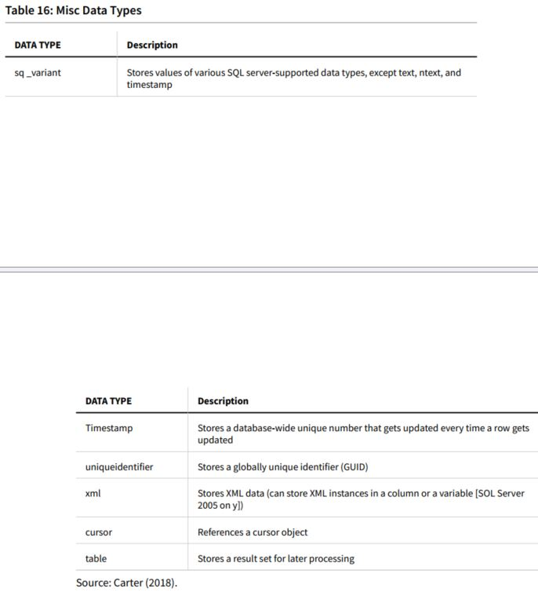

Other operators supported in SQL include arithmetic, comparison and logical. Following images show some of these operators.

Logical operators include: *ALL, AND, ANY, BETWEEN, EXISTS,IN, LIKE, NOT, OR, IS NULL, UNIQUe*. These operators are vital when *filtering* data in search queries i.e SELECT statements.

### Aggregate Functions

Aggregate functions are used to summarise data. Summarising data is a great way to reduce the amount of data being analysed and it also provides quick insights like exposing trends. Aggregate functions can be used to return single values or values by categories. When categories are involved then the data must be group by the categorical variable. The following image shows aggregate functions supported in SQL server.

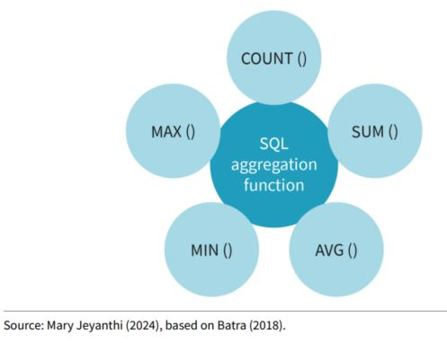

### Querying Multiple Tables

Storing denormalised data in one or few tables can cause data redundany even though it is optimal for the performance of the database. However, redundancy can lead to data storage issues. A good mechanism for handling redundant data and improve data storage in relational databases is by normalization, which often splits a table into several other tables and create relationships via *primary and foreign keys*. Using joins in SQL, it possible to query related tables created on the flight. SQL offers 4 different types of joins, which are as follows:

+ INNER JOIN: return *intersecting rows* in the tables involved in the join operations. Intersecting rows are determined by the columns used in the join operation i.e key columns.

+ LEFT JOIN: return *all rows* of the left table or first stable in the SQL statment from all the tables involved in the join operation. When there is a match in the second, third etc or right table(s), then the corresponding row will have entries. In case of no match, the right table(s) or columns of the right table(s) will have **NULL** entries.

+ RIGHT JOIN: Negate the description of LEFT JOIN.

+ FULL JOIN: It returns *all rows* of tables involved in the join operation. In its solution space, one can retrieve inner join, left join and right join results.

The following images provide a visual explanation of the different join operations using two tables. The shaded areas represent the returning rows. Note that join are not limited to two tables and could also be used with Filters(WHERE clause) and Aggregate functions including Groupings.

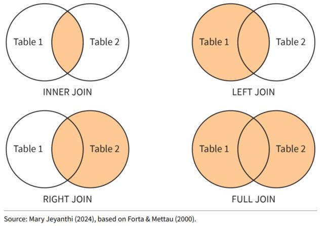

When working with a specific database management system, it is important to explore the data types it supports. This is mostly provided in the documentation. For postgresql you can visit https://www.postgresql.org/docs/current/datatype.html.

## Chapter six: NOSQL DATABASES

NoSQL stands for *Not only SQL* and are a class of databases that offer flexible schemas and scalability for efficient data storage and retrieval. These databases are of great importance especially in the advent of Big Data. Their schemaless functionality make them a great alternative to Relational databases which have a regit or fix schema. In relational databases the schema is determined during write while in NoSQL databases, the schema is determined during read.

### Motives and Characteristics

Before the introduction of the internet, cloud computing, mobile apps development and big data, relational databases hat been in existence and was the major tool for storing and retrieving data in Government and Non-Governmental organizations. These databases were primarily run on premise i.e on servers. To accomodate growing amounts of data that can as a results of business expansions or growth, these databases were developed with the ability to scale vertically. This means that, the servers receive more processors, memory and storage. Vertically scalability is a limitation of relational databases which is caused by their regid schema of storing data strickly in relations. To overcome this limitation in the advent of the internet era and big data generated at unprecidented rates from several applications including social media, NoSQL databases with a more flexible schema which supports both vertical and horizontal scalability were developed. In horizontal scalability, more servers can comfortably be added to handle large loads without performance losts. The introduction of NoSQL databases have pushed developers to think and act beyond the limitations of relational databases, and as results are expected to innovate and develop much more faster by taking advantage of the strengths of NoSQL databases. The aspect of fast development relate with the fundamentals of agile development for achieving quick gains or making quick progress which adapts to rapid changing environments.

### Importance of NoSQL Databases

This is sorrounded around the Consistency, Availability and Partition(CAP) theorem and the ability of NoSQL databases to handle semistructure and unstructured types of data as well as Big Data. For instance, Availability Partition (AP) Systems are always reachable or available even in the event of network failures. For an application built on AP, users will most likely have issues related to the service not being reachable. Additionally, there are five major evolving trends that support the use of NoSQL databases by companies nowadays. These trends are described in the following images.

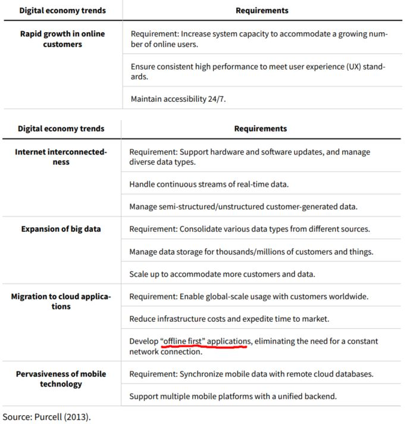

### How NoSQL Works

In NoSQL databases, data is partitioned or distributed accros multiple databases instances that are connected via a network with no shared resources. For high availability, data is replicated or redundant copies of same data are stored on one or more database instances within the same cluster of nodes. This is called inter-cluster replication. This ability is built in NoSQL databases and are automatically triggered. Automatic failovers ensures that the system stays reachable in the event of network failure. This means that the system can continue performing read and write operations even when one or more nodes in a cluster fails. In relational databases, replication is supported but often requiring a separate software. E.g in PostgreSQL replication is possible with the use of Citus. If an instance fails, the application can forward requests to active nodes. Moreover, it is possible to easilly deploy nodes of a cluster in different geographical locations or zones. This ensures that users can be served by nodes that are closest to them. The ability to replicate data and to deploy nodes flexibly in different locations improves the reliability of the system and increases performance. Because of these aspects i.e flexible schema, horizontal scalability, handling big semi and/or unstructured data, replication/partitioning and increased performance, there is a growing shift from relational to NoSQL databases by startups to large companies, espcially those active in the digital space. NoSqL forster agile development. The following image shows how replication looks like in NoSQL applications.  

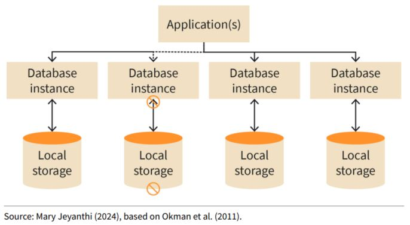

### Benefits of NoSQL Databases

There are several benefits that comes when working with NoSQL databases. A few a described as follows:

+ *Schema independence*: In NoSQL developers do not need to develop a data model before they start loading data in them. This is why they are schemaless or have flexible schemas. This means that data, semi-structured or unstructured, can be stored without being concerned how the database operates internally. It is only during retrieval that developers or users must know how and what data they want to retrieve. Data retrieval depends on the NoSQL database being used. On the other hand, relational database stores data in relations/tables. This means that a data model, where data will be stored, must be physically implemented before data in loaded in them. The schema in NoSQL is infered during read operations while in relational databases it is infered during write operations. 

+ *Scalability*: NoSQL databases support horizontal scaling which allows computional resources to be flexibly and easilly added or removed based on workloa. Horizontal scalability is cost efficient and unlimited as opposed to vertical scalability where at some point it becomes inpracticable to increase processing power, memory or storage. 

+ *Performance*: Throgh replication, and efficient data storage and processing frameworks, user requests can be fulfilled by nodes closest to them. Automatical failover capabilities of NoSQL systems guarantees the reliability of the system. Overal system reliability and availability increase system performance.

+ *High availability*: Through scalability as a data distributive capability and for availability tolerance systems as described by the CAP theory, NoSQL databases are highly available even in the event of partial network failure.

+ *Global availability*: Nodes can be easilly be deployed in different geographycal regions or zones. This ensures that users in particular regions are served by nodes closest to them, reducing latency.

+ *Flexible data modeling*: NoSQL Databases allow developers to use data types that are most suitable to the application use case. This is because each class of NoSQL database is built for a particular sets of problems. This flexibility promotes agile product development.

### Classes of NoSQL Databasess

There are four classes of NoSQL databases, each with its particular strengths. These four categories are shown in the following image.

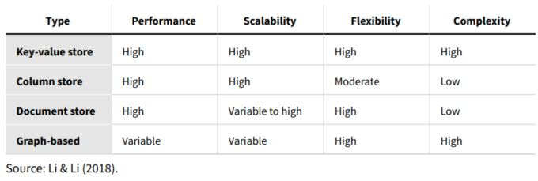

### Key-Value Store and Modeling

Key-value store, key-value model or key-value databases are used interchangebly to refere to a category of NoSQL databases that employ an associated array, like maps or python dictionary, internally for the storage of data. Data is stored as *key-value* pairs where a unique key is associated to only one value. A Key can be any unique identifier like *filename, Uniform Resource Identifier or a hash value* while a value, which is the desired content being stored, can be an image, link, string, number or any other complex entity linked to a key stored in a database. Keys are used to directly retrieve values while values can be stored on blob, which eliminates the need for indexing. In general, key-value stores lack a query language but offer functions like *push, get, and delete* to perform CRUD operations i.e store, retrieve and update, typically via APIs. They can support both vertical and horizontal scalability. Vertical scalability can be achieved by avoiding locks, latches and low-overhead server call. This will enable these databases to be kept in RAM and minimize the effect of the ACID principles ensures the persistent storage of data. Horizontal scalability is achieved via partitioning, replication and auto-recovery. This allows the system to handle large amounts of data with little response time(low latency) i.e without significant performance lose, and ensuring system reliability.For these reasons Key-Value stores are suitable in e-commerce platforms.

Key-Value models do not support joins or complex queries. However, the data stored in key-values could have relationships. As a result, it important for developers to consider relationships and how they can be implemented when storing data in key-value models. A straigth forward approach is to use denormalization where related data  are stored together as key-value pairs or on separate key-value stores. Alternatively, a hybrid approach, where data is stored on both key-value database and ralational database. Thus maximizing the potentials of both DBMS. As already mentioned, key-value databases can store data of different types including text, images, json etc. Thus they can handle both semi-structured and unstructured data types due to their flexibility regarding schemas. *KVMod* is a model-driven approach (MDA) specifically used for modelling data in Key-Value databases. Related to this is a *KVDesign* which is a tool developed for automating the modeling process in key-value stores. KVMod is also a *software development methodology* based on the use of models and model transformations. It separates the business logic or functionalities of an application from the technical implementations using a platform-independent model(PIM). The business logic is modeled using *computation independent model (CIM)* while the technicalities are modeled using *Platform specific model (PSM)*. These 3 levels of abstraction are similar to the modeling procedure discussed in relational databases. At each level of the modeling process, KVMod uses metamodels and leverages a series of model transformations to move from one model to the other. This approach aims at conceptualising the model and provide a query which automatically generates a logical and physical model for key-value systems via a series of mapping rules. In addition to the entities and relationships conceptualised, it is important to understand how entities are handled in run time. This can be modeled using *platform independent data metamodel (pidm)* and *key-value logical metamodel(kvlm)*. The following images illustrate *KVMod Trasformation process* and a *Key-Value Logical Metamodel* respectively.

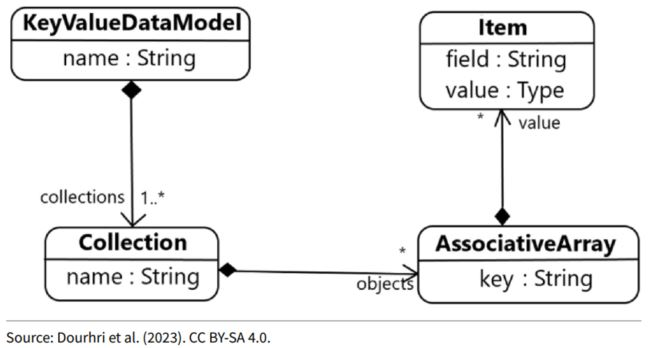

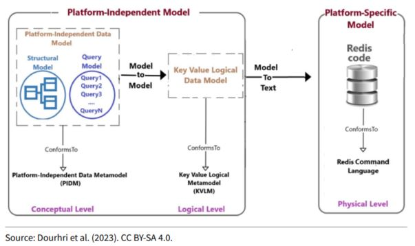

1. *Creation of a conceptual data model, which conforms to the PIDM*: It uses a UML-Like syntax to define entities, attributes and relationships and a SQL-Like syntax for queries. This enables the integration of data structures and access queries.

2. *Transformation into a Key-Value logical data model, which conforms to the KVLM*: Hier the PIDM is translated into an intermediate meta-model that is specific to key-value databases. For each access request, collections are created containing fields according to the requirements of the queries.

3. *Optimization by merging collections*: Similar collections are merged to avoid redundancy and improve efficiency.

4. *Model-to-text transformation*: For the physical implementation specific to key-value like Redis, the KVLM is tranformed to the required code. The transformation contains the definition of data structures and indexes in the target language of the DBMS.

#### Data Aggregation in key-value stores

Given that data is stored as a collection of key-value pairs recording every pair of related entries where the key is a unique idenfier of a particular value, it becomes challenging to effectively aggregate values like in relational databases. Howerver, there are seveal techniques that can be used to aggregate values in key-value databases. To illustrate data aggregation in key-value stores, key-value store called **Redis** will be used.

#### Redis

Redis is an in-memory and highly distributed key-value store widely used for data aggregation. Its simple and flexible data model makes it easy to store and manipulate data. The key-value pairs of data can be accessed via the key which is always a string. The values can take different data types like numbers, strings, hash, sets, list and ordered sets etc. Operations like adding, updating, retrieving, deleting can be performed using functions provided by Redis. Due to its high performance and scalability, it is used in for the development of real-time applications, caching, messaging and session management. Other features provided by Redis support multiple data structures, atomic operations, persistence options and cluster support. Also APIs and Client Libraries are available to ease integration with a variety of programming languages and frameworks. In an ordered set, each key is associated with a floating point which is a score used by Redis to sort all the elements of the set. Keys with same score are sorted lexically. For more complex operations requiring joins, it is advisable to use relational databases. However, Redis provides aggregate functions that can be used to calculate simple summaries like sum, average, mean etc. Before peforming aggregations, data must first be queried. Redis provides the following functions, that can be used to aggregate data after querying.

- ZRANGEBYSCORE: Retrieves a set of values, based on their score, from a sorted set.
- ZUNIONSTORE: Takes multiple sorted sets and perform a union operation then store results on another sorted set.
- ZINTERSTORE: Takes multiple sorted sets and performs an intersection between them, then store results in another sorted set. 
- SMEMBERS: Retrieve all members in a set.
- SINTER: Performs an intersection operation on multiple sets
- SUNION: Performs a union operation on multiple sets.
- SCARD: Returns the number of elements in a set

For complex aggregations, Redis can use Redis pipelines or Lua Scripting. In Redis pipelines, the data to be aggregated must first be queried, filtered then passed to an aggregation function. Filtering may consist of several transformations commands like grouping and reducing, sorting, limiting etc. To retrieve or extract data from stored in Redis, the following functions can be used:

- GET
- MGET
- HGET
- HMGET
- LRANGE
- SMEMBERS
- ZRANGE

#### Drawbacks of Redis Data Modeling

- Provides limited support for complex data structures like sets and ordered sets
- Complex aggregations requiring joins must be done out of Redis increase work overhead
- As an in-memory database it stores data in RAM which is optimal for data retrieval but storing large amounts of data above available memory becomes a challenge.
- When persisting data in disk, data could be lost if system fails before data is persisted. This can occur when data to be stored is high.
- As compared to other NoSQL databases like Cassnadra and MongoDB, its scalability or sharding feature is not optimal.

### Example of Key-Value databases

+ Amazon Dynamo DB: Most used and trusted key-value database with high number of users. Besides being capable of handling high number of requests on a daily, it also provides a variety of security options.
+ Couchbase: Supports SQL-like querying and text searching.
+ Riak: Prefered database for creating applications
+ Aerospike: Open source and real-time db that handles billions of exchanges
+ Berkeley DB: High performance open source DB with scalability.

### Amazon Dynamo DB

This is a key-value store is a database that leverages consistent performance irrespective of the scale. It is a fully managed multi-region, multi-master database that provides built-in security, backup and restore features, in-memory caching, and reliable single-digit milisecond latency. Through distributed storage and processing, DynamoDB can handle huge volumes of Data including updates.  Although, there is no restriction in the number of items, attributes or number of items including all its attributes, the total size of an item cannot exceed 400 KB. In DynamoDB, items consist of a primary or composite key and a variable number of attributes. A table in DynamoDB is a collection of items which is similar to a collection of rows in relational databases. There are no limitations in the number of rows that can be stored in a table.

+ *Advantages of Key-Value Stores*
    - Support different data types e.g strings, numbers, images etc.
    - Support vertical and horizontal scalability which provides high throughput.
    - Low latency improves system reliability.

+ *Disadvantages of Key-Value Stores*
    - Does not have a query language.
    - Values can only be retrieved via keys.
    - Queries cannot be transfered between databases.

### Document Stores

Document oriented Databases are also called Document stores, Document databases or aggregated databases. They store collections of documents where each entity, with its associated data, is stored within a document. Thus, documents are central to documents databases. It is assumed that documents encode encapsulated information into a standard format. Observed formats in practice include: JSON, XML, YAML or BJSON. Documents can be understood as objects. These data strucures allow data to be stored hierarchically or in nested form. Theire flexible structure allows slots, parts, sections and keys to be switched around.The fields in a document store are optional but can take various types of documents. Their flexibility make them robust which is essential in big data environments. However, flexible schema pose a challenge in enforcing rules as oppose to relational databases. The following images illustrate the structure of a document store.

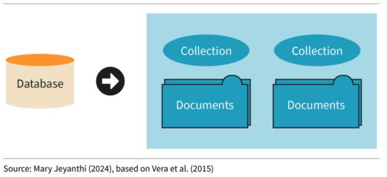

Document databases have two main characteristics that set them apart. These are:

1. Flexible: The data structures used for data storage don't impose a fix schema and exhibit object oriented properties as each document can be understood as an object. Moreover, these data structures are used by object oriented programming languages. This means that, dvelopers can *intuitively* map documents to objects. These data structures are typically light weight and language independent. Thus making them ideal for data transmition and storage data without conflicts. Documents can store data in various formats including: *key-value, tables, timeseries, geospatial etc*. Some documents databases, however, allow schema validation or schema lockdown. Their flexibiliy is ideal for developers as it supports agile product development since developers must not develop a sophisticated data schema or model before they can start product development. This avoids data normalization which often lead to complex joins during data aggregation or retrieval. Thus making them adaptable to changes in development. 
2. Scalability: Horizontal scalability, in particular, allow document databases to support high read and write operations without performance lose. Additionally, horizontal scalability is cost efficient as opposed to vertical scalability in relational databases. This is because, horizontal scalability, nodes can be added and removed based on work load.

The following properties or features of Document stores make them preferable over relational datbases in some use cases.
- Flexibility: Flexible data structures like JSON, BJSON etc. can store in nested or hierachical form. The flexilibilty of the data structures allow parts or sections of the data fields to be moved around without the need to change the data model unlike in relational databases.
- scalability: Aggregated databases support horizontal scalability. This means that data can be stored and processed in parallel. As a results, high read and write operations can be executed, which is important in big data context.
- Performance: Their flexibility and scalability make them robust. This means that read and write operations can be processed without lost in perfomance.

### Data Aggregation in Document Stores

In Document databases, data stored in its data structured are transformed and aggregated based on the aggregation framework provided or supported by the database management system. By leveraging the aggregation framework, data can be prepared for analysis(e.g dashboard or reports) by transorming and aggregating stored data via several stages that can be linked together to form a pipeline. Each stage in the tranformation or aggregation process performs particular task, and the output of one stage is used as the input of the next or another stage. The different stages could include the following:#
+ Match: filters data based on given criteria
+ Project: Reshapes the data by excluding or including unwanted fields or by adding calculated fields
+ Group: Aggregates data by specific fields(e.g keys) then summarise the data. Often leads to data reduction.
+ Sort: Output is sorted based on given fields.
+ Limit: This stage limits the number of douments to be returned.
+ Facets: Several results are returned by groups or catagories involved in the *group stage*

### Data Extraction in Document Stores

Document databases often provide a query language or API which is used to first of all query documents based on given criteria then retrieving the data stored in their data structures. This is how data is extracted. After data extraction, further data processing steps can be leveraged. The following approaches are commonly used for querying document databases.

+ Querying by key: Documents are retrieved based on specific keys or given set of keys.
+ Querying by value: Documents are retrieved by values that match specific values of a given fields or sets of fields.
+ Querying by range: Documents that fall within or outside a given range are retrieved. Suitable for date or datatime fields.
+ Full text search: Documenent containing exact matches of text values in a field or sets of given fields are retrieved.
+ Aggregation: Development of data pipeline as discussed in the later.

It is possible to extract and analyse data from document databases using connectors provided by Business Intelligence Tools. The connectors in BI tools simplify data extraction which significantly reduces the time for developing complex data aggregation pipelines using aggregators provided by document database management systems. Additionally, BI tools provide data visualization features. Thus simplifyign the entire data analysis process from data extraction. Some connectors allow data to be retrieved using SQL-like approach. For instance, power bi provides a BI connector for MongoDB. This connection can be established via *Java Database Connectivity (JDBC) or Open Database Connectivity (ODBC)* drivers, allowing data to be retrieved in a structured way. The following image shows a structural illustration of the connection.

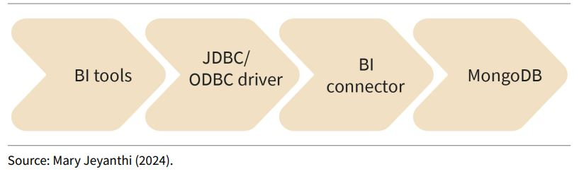

### MongoDB

This is a data aggregation database that offers a flexible data model for storing and retrieving data. Data is stored as documents where every document can be structured differently. This means that each document can have its own set of fields and values. It provides a handful of aggregation functions or operations that can be used to develop data transformation and aggregation pipelines to support data analysis. The stages described in the later are supported in MongoDB.

The following code determines the average price of products in every product category.

db.products.aggregate([
{ $group: { _id: null, avgPrice: { $avg: “$price” } } }
])

### Drawbacks of MongoDB Data Modeling

+ MongoDB is not ACID compliant. Thus does not guarantee data consistency and integrity espcially when dealing high number of write operations.
+ Its flexible schema which can store data in different formats like in hierarchies or list, increases the complexity for deriving a reasonable data model in the event of data migration to relational databases.
+ MongoDB does not support join operations which in some cases can reduce the ability to draw meaningful insights from the data because of the difficulty in establishing relationships between documents.
+ MongoDB heavily leavarges indexing for optimized data querying. However, indexes are data structures that require updates when data changes and they also consume a considerable amount of disc space.
+ The opon source version provide limited functionalities and support. Enterprise and premium features are costly.

### Column Family Stores

In wide column stores, data is stored vertically instead of horizontally like in relational databases. This arrangement enables the efficient storage and retrieval of data. Since data is stored in columns, this allows data compression as data in a column are of same data type. Columns with no entries or only null values are not stored, improving data storage as opposed to row based data storage in relational databases where columns in a table must have the same number of entries, irrespective whether the rows are empty or not. Additionally, data stored in columns can be efficiently stored in disk as each column can be stored in the same location as opposed to relational databases where values of a column are spread accross several locations on disk. This possibility to aggregate data into column families is optimal in distributing computing as data in a column family can be stored in a single node. Thus improving data retrieval. Column family stores consist of schemaless *key spaces*, similar to schemas in relational databases, that contain information about the structure and organization of data in the column store database. Within key spaces, there can exist several *column families*. Column families are a collection of columns, typically those that are frequently queried together, that a logically stored together. A column family should be considered as a table like in relational databases. Since data is stored in columns in wide column stores, every row must not have the same number of columns or entries. Key spaces and column families must have their identifiers. Similarly, the first column in a column family is a *row key*. Row keys are like primary keys in a relational model. To track changes made on column entries, there exist a timestamp column key. Despite the fact that they are efficient in data storage, scalability and data retrieval, they are not suitable for online transaction systems. Rather, they are suitable for analytical systems. Column keys are the column names which are used to query entire columns. The following images demonstrate how data is stored in wide column stores.

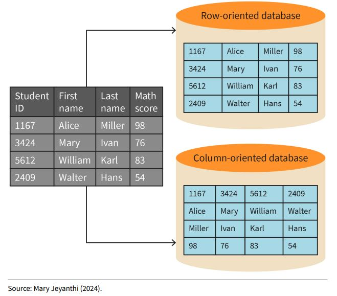

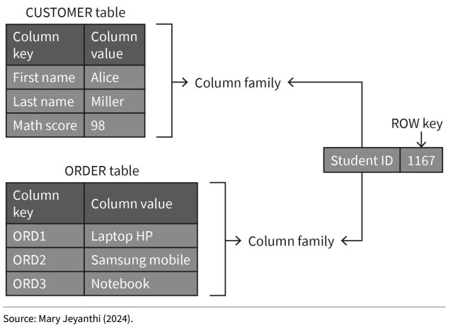

#### Data Aggregation in the context of Apache Cassandra

An example of Wide Column Store NoSQL database that structures data as key spaces -> Column families -> Row keys and Column keys is Apache Cassandra. This database is scalable and optimal for data storage and retrieval. It provides a query language called Cassandra Query Language (CQL). This language is similar to SQL and suitable for performing complex queries like filtering, aggregating, sorting etc. Some aggregation operations commonly used in Apache Cassandra include:

+ Batch Operations: Allows the execution of multiple updates, inserts or delete operations in a single batch.

+ Counters: Allow values in columns to be increased or decreased.

+ Secondary Indexes: Allows creation of indexes to speed up queries

+ Aggregation functions: Allows data to be summarised. E.g functions include avg, sum, mean, min, max etc.

+ Materialized views: Alows creation of denormalised views which are optimal for specific use cases.

+ Time-to-Live: Allows columns to be deleted after a given time period

#### Data Extraction in the context of Apache Cassandra

Data can be retrieved in Cassandra via several approaches including the following:

1. CQL Queries: Cassandra support CRUD operations that can be implemented using CQL. When retrieving data, the column family name, column keys and filter criterias are specified.

2. Bulk Loading: Through its *COPY* feature, data can be loaded q<uickly from *csv* files to a table in Apache Cassandra. Other third party tools like Apache Spark and DataStax Bulk Loader can also be used to for bulk loads.

3. Exporting to csv: The COPY feature also allows data to be exported from a table to a csv file. This is useful for creating data backups or for performing data analysis on the exported data.

4. Apache Spark: This is a distributed data processing framework that can be integrated to cassandra for data extraction. It provides APIs that can be used to connect to data tables and retrieve data. It supports complex data processing and transformations like data aggregations, machine learning and graph analysis.

5. Secondary Indexes: These can be created on non key columns and used to optimize query performance.

#### Drawback of Data Modeling in Apache Cassandra

+ Does not support ACID priciple
+ Does not support subqueries and joins
+ The maximum column value in the database is 2GB and the maximum column familiy size is 64GB.
+ Lacks detail documentation. As such users must look for solutions/explanations via third parties.

### Graph Databases

The Entity-Attribute-Value model is the foundation of graph databases. In a graph model, *nodes* represent entities while *edges* represent relationships. Nodes store all information about an entity while edges store the relationship type. The edges can be *directional or undirectional*, and there is no restriction on the number of relationships an entity is allowed to have. A Relationship must have a name and could represent different types of relationships like parent-child, is-friend-of etc. Graph databases can handle structured, semi-structured and unstructured data, and any kind of relationships. Since nodes and edges are stored in graph databases, this leverages high query performance as compared to relational database where complex joins may impact the system negatively. Through edges, it is possible to traverse or navigate the graphs. This is particularly important in analytical scenarios. Graph databases are mostly used in developing social networks(e.g X, Meta etc.), recommendation systems, and fraud detection systems. This is because relationships and near real-time analysis of large amounts of data are of particular interest in these systems. Addtionally, graph databases are flexible and scalable making highly adatable(e.g incorporating new relationships) and cost effective, respectively. *semantic graph models* are a specific type of NoSQL databases that leverage *Resource Description Framework (RDF)* triplestore to integrate data from multiple sources, establish relationships between entities and extract insights. Semantic graph models can be used for knowledge discovery in existing as well as new data. The following image illustrate a graph database model.

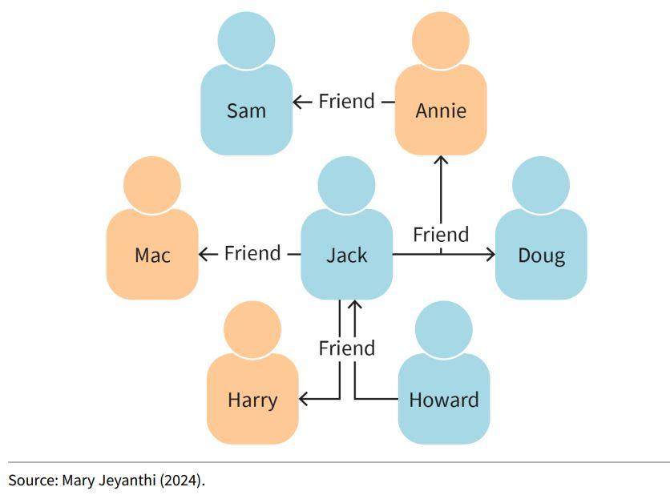

#### How Graph databases work

They are straight forward as shown in the image above. The two main components of a graph database are:

1. Nodes: They store entities and their properties.
2. Edges: Store relationships which can be birectional, unidirectional or undirectional. The number of relationships that can be modelled is limitness.

#### Example of Graph Databases

Graph databases are the least used in the class of NoSQL databases. However, some of them are being widely used in production systems. Examples of these include:

1. **Neo4j**
- Most used graph database developed in jave
- Efficient for fraud detection and center data management
- It is open source
- Cypher is its language similar to DQL in SQL but tailored for graphs
- Support other languages like python, java, javascript and .NEET

2. **RedisGraph**
- Graph is a modul in Redis (a key-value NoSQL store).
- High performance as data is stored in-memory or directly on the RAM.
- Support indexing which enhances query performance.
- Cypher is the query language
- Prefered by programmers and data scientist due to its flexibility.
- Used in cases requiring high performance

3. **OrientDB**
- It is multi-model database that supports graphs, document, key-value and object oriented model.
- Developed in Java and is open source.
- Suitable for use cases with multiple data models
- Ensures data consistency and reduces the complexity in handling data from different data models
- Does not support Cypher.

#### Data Modelling in Neo4j

In graph data modelling, nodes and edges are used. Nodes store entities or objects with their proporties or attributes while edges model relationships which are connections between the nodes. The model is in a form of a network allowing navigation through the edges. For this reason graph databases are optimized for querying and are suitable for applications that require complex joins and analsis. Modelling in Neo4j involves defining a graph schema that specifies entities, relationships, properties as well as constraints and validation rules.

The following steps are involved in graph Neo4j graph data modelling:

1. Identify entities and relationships: Examine the domain to understand relationships. Based on the understanding of the scope, identify entities, relationships and how the entities are related.
2. Define node labels: Nodes of the same type should be labeled. This facilitates the application of constraints to specific labels.
3. Define relationship types: Relationships can also be labeled to ease the implementation of constraints and validation rules.
4. Define properties: These are key-value pairs that can be used to store extra information about the nodes or relationships. These properties can also be used in queries and analysis.
5. Define Indexes: Index improve query performance which ensures that entities or relationships can be searched efficiently using propoerties.
6. Model Cardinality: Cardinalities define the number of relationships between nodes. one-to-one, one-to-many and many-to-many are acceptable cardinalities in Neo4j.
7. Model Inheritance: Nodes can inherit properties and constraints from other nodes. This is optimal in the context of reuseability.

#### Aggregation of Data in Neo4j

Cypher query language provides several functions that can be used to aggregate and summarise data based on certain criteria. Aggregation can be done on nodes, relationships, groups of nodes or relationships. Some of these functions include:

+ COUNT: Returns the number of items in a collection or the number of distinct values in a property.
+ SUM: Returns the sum of a collection or property values
+ AVG: Returns the average value of a collection or property values
+ MIN: Returns the minimum value of a collection or property values
+ MAX: Returns the maximum value of a collection or property values

To perform aggregation, the *MATCH* clause is used to specify nodes or edges of interest while in the *RETRUN* clause, the aggregation function is specified and results of the calculation are retrieved. In the *WHERE* clause, data is filtered before aggregation is performed.

#### Data Extraction in Neo4j

In Neo4j data can be retrieved from the graph data model using Cypher, Neo4j browser, Neo4j drivers or APIs. However, Cypher is the most common used language and it allows users to retrieve data by specifying criteria corresponding to specific nodes or relationships. This declarative language has a simple syntax similar to SQL and its queries are executable on Neo4j browser, Neo4j drivers and APIs. The retrieved data can be used for visualizations, reporting and other data analytics tasks. The following are some of the Clauses or Keywords used in Neo4j for data extraction.

+ MATCH: clause used to find nodes or edges that match a certain pattern
+ WHERE: clause used to filter data based on certain criteria
+ RETURN: claused used to specify the aggregation function which determines the data that should be returned.
+ ORDER BY: clause used to Sort data based on certain criteria
+ LIMIT: clause used to limit the result to be returned by the query
+ WITH: clause used to chain multiple queries together and pass data between them.

#### Drawbacks of Neo4j

Developing a graph data model is not trivial because of aspects that include the following.

1. Requires detailed understanding of graph theories and graph databases
2. Scalability is not fully exploited if the use case is not suitable for graph databases
3. Query performance can be affected by large number of nodes or relationships being queried
4. It is a commercial tool which requires licensing. Thus may not be affordable for small businesses
5. Data consistency and integrity is not guaranteed as in relational databases.

#### Graph Structure

Beside knowing the different graph databases and models (e.g RDF) it is crucial to understand certain aspects of graphs such as *shapes, characteristics and density*.

+ **Graph Shapes**

Shapes have 3 propertie, namely;

1. Random: Every node has the same chance of being connected to another.
2. Small-World: A graph may contain several cluster with high degrees. Thus, reducing the average short path within the graph.
3. Scale-free: An entity is allowed to have as many relationships as possible.

+ **Graph Characteristics**

The following are the 4 main properties of a graph: **connected & disconnected, directional & undirectional, weighted & unweighted, tree & spanning tree**.
These properties are explained in the following image.

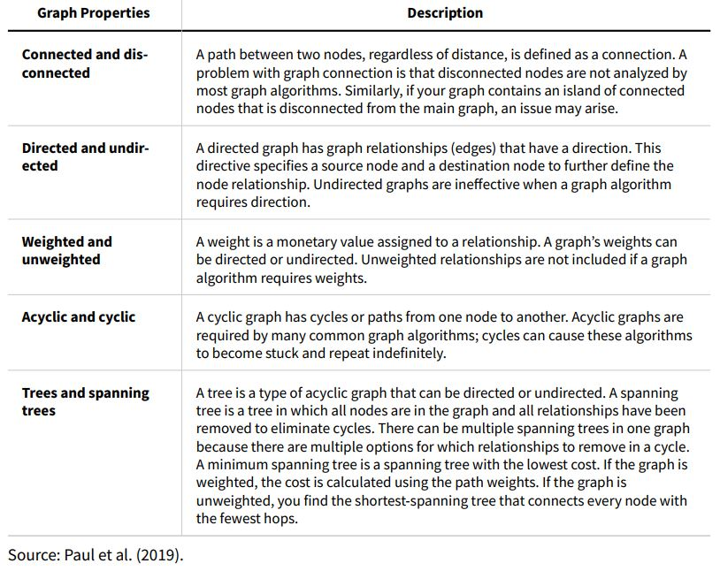

+ **Graph Densitiy**

The key take aways here are the calculations for *maximum density and actual density* as well as the difference between densed and sparsed graphs. A densed graph is results when there are several edges and a sparse graph results when there are few edges in the graph. Maximum density occurs when every node has edges to every other node in the graph.

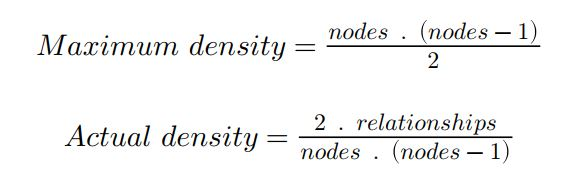

#### Benefits of Graph Databases

## Chapter 8: Data Reporting

Data reporting is the process of collecting, analysing and present information in a structural format to leverage insight that support decision making. Data reporting enables stakeholders like executives, managers and analyts to understand trends, identify patterns and monitor key performance indicators to support decision making. For this reason data reporting should be performed on *accurate, complete and current data* to ensure concise decision making. Data reporting can be done in form of *dashboards, reports, charts and other visualizations*. Data reporting is an important component in data analysis and plays a vital role in planning, performance evaluation and decision making in many fields including *business, health, education, and scientific research*. Data reporters require both technical and communication skills to collect data from different sources, analyse and communicate insights to the right audience(e.g managers, employees of a department, investors, customers etc). A data warehouse is a central repository for storing structural data. The stored data is topic oriented, integrated, time variant, durable and aggregated/summarised. Thus it can serve as a single source of truth for data validation and verification during data reporting. Business Intelligence tools can be used to access data in a data warehouse for data reporting. According to 

### Categories of Reporting

According to Sharda et al.(2014) there is a variety of data reporting categories which include:

1. Information reporting: This type of reporting aims at educating stakeholders about the organization as it provides general information about the organization such as its history, mission, vision and its activities.

2. Operational reporting: Provide information about day-to-day business operations that include sales figures, production statistics, customer interaction etc. This type of reporting aims at monitoring and controling business operations and to identify areas that need improvement.

3. Project and Progress reporting: This tracks the progress and performance of specific projects or initiatives. The information typically tracked include project's goal, timeline, budget, milestones as well as challenges that arise.

4. Analytical reporting: Aims at providing insights on the performance of the business by analysing data and spotting trends. In most cases, data being analysed is collected from different sources like financial systems, sales systems, marketing data etc, and stored in a consolidated in a central repository called a data warehouse. Data in the data warehouse can then be retrieved and analysed to generated insights with BI tools.

5. Statuary reporting: It aims at creating transparency in the maintenance of compliance regulations and legal requirements by stakeholders. This type of reporting takes into account financial statements, tax and other regulatory filings.

6. Strategic reporting: Aims are communicating an organization's long-term vision, goals and objective based on information from market trends, strategic positioning and market competitors.

7. Internal and External reporting: Internal reporting focuses on communicating information within an organization based on financial reports, project updates and perfomance metrics. On the other hand, external reporting focuses on communicating information to external actors like investors, customers and regulatory agencies.

### Application Areas of Data Reporting

Data reporting is essential as it allows executives, managers and analyst to evaluate the status of business units or enterprise. Data reporting find uses cases in several domains including the following:

1. Market and Product Analysis: Managers can use data reports to support their decisions on the introduction of a new product or service in the market. Market analysis reports can also be used to support strategic decisions regarding the opening of new branches in other locations(e.g city, country or region). 

2. Customer Analytics: This type of analysis focuses on customer purchasing behaviour and demographics. Through this analysis companies can understand customer needs and determine the likelihood that a customer or group of customer will purchase a product or subscribe for a service

3. Financial Reporting: This type of analysis is used to determine the financial status of the company. Date reporting is performed on data from accounting and controlling systems and often include financial statements, balance sheet and cash flow.

4. Research Reporting: The aim of this type of reporting is to answer a predefined research question based on data collected from a series of measurement readings. The purpose of the analysis of the data is to arrive at a new finding that will enable researchers to answer the research question. This kind of analysis is typically performed in science, and research & development institutions.

5. Performance Monitoring: This kind of analysis evaluate and presents the performance of business operations in different functional areas of the company.

### Reporting Tools

According to (Greenacre,2016), data reporting is the process whereby companies organize and analyze data to make critical strategic decisions.To do data reporting is strongly recommended to have good communication skills and familarise yourself with reporting tools that can enable you to gather business data, analyse and present this to your audience in a structured and understandable format via graphs and visuals. For instance a Customer Relationship Management (CRM) analyst may use marketing reporting tools to gather and analyze data, based on the company's key performance indicators, from various sources that include e-commerce platforms, social media channels, email accounts and websites. Performance management tools are similar to Business Intelligence tool, however, they differ in their capacity to establish key performance indicators found in the company's data. For the selection of a business intelligence or data reporting tool for your business, it is important to consider the following factors:

* The size and complexity of your data.
* The data sources
* Your reporting requirements e.g real time or interval analytics
* Your budget
* etc.

In addition to the factors in the latter, it is strongly recommended to consider the features of the business intelligence or data reporting tools as well because the reporting tool should be able to meetup to the reporting requirements. The following image illustrate the key features to consider about the data reporting tool.

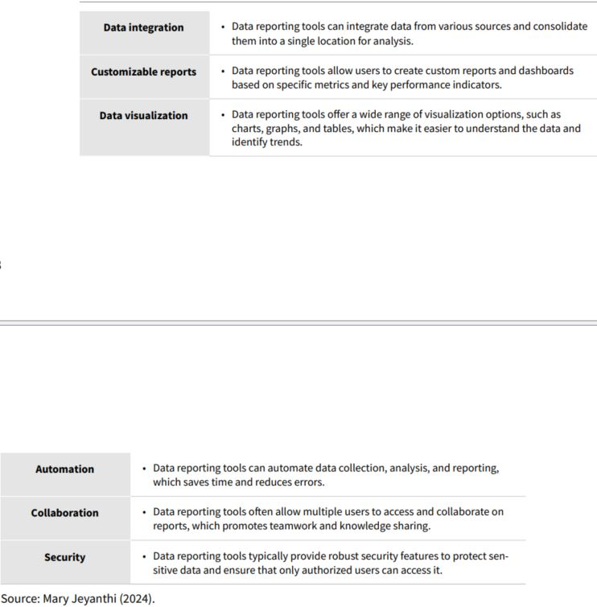

Some widely used business intelligence or data reporting tools include: *microstrategy, Tableau, Microsoft Power BI, Google Data Studio, SAP Crystal Reports, SAS Visual Analytics, QlikView, Looker, Salesforce Reporting, IBM Cognos Analytics, Pentaho, Whatagraph, Reportei, Hive, Wrike, Proworkflow, ThoughtSpot, Zoho Analytics*. The listed tools is not exhaustive.

### Layout and Format

Though *layout* and *format* are used interchangeably when visually presenting data using a reporting tool, they have different meanings in the context of data reporting.

+ Layout: This is the general arrangement of elements in a report. Elements here include, charts, graphs, cards, tables etc. Data reporting tools often provide features for page orientation, margin and column widths adjustments, alignment options etc. These features can be used to organize elements within a report or bi tool canvas. A well organized layout increases visibility making it easier for users to navigate the report.

+ Format: This refers to the way individual data points appear within the report. Font & Style, colors, highlights & shading, interactivity, conditional formating etc are all part of formating. Good formating enables users to quickly spot trends and changes in the report.

The following are examples of commong layouts and formats:

1. Table: It is used to present numerical data in a structured form i.e column and rows. This allows data points to be easilly compared. Example of numerical data are: sales figures, survey results etc.
2. Matrix: ...
3. Chart and Graph: Used to visually present data to facilitate the identification of trends, patterns and outliers. Frequently used charts include bar charts, column charts, area charts, pie charts, line and scatter plots.
4. Dashboard: A graphical representation of KPIs and Metrics that reflex a snapshot of a company's or project's status. They are built by a combination of charts & graphs, tables and other visual elements. The following are types of dashboards observed in practice.
    - Sales Dashboard: This dashboard is used to track sales performance, revenue and other sales related KPIs. Specifically, sales volum, number of sales transactions, number of new users, customer demographics etc. may be displayed.
    - Marketing Dashboard: This is used to track marketing performance and the effectiveness of marketing campaignes. For a marketing campaigne, the following data can be displayed: number of generated leads, cost per lead, conversion rate of generated leads, return of investment (ROI) of the campaign.
    - Finance Dashaboard: This is used to track the financial performance of the company. This could include account receivables, account payables, cashflow, collection etc. In account receivables, data that can be displayed include Days Sales Outstanding (DSO), Average Days Delinquent (ADD), Best Days Sales Outstanding (BDSO), number of successfull payments, number of successfull collections etc.
5. Infographics: This layout approach is used to present complex data in a more engaging and memorable form. Icons, illustrations and other design elements are used to ease comprehension of the content being presented. The following are types of infographics.
    - Timeline: used to visualise progression over time. E.g The evolution or history of a company or progress of a project, over time, with key instances can be visualized.
    - Comparison infographics: Used to compare two or more things side-by-side. E.g compareing features of different products or benefits of different services.
6. Texttual Reports: Used in Research and Academia, they are used to provide detail explanations and recommendations based on insights from data analysis.
7. Business Reports: Provide detailed information about business operations based on financial figures, sales figures etc. Also used to provide recommendations on potential future improvements. 
8. Research Reports: Used to present the result of research finding including data analysis, methodology and conclusions.

### Automated Data Reporting

Automated reporting, a management tool, is the use of software and reporting tools to generate reports automatically without the need for manaul intervention. During automation the process of collecting & transforming data, analysing and presenting insights in an understandable format is covered. This tool creates and shares reports to different stakeholders periodically without the need for manual work. In the case of data warehousing, the ETL process is automated. This means that data, from a variety of sources, is automatically extracted, transformed and loaded into a core data warehouse for analysis purpose. Based on the data in the core data warehouse, reports can then be generated either via reporting tools that access the data or by producing generated reports as files. These reports can be shared with stakeholders via emails, webs or self-service. Automated reports can equally be used to track financial performance, customer behavior, monitor KPIs and measure performance, at regular time intervals, and identify patterns and trends. As the volume of generated data keeps increasing, leveraging automated reports is a great way for companies to increase productivity, reduce or eliminate manual work while still analysing their data to make informed decisions. 

### SQL Reporting

This is data reporting that is done by using SQL to query a database and build reports on the results of the queries. SQL reporting tools such as SQL Server Reporting Services (SSRS), Oracle Reports and Crystal Reports are used to create, manage and share reports. You may explore SQL Server Reporting Services.

## Chapter 9: Online Transactional Processing(OLTP)

OLTP is a form of *data processing* designed for transactional applications like banking systems(e.g online banking, ATMS etc),order processing in e-comerce etc to enable them to *process their transactions almost instantaneously or near real-time*. Trasaction processing applications also known as *online transaction processing systems (OLTPS)* usually process their transactions in a centralised systems. They posses the capability of reliably handling a high number of concurrent user transactions while prioritising *data consistency, integrity and accuracy*. Because of the large amounts of transactions they are expected to process, OLTPS must have high processing power, memory and storage. Addtionally, a key characteristic of OLTPS database is *transaction atomicity*. This means that a transaction is *indivisible*; This means that the action of processing a transaction can either lead to *success, failure or cancelation*. Thus, intermediate states are not acceptable. Remember the ACID principle governing transactions in relational database management systems. Because of these, OLTPS are widely used by businesses to perform day-to-day transactions such as purchases, orders, updating inventory etc. Transactions processed by OLTPS are typically initiated, by users, from the front end of the application. OLTPs are built on the *three tier architecture* which includes: **presentation, application and the data** tier.

### Transactional Data

Transactional data are information about business activies. These data are used by *operational systems* like *Enterprise Resource Planning (ERP), Supply Chain Management (SCM), Human Resource (HR)* Transactional data may have a define set of attributes including char,strings, integers, floats, hexadecimal. Like in the latter, example of transactional data are *invoices, orders, activity records, deliveries, storage, travel records, insurance claims, credit card payments etc*. The following image shows categories into which transactional data fall.

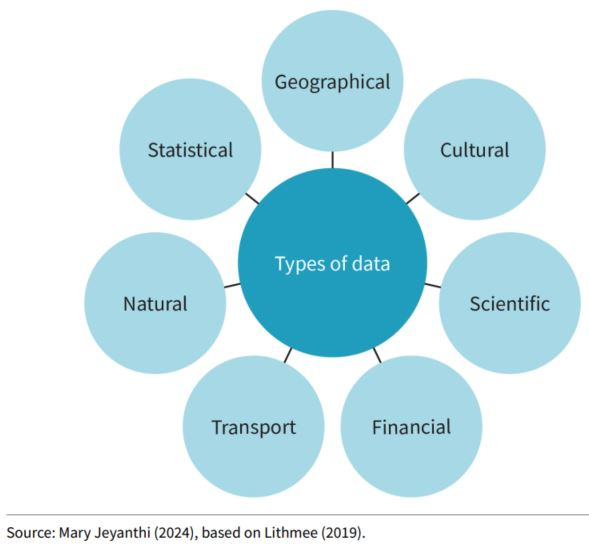

### Data Model of a Transactional System

A data model in an OLTPS is a way of organizing and structuring data involved in transactional processing. These Systems are crucial for the fulfilment of operational activities. As such their data models must ensure that transactions are processed completely and accurately. The data model may contain entities or objects (e.g patients, doctors etc.), relationships (e.g n:m), constraints(e.g a patient may not visit more than one medical doctor at the same time of the day.). Constraints are rules defined by the business stakeholders that must be respected and implemented at the level of the physical model. These rules ensure data consistency and integrity.Additionally, the data model must contain a schema. A Schema defines the structure of the database and how the data is stored. For instance, an entity must have a name, defined number of attributes as columns with their associated datatypes and the relationships between the entities. Transactional data can be differentiated into **Master data and Movement data**. Master data(also called critical data) is set to be static i.e mostly stay unchanged e.g customer data, while movement data(transactions) are records generated by the core business events(e.g a patient uploading their blood presure values into the system). Transactional or operational data are often extracted from transactional or operational systems then transformed and ingested in analytical systems e.g DWH, where they are analysed to support decision making. The following images illustrate tables for master and movement data as well as enterprise data comprised of transactional and analytical data.

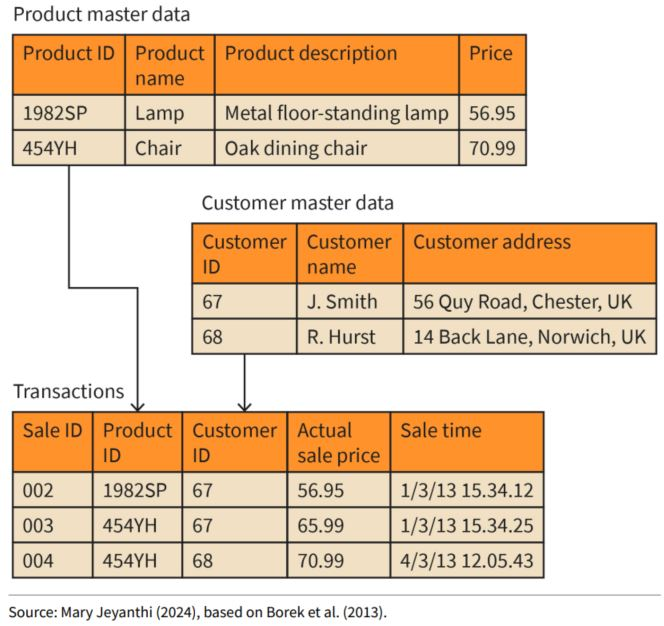

### Key Selection Criteria

The data model in OLTPS may constitute several tables connected via primary and foreign. As such, several joins operations could be involved in queries to retrieve data. For this reason, the selection of a primary key for the tables is crucial for the performance and functionality of the OLTPS. A primary key is an attribute of a table that uniquely idenfies every record. In relational databases, it is used to enforce entity and referential integrity. The primary key attribute must be *stable, unique and must not accept NULL values*. There are different types of primary keys including: single attribute primary key, composite primary key and surrogate keys. Surrogate keys are integers or UUIDs that are automatically generated and incremented when new entries are entered in a table. Primary keys are indeces that enhance query performance. This emphasises the need for carefully chosing primary key attributes. The following are selection criteria to consider when defining a primary key for tables in a data model.

1. Uniqueness: unique identification of rows
2. stability: Should not be subjected to frequent changes to avoid breaking relationships.
3. simplicity: Straightforward and easy to comprehend to facilitate troubleshooting
4. scalability: Should not be constraint by limits.
5. performance: Enhance query performance during data retrieval
6. multitenancy: 
7. availability: Guarantee data accessibility and minimize downtimes.

### Technology Choices

Considering the volume of data is expected to be processed by OLTP systems and their importance in day-to-day business of an organization, the choice of a technology is vital their *performance, scalability and reliability*. Consider the following classes of technology when creating an OLTP system:

1. Database management systems (DBMS): This system is central to the OLTP System and directly influences Performance, scalability and reliability. Examples of DBMS are: PostgreSQL, MySQL, Oracle, MS SQL Server etc.
2. Programming language: The choice of the programming language significantly impacts the performance and scalabilty of the OLTP system. The chosen programming language should also be supported by the chosen DBMS.
3. Application framework: Frameworks facilitate the development of the OLTP system as it provides pre-built components for standart functions like *user authentication and data validation*. Examples of popular frameworks for OLTP systems are: Springboot, .NET, Django etc.

Before making a decision on the technology to use in creating an OLTP system, the following factors can be used to compare the technologies.

1. Performance
2. Scalability
3. Reliability
4. Security
5. Cost
6. Integration

## Online Analytical Processing (OLAP)

OLAP is a technology widely used in BI and Data Analytics to organize and analyse large amounts of multidimensional data, from various sources, to support complex and ad-hoc business decion-making. OLAP Systems are mostly used in data Warehousing. A data warehouse is a central repository for storing structural data integrated from different sources. This allows users to easilly and flexibly access data to perform complex analytical tasks and generate reports. OLAP databases are not optimized for data analytics as they are purposely built for the extraction of business intelligence information and to address the limitations of transactional databases. For this reason, querying OLAP databases is time consuming and labour intensive. In OLAP systems, data are organized and stored in *multidimensional cubes* where *each dimension* of the cube is made up of at least two attributes arranged in hierarchical order. These dimensions are used to sort and analyse the data facts from different perspectives in support of data driven decion-making. For example, dimensions in a sales cube could be *time, location, product and salesperson*. OLAP cubes provide techniques that allow users to analyse facts to obtain valuable insigts from the data. Some of these operations incude: **roll-up, drill-down, slice, dice, and pivoting**. Additonally, users can explore data by performing operations like *aggregation, summarization, filtering and ranking* on the data in OLAP cubes. 

### Structure of an OLAP Cube

An OLAP cube is a multidimensional database that lies at the center of an OLAP system. The cube is made up of *dimensions, facts and cells*, and the data are stored as arrays. This arrangement enables efficient data processing and analysis giving them an edge over traditional databases. The dimensions are categorical attributes arranged in hierarchical order, used to navigate the cube and describe facts. Facts are numrical value that are measured or calculated. Facts are stored in cells and cells are intersecting points for the dimensions. SQL and other reporting tools can be used to query, report and analyse data stored in multidimensional cubes. However, this leads to performance loss with increasing amounts of data. For this reason efficient querying techniques via roll-up, drill-down, slice, dice and pivoting are available for OLAP systems. Other operations like aggregation, filtering and ranking are equally available. OLAP Systems are filled with data from different sources, thus allowing users to analyse these data simultaneously. OLAP cubes can also be divided into one or more cubes known as *Hypercubes*. Using microsoft technologies, Microsoft SQL Server Analysis Services (SSAS) can be used to create a Cube. A cube can be built from data in a data warehouse (dwh), which get their data from OLTP(source systems) databases like MS SQL Server. Reporting tools like SQL Server Reporting Services(SSRP) can then be used to create dashboards, reports, scorecards and perform other forms of analysis. The following image illustrates a simple architecture that can be used to create an analytical systems.

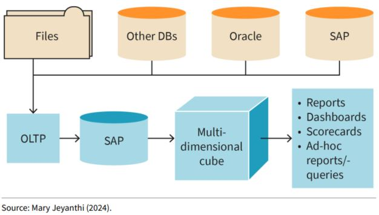

### Basic Analytical Operations supported by OLAP cubes

There are five basic techniques used for analysing data in OLAP cubes. These include

* Slice

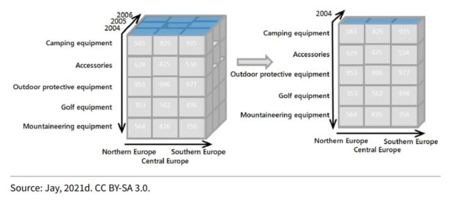

* Dice

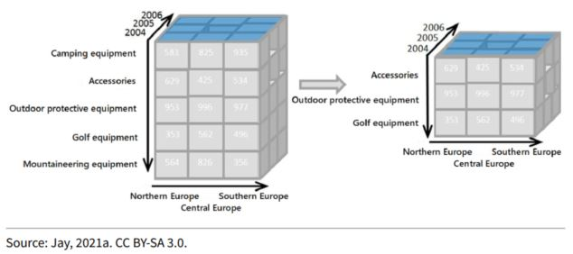

* Drill-down and Roll-up

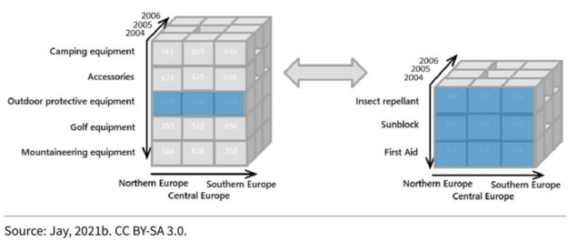

* Pivoting

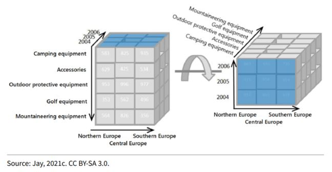

### How to prepare data for OLAP

The following steps should be considered when developing a multidimensional cube or star schema for analysis purpose.

1. If the cube will get its data from a dwh, then create a dwh first.
2. Define attributes for each dimension and how the attributes should be ordered in each hierarchy. Also, define the measures that should be included in the multidimensional cube or star schema
3. Clean and transform the data e.g remove duplicates, correct or remove errors, filter the data, set data types.
4. Create the cube or tables for the facts and dimensions
5. Integrate data into the cube. ETL tools can be used for data integration
6. Schedule update or refresh.

### Types of OLAP Systems

There are many types of OLAP Systems but the three common ones are: Relational OLAP(ROLAP), Multidimensional OLAP(MOLAP), and Hybrid OLAP(HOLAP). The each of them have their strengths and weaknesses. ROLAP stores detailed data in relational databases as tables, while MOLAP stores aggregated data in cubes and HOLAP stores detailed data in relational databases and aggregated data in cubes. HOLAP exploits the strength of both ROLAP and MOLAP. The following images show the different types of OLAP systems and their comparisons.

