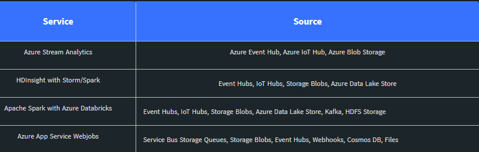
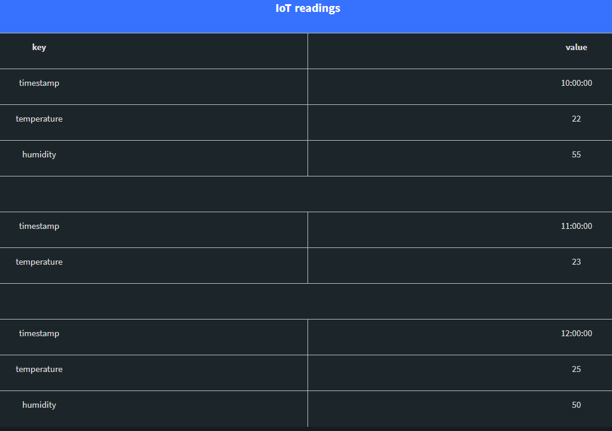

<link rel="stylesheet" href="background.css">

<h1>
<p style="font-family: Arial, sans-serif; text-align: center; font-size: 2rem"><b>Concepts in Data Management</b></p>
</h1>

<p>
This course is concerned with developing strategies to securely store data in a cost-effective and efficient way. 
It also covers data lifecycle, data collection upto and including analysis as well as transforming <b>data</b> into
<b>information</b> to support operational decision-making. At the end of the course one should have learned the
vital skills and knowledge necessary for managing data professionaly. The major concepts that will be covered are:
</p>

1. *Data processing lifecycle*
> This segment falls in unit one and covers data ingestion, storage, analysis and reporting.
2. *Data protection and security*
> This segment falls in unit two and covers ethics of handling data, protection and technological solutions.
3. *Distributed Data*
> This segment falls in unit three and covers data replication, partitioning and processing frameworks.
4. *Data quality and data governance*
> This segment falls in unit four and covers concepts like Data as a Service (DaaD), data Virtualization techniques
>and general principles for data governance.
5. *Data Modeling*
> This segment falls in unit five and covers Entity relationship models, data normalization and data schemas.
6. *Metadata management*
> This segment falls in unit six and covers types of metadata and how they are stored.


<h2>
<p style="font-family: Arial, sans-serif;text-align: center;"> <b>Chapter 1: Data Processing Lifecycle</b></p>
</h2>
<p>
As the amount of data genarated rapidly increases, technological level ups have been made to enhance data integration, storage, 
analysis and reporting. As a result companies are shifting their traditional decision making rules by deploying these
technologies to develop analytical data applications that will assist them in analysing their data for <b>data-driven decision.</b>
Developing analytical data applications often entail <em>complex processes</em> since data usually comes from many different sources.
The development of analytical data applications i.e the transformation of aggregated data from different sources into actionable
insight or information is refered as <b>Data Lifecycle</b>. This cycle is made up of five phases which include:</p>

+ Data Integration and Ingestion: 
Involves data extraction from different sources and transforming these to a homogeneous storage format.
+ Data Processing: 
Processing and transforming of Data. This involves harmonization, aggregation and enrichment.
+ Data Storage: 
Storing Data in a target data store like relational database or multidimensional data space like an OLAP cube.
+ Data Analysis: 
Providing tools to analyze the stored data. e.g Data mining.
+ Reporting: 
Deploying business intelligence tools to build KPI Reports like Score Cards and interactive dashboards.

1. <b>Data Ingestion and Integration</b>
<p>
 This is the stage in the data processing lifecycle where data from different sources is extracted, in
 some cases processed to correspond to the target data format, then ingested in a database. Data integration
 is often not separated from data ingestion because some data come in formats that need to be transformed
 to an agreed format. Integrating data of different types from different data sources e.g social media, mobile devices
 can be stressfull due to their <em>heterogeneous</em> nature. Heterogeneous data means data can be of different data types,
 formats or might require different storage methods.</p>
<p>
 In most cases data is <b><em>classified as structured</em></b> when it takes the form of a table. E.g master data where each entry
 is a row and the attributes or features are columns. Each attribute must only store data in a particular type like
 <b>date, string, boolean, numbers</b>. Structured data is usually stored in relational databases, spreadsheets like Excel,
 text files like csv and also proceed from data warehouses or a company's legacy system.</p>
<p>
On the other hand, semi structured data are often not in a table layout and don't have a schema. However, they contain <b>tags</b>
that can be used to restructure them to structural data. Examples of unstructured data include Jave Script Notation (JSON),
Extensible Markup Language (XML) or Hypertext Markup Language(HTML). Results of API calls to a web service(e.g twitter) are often in these formats, thus unstructured. An example of unstructured data from a twitter api call is as follows.</p>

        ```
        {
            “created_at”: “2026-10 18:16:26 2021”,
            "id": 10401183211789707,
            "id_str": "732534959601",
            "text": "I'm quite sure the best way to solve the issue is getting in contact with the company …",
            "user": {},
            "entities": {}
        }
        ```
<p>
Finally, unstructured data are those that lack a schema to describe them. They don't necessarily appear in a table format and
don't have tags that can be used to restructure them. Most of these data are found in text files like word, powerpoint, pdf, jpg,
audios etc. One good aspect of these data is that they are easilly interpretable by humans. However, they need preprocessing by 
computers before information can be extracted. One way to ingest unstructured data is by collecting text files from a google drive directory uploaded by someone in a survey process.</p>

#### <b>Data ingestion and ingegration frameworks</b>
<p>From a technological point of view, data integration and ingestion are treated as same. Data integration framworks have been
around for quite sometime and are being used in the context of <em>data warehousing</em> as <em>ETL</em> processes.</p>

> ETL comprises of data *Extraction, Transformation and Loading.* Extraction entails collecting data from several different sources
> while Transformation entails bringing the data to a homogeneous agreed format, cleaning, feature engineering and enrichment and
> Loading takes care of putting the data in the right storage location e.g database.

Apart from ETL Tools other approaches or frameworks for data integration and ingestion include: 
**IoT Hub**
**Digital twins** 
**data pipeline orchestrators**
**bulk import tools**
**data streaming platforms**.

<div style="page-break-after: always;"></div>

#### <b>Features of a data integration tool</b>
A modern data ingestion tool should have the following characteristics.
- support different protocols to aggregate data from different data sources.
- Hardware and operating systems that can support data integration processes
- Scalable and adaptive
- Capability for data transformation operations including fundamental and complex transformations.
- Secure to protect breach in the transformation pipeline.

#### <b>Challenges</b>
Challenges in data integration include:
- handling multiple data sources
- Large amount of incoming data at high speeds
- Cybersecurity
- integrating tools for analysis directly on the edge devices.

2. <b>Data Processing</b>
<p>Data processing is achieved by the use of data processing frameworks that typically transform data in  several steps. 
Some frameworks model the transformation in a form of a <strong>Directed Acyclic Graph (DAG) e.g Apache Airflow, dbt</strong>. Apart 
from the root and final nodes, every inner node on the DAG comprises of an <b>incoming and outgoing</b> arrow called 
<b>source and target</b> respectively. DAGs are great to model transformation as they clearly show dependencies and 
prevent backward flow in the transformation pipeline. An Orchestrator of the pipeline usually have the following tasks:</p>

- Supervises the correct execution of the pipeline
- Uses a **schedular** to cordinate executions of the pipeline
- Uses an executor to run the tasks
- Uses a metadata to monitor the state of the pipeline.
There exist different data processing frameworks or architectures. This include: Batch, Streaming and Lambda.
#### <b>Batch versus stream data ingestion architecture</b>
<p>Batch data ingestion involves an automated process for collecting data at <b>regular time intervals</b> from different 
data sources, transforming and loading the transformed data into a centralised system for analysis. 
Batch was traditionally used in ETL for Business intelligence use cases. With the rise of numerous data sources,
large volumes of incoming data at high velocities with the need of real time analysis; *Streaming data ingestion*
has become very important. In streaming data ingestion, time interval between data collection is not necessary.
Another difference between batch and stream data ingestion is that data processed via batch is constraint e.g by
size and number of entries before the process is executed whereas in streaming data ingestion constrainst don't apply.
The following table show example scenarios where batch is used and one where streaming is the right applicable.</p>

|batch data ingestion|streaming data ingestion|
|:-------:|:--------:|
|Data processing occurs at given time intervals| Data processing occurs at near real time|
|Size and nature of data is known or can be estimated| Size and nature of data is not known|
|capable of complex analytical tasks|Suitable where speed is necessary|
|E.g Hourly number of orders received|E.g health monitoring applications|

### <b>Lambda Architecture</b>
<p>
This data processing framework is a combination of the batch and stream framwork. It is made up of 3 layers where
ther first layer implements batch for handling complex analytical tasks, the second layer implements streaming
for generating quick insight at near real time(low latency). The third layer provides an interface where the
processed data can be queried with other analytical tools. <b>Microsoft Fabric</b> offers <em>lambda</em> architecture for
data processing. An alternative to the lambda architecture is the <b>kappa architecture</b> that combines the batch 
and stream layers of the lambda architecture into a single layer.  This makes it easier to maintain and provides 
less possibilities of system attacks.</p>

#### <b>Data Processing Solutions in the Cloud</b>
<p>
The Hadoop ecosystem like <b>MapReduce, Spark and Kafka</b> provides technical solutions via Apache open-source projects 
where Batch, Stream and hybrid(lambda and kappa) have been implemented. The challenge with such ecosystems is that
it is difficult to manage resources like set up, administration and maintenance. An alternative better solution is 
the use of Cloud providers like <em>Microsoft Azure, Google Cloud Platform and Amazone Web Service</em> etc. Cloud providers
manage the infrastructure and its maintenance while users only focus in processing and analysing their data.</p> 
<p>
Application of processing frameworks by using cloud solution e.g microsoft azure. Azure offers several analytical
services for batch processing as well as for stream processing frameworks. When chosing resources one needs to 
consider the supporting programming language, the programming paradigm,the pricing model and available connectors.</p>
<div style="page-break-after: always;"></div>

1. Batch Processing analytical services in Azure.
    - Azure Synapse is a distributed **data warehouse** offering analytical capabilities
    - Azure Data Lake analytics
    - HDInsights for Hadoop technologies such as MapReduce, Hive an Pig
    - Databricks is a large-scale analytical platform based on spark

2. Stream Processing Analytical Services in Azure
    - HDInsights with Spark Streaming or Storm
    - Databricks
    - Azure Stream Analytics
    - Azure functions
    - Azure App Service Webjobs
    - IoT and Events Hubs

The following illustrates out-of-the-box available data sources and sinks for some streaming solution in Azure.<br>




3. <b>Data Storage</b>
<p>
Storing Data means saving it on a physical device. Primarily on a computer's CPU. Secondary storage ensures that
the data is persistently stored in a way that it can be retrieved. Secondary storage include Hard Disc Drives, 
Solid State Drives (SSD) etc. Cloud Storage is storing Data over the Network with an advantage that it can store
Data in very large amounts. Cloud Storage involves an infrastructure of interconnected servers that are designed
to distribute Data across the physical storage of individual machines. Generally Data is stored in bits since it
is the language that computers understand. For human readable storage, text or comma separated values(csv) formats
are used even though the data is in bytes. When data is stored in binary format, it offers computers the possibility
to compress data files hereby taking advantage of the storage available. Data stored is binary are optimal for
computers since they can access this faster. Converting data from human readable text to binary is called 
<b>Serialisation</b> while converting from binary to human-readable is called <b>de-serialisation</b>.</p>

### <b>Data Storage types</b>

Depending on the business requirement and the resources available data can be stored in different ways including:
- File Systems e.g think of storage-box or sftp server
- Data lakes
- Relational Databases
- Data warehouses
- NoSQL databases

<div style="page-break-after: always;"></div>

***File Systems***
>Our Computer's operating System is a local file System where Data is stored hierarchical in drives, directories,
>subdirectories and as files. These files are easilly accessible to the owner of the computer or anyone who has been
>granted access to the operating system. On the other hand there exist cloud-based file systems which allow workers
>within an organization to work on files and remotely share files as well. Managers of cloud-based file systems
>typically provide extra services like **automated backups, synchronization of data, user specific file/folder access,**
>**versioning, data security services and data management via a user-friendly interface**. The focus of cloud-base
>is on **sharing and access control** rather than handling large distributed datasets. Examples of cloud-based file
>systems include: Sync, pCloud, IceDrive, Google Drive, Sharepoint, OneDrive and DropBox. Example of a cloud-base
>file system provider is *Hetzner*.

<p>Hadoop Distributed File System (HDFS) is a distributed data storage technology that provides availability and fault
tolerance by implementing redundant copies of the data. HDFS are used when the amount of Data to handle becomes large. 
HDFS splits files or folders containing files into blocks and stores them on different nodes or machines. In the 
event of increasing data HDFS can scale <b>vertically</b> by increasing the computers or nodes capacity. It can also scale <b>horizontally</b> by adding computers on nodes to a cluster of available nodes. This properties makes HDFS fault tolerant 
and highly parallelizable by running processing task simultaneously on several nodes.</p>

<p>To use Hadoop Distributed File Systems organisation must set them up on their own servers which in most cases is
costly to maintain and manage. As such it is recommended to use cloud file systems since the cloud providers is
responsible for maintaining their infrastructure and often offer more vital services. Additionally, most of
underlying principles on the functioning of HDFS are retained by cloud storage providers. Amazon, Google and 
Microsoft offer cloud-based file systems for handling and storing large amounts of data.</p> 

Example of cloud-based file system in Microsoft Azure is Blob Storage
> Blob storage belongs to a family of *storage services* in Azure called *Storage Accounts*. Blob storage holds
> data in containers within which the data can be structured into *virtual folders* like one knows it in local
> file systems but then the data is not stored in the underlying phisical storage of the cluster machines involved.
> Once data is stored in Blob it can easilly be converted into Azure Data lake.

***Data Lakes***
<p>Data Lakes are <b>repositories</b> for raw and unstructured data integrated from several different sources for one or
more departments of an organization. Data in Lakes are stored in different stages where data stored in each stage
is transformed to a particular level suitable analysis at that stage. In Databricks for example, raw
and untreated Data are dumped into the <b>bronze</b> stage while in the <b>silver</b> stage, the data is refined and
processed. Finally, in the <b>gold</b> stage, the data is entirely prepared and ready for analytical purposes such 
as training machine learning models.</p>

***Relational Databases***
<p>These are the traditional solutions for storing structured data where the data conform to a schema-based data
model stored in tables. The data records are in rows while the attributes are in columns. The principles of
Storing data in databases is governed by the <b>ACID</b>. Typical concepts in Databases or Relational
Data Management Databases are <b>referential integrity</b> and <b>data normalization</b>. To query data from databases
a Structured Query Language(sql) is used. Popular commercial RDBMSs or Databases include Microsoft SQL Server,
Oracle Database etc. Open-source relational databases include MariaDB, PostgreSQL, MySQL and SQLite.</p>

<p>Cloud providers also offer several cloud based databases. E.g Google Cloud Platform offers Cloud SQL, Microsoft
Azure offers Azure Database for PostgreSQL Flexible Serve etc. Cloud based solutions have the extra advantage 
that that they are accessible remotely, automatically scale according to workload, partition, and distribution
of the data is across a cluster of several machines that perform automated backups, security audits and patches.</p>

***Data Warehouses***
<p>Data warehouses are similar to relational databases with the added value that they integrate data from different 
sources, aggregate these data in a clear semantic and homogeneous format then stored in a central repository so that 
it can be querried with SQL. Data stored in data warehouses can support massive analytical processes and of course 
they only store structured data like relational databases. Some examples of data warehouses include 
Microsoft Azure Synapse, Snowflake etc.</p>

***NoSQL storage solutions***
<p>These databases are storage solutions for structured, semi-structured and unstructured data. Unlike relational databases
that define schemas during write i.e referential integrity, NoSQL databases infer schemas during read i.e 
flexible schemas. NoSQL Databases are differentiated from each other based on the following classes.</p>

- Key-Value Oriented Databases
- Document Oriented Databases
- Column Oriented Databases
- Graph Oriented Databases

1. **Key-Value Oriented Databases**
> These are databases where data is stored as a key-value-pair i.e every value is mapped to a key. This is similar to
> python dictionaries. Examples of Key-Value oriented databases include: *Redis, Amazon SimpleDB*. Example situations
> where these databases are used include: content of shopping cart, Product details in ecommerce.



2. **Document Oriented Databases**
> These Databases store *object* information in a *collection of key-value-pair*. This is similar to XML, JSON etc  
> data structures. Example Databases where data is stored in this format are: MongoDB, CouchDB, Google Cloud Firestone.
> Example scenarios where these kind of databases are used include: User Registration in an online portal.


3. **Column Oriented Databases**
> In relational databases records are stored in the form of a table where every observation is in a row and the 
> measured attributes are in columns. This is optimized for append operations where every new entry is appended
> to the existing table. Conditional search operations to get particular entries can be challenging. A better way
> of storing data that will allow direct acces to the columns, hereby simplifying search operations, is by the 
> use of column oriented databases where data are stored in rows only. This means that the column name and its 
> corresponding values are stored in rows. Additionally, these databases also allow groupings based on similar
> access patterns. Examples Databases include: Cassandra, Microsoft Azure Table Storage.

4. **Graph Oriented Databases**
> These databases are designed to store data in situations where there exist <em>relationships</em> between data points.
> The data points are stored as <em>nodes</em> while the directions are stored as <em>edges</em>. One can find these databases
> in the context of routing systems, social networks etc. In ecommerce, it can be used to build recommeder systems.
> Example databases include: Neo4j, JanusGraph, TigerGraph and NebulaGraph.

***Multi-Model Databases***
<p>Azure CosmoDB is a NoSQL that supports multiple data models like Document oriented, Column Oriented and Graph
oriented storage.</p>

4. <b>Data Analysis</b>
<p>So far in the Data lifecycle, data integration, processing and storage have been covered. Most of getting data
to storage is not the end goal. To extract insight from stored Data, <em>data analysis</em> is required. However, there
are different kinds of analysis.</p>

- **Descriptive data analytics**: <p>Use of statistical methods to explain past or present event based on historical data.
Typical analytics approach are calculating measures like summaries, averages etc and visually representing them. In
descriptive data analytics, root-cause analysis can also be performed.</p>
- **Predictive data analytics**: <p>Use of statistical or black-box approaches to build forecasting models based on 
historical data. Example: Use past orders to predict expected number of orders next week.</p>
- **Prescriptive data analytics**: <p>Using Models to investigate all possible <b>outcomes from predictive analytics</b>
so as to be able to suggest the most favourable predicted event. E.g maximize efficiencies for production lines.</p>
<div style="page-break-after: always;"></div>

### <b>Machine Learning (ML)</b>
<p>ML is the ability of models to automatically extract underlying vital patterns from data that can reveal insights
that wouldn't be possible by barely observing data with a human eye. ML is performed on tabular Data where the rows
represent observations, a column called the <em>Label or Target</em>, and one or more other column(s) called <em>Predictors 
or Features</em>. Artificial intelligence is a larger category of ML while deep learning is a specific field in ML. 
ML is made up of 3 major parts name;</p>

* **Supervised Learning**
> It is that part of ML that aims at predicting a label of an observation. It comprises *Regression and 
> *Classification*. In Regression the ML Model must predict a *numerical value*. In Classification the ML
> must predict a *label* belonging to two or more predefined classes of labels. 

```
"Typical supervised classification algorithms include Logistic Regression, Decision Trees, Random Forest, Support Vector Machines (SVM), Naïve Bayes, k-Nearest Neighbors (kNN), and Gradient Boosting. For supervised regression tasks, we can use, for example, Linear, Ridge, Lasso, or Elastic Net Regression, Decision Trees, Random Forest, or Support Vector Regression (SVR)." 
```

* **unsupervised Learing** 
> It is that part of ML that aims at finding underlying patterns, in historical data, that it uses segment data points
> into groups called clusters. 

```
"Clustering – Assigning data points to clusters that are not known before the analysis. Typical algorithms include k-Means, Hierarchical Clustering, and DBSCAN.
Anomaly Detection – Similar to Clustering, data points are assigned to clusters, but in this case, specifically to be a “regular” or “unregular” data point. Typical applications of anomaly detection are the discovery of fraud in financial or insurance systems or the detection of intrusions in information systems. Algorithms include Local Outlier Factor (LOF), One-Class SVMs, and Isolation Forests.
Dimensionality Reduction – Large datasets with many columns/features are hard to overlook. Dimensionality reduction aims to transform the data to reduce the number of columns while preserving the information as well as possible. Typical algorithms include Principal Component Analysis (PCA), t-SNE, and Linear Discriminant Analysis (LDA).
"
```
<div style="page-break-after: always;"></div>

* **Reinforcement Learning**
> It is that part of ML that uses a *Reward Priciple* to evaluate an Agent that is under self learning.

* **Deep Learning**
> Learn it on my own.

### <b>Time Series</b>
> Learn Time Series from ***https://otexts.com/fpp2/***.

```
"
Time series analysis refers to the analysis of data indexed by time. Several techniques exist to learn patterns in historical observations to forecast future values, such as Holt-Winters smoothing techniques, Autoregressive Moving Average (ARMA) models and extensions like ARIMA, SARIMA, and SARIMAX models, and ensemble models such as TBATS. Time series analysis is quite similar to the supervised machine learning approach. Still, for the latter, we use multiple features to predict the label, whereas, for the former, we forecast future values solely based on this one time-indexed variable (and time-lagged versions of itself). Nevertheless, the boundaries have become blurry, and libraries for automated feature extraction from time series have been developed to use these features in a machine learning manner.
From a data management perspective, we should memorize that the time index is highly relevant for time series analysis and should be treated accordingly in the data system.
"
```

5. <b>Reporting</b>
<p>This is the final stage of the <b>Data Processing Lifecycle</b>. In this phase <em>Business Intelligence<em> methods come into play
to get actionable insights from data. In fact, BI Reporting is the use of <em>processes and tools<em> to extract actionable 
insight from data about an organization's operation. Example of BI Tools are <em>Power BI, Tableau,Qlik Sense</em>. Reporting 
can be in the form of <pem>visualization, dashboards and texts</em> that are often derived from <em>Key Performance Indicators</em>. BI Reports does not only support business decisions but covers every decisions that are data-driven. This can be in urban planning, logistics, public health, environmental policies etc.</p>

**Possible insights from BI Reporting include**
+ Decision-making based on evidence
+ Real-time Analytics
+ Details about processes
+ Discover business opportunities
+ Control planning commitment etc

<p>Depending on the use case or business activity that needs to monitored and improved, BI can integrate Internal or External
Data in order to achieve results. Internal data sources include <b>ERP or MIS</b> Systems. While external data sources include
<b>Social media platforms, Webshops, Websites etc.</b></p>

<h2>
<p style="font-family: Arial, sans-serif;text-align: center;"> <b>Chapter 2: Data Protection and Security<b> </p>
</h2>

<p>Nowadays Big Data and Digitilization are taking their peak raising data privacy concerns. As such, sustainable and appropriate
measures must be taken to protect individuals rights. To develop appropriate measures it is necessary to review the impact of
(big) data collection, data analysis and digitalization on individuals rights. Ethical principles define the fundamentals for
handling individuals data during data analysis. The General Data Protection Regulation (<b>GDPR</b>) is established on ethical
principles that must be implemented to <b>protect</b> individuals rights. The technical implementation of these principles are often
non-trivial and thus have an impact on information systems. Two modern technological techniques used in data protection are
<b>Encryption and data masking</b>. These techniques must be implemented following a well thought risk management plan that provides
mitigation strategies for security threats.</p>

## <b>Ethics in Data Handling</b>
<p>Ethical principles defined the basics for developing legislative regulations (e.g GDPR) for data protection and privacy. For this
reason it is vital for everyone designing modern data systems to fully understand these ethical principles.</p>

### <b>Ethical Principles</b>
<p>As technoligical improvements are often faster than legislative regulations, there could be gaps between the current state of
technology and the regulations safe guarding individual data. For this reason, it is always important to fall back to the ethical
principles used in the development of legislative regulations. The basic ethical principles are **Transparency, Fairness and Respect**
(Jobin, Lenca & Vayena, 2019, p.1).</p>

#### <b>Transparency</b>
<p>The individual and the data handlers must have the same understanding on the <em>purpose</em> for collecting, storing and transforming the
individual's data. To ensure transparency, clearly written policies should be defined and shared. An example of a scenario that 
implements transparency are cookies on a website. In this scenario policies that protect user's privacy are set by default. If the individual consent to the collection and processing of additional data, then the purpose must be clear to the user.</p>

#### <b>Fairness</b>
<p>This principles focuses on the <b>impact</b> of data handling on the data subjects and their interests. Under no circumstance should data
handling lead to <em>discrimation, exposure of senstive personal data</b> e.g race, religion, sexual orientation etc. This should strongly
be considered when developing automated systems used in decision-making. Addtionally, organizations should only used data within the scope 
for which the data subject consented.</p>

#### <b>Respect</b>
<p>This principle focuses on the <em>individual</em> for whom the data is collected. Data managers should primarily consider the data subject's
individual interets before considering the value that an organization can derive from the collection, storing and processing of the
individual's data.</p>

### <b>Discussion on the ethical management of data</b>
Key take aways in this segment are:
* Unethical handling of data can harm the right of the data subject or lead to loss of control over their data.
* Data subjects must consent to the use of their data and organizations must limit the use of individual's data within the consented scope.
* Inappropriate data-sharing: Sharing data with third party stakeholders without the consent of the data subject
* Privacy preserving transformation or data anonymization: Transforming or removing all personal identifiable information from the data in a way that it cannot be used to identify a data subject using appropriate methods. It is legal to use anonymized data in big data applications without violating regulations. However, there are cases where data anonymization isn't enough as the anonymized data can still be used to identify datasubjects. For this reason, it is advisable to use anonymized data with caution
* <b>Data profiling</b>: <p>The process of finding correlations between data in a database that is required to identify or represent a human or nonhuman (individual or group), or it is the process of using a profile to identify and represent an individual or the use of profile
to identify and represent an individual as a member of a group or category. Profiling depends on data mining approaches, specifically
on descriptive and predictive analytics. In descriptive data analytics, profiling is the identification of groups by means of measures
calculated on historical and present data and the output is the description of the characteristics and relationships found between
group members. In predictive analytics, profiling is the use of models that learn from the data the underlying relationship between the
data subjects and their class membership to be able to predict with a certain accuracy that a data subject belongs to a specific class or
group. Usually, the data used for learning is labelled. Unethical use of profiling and data mining is associated with a significant risks 
that can lead to <b>discrimination, de-individualization and information asymmetry</b>.</p>  

* Discrimination: The intensional use of profiling to favour data subjects over others. E.g Training a model based on biased data.
* De-individualization: Stigmatization of a data subject based on the characteristics of the class or group assinged to him or her. E.g
Rejecting credit offer to an individual because they live(d) in a particular zipcode. 
* Information Asymmetry: As profiling and data mining create insight on data subjects, this can offset the balance of power between 
parties and affect the relationship between them. E.g Profiling can impact the relationship between Governments and Citizens, Businesses 
and Consumers etc.

<p>To achieve results free from discrimination or de-individualization, it is advisable to exclude the use of personal data like gender, race,
political orientation etc when developing predictive models used for profiling.</p>

### <b>Risks of data privacy in the digital society</b>
<p>This arise from the voluntary act of revealing personal identifiable information such as images of oneself or other personal information
like location,age, gender, place and date of birth etc. This could have the following effect on individuals</p>

+ lead to data theft and stalking.
+ Data aggregators can collect and sell these data to third parties who use it for commercial purposes
+ Governments can use these data for public surveilance which can harm the rights of citizens. For instance, it can lead to disservice.
+ Internet of Things applications are often under cyber attacks as they store data in the open. As such IoT applications that use personal
data can negatively impact its users in cases where these applications are compromised.

Interesting literature on this include: (Keyes & Lamnitchi, 2017), (Ziegler, 2019), (Crawford, 2019)

### <b>Discrimination by algorithms</b>
+ Revisit the case of *discrimination* in predictive profiling.

## <b>Data Protection Principles</b>
<p>These are legislative regulation built on ethical data protection principles. In this case, we'll focus on the EU General Data Protection 
Regulation (GDPR). GDPR is a regulatory framework that defines how Data from EU Citizens should be protected during <b>collection, storage 
and process</b>. Additionally, it defines the roles of different stakeholders and their responsibilities as well as provide several data
protection principles derived from the ethical principles. The three roles stakeholders can belong to are: <b>Data Subject, Data Controller 
and Data Processor</b>.</p>

- Data Subject: The individual (person) whose data is or being collected.
- Data Controler: Those who store the data and define how the subject's data is collected and processed.
- Data Processor: Those who collect and process data in the name of and commissioned by the data controler.

### <b>Data Protection Principles of the GDPR</b>
These principles are built on the ethical principles and defined in (EU) 2016/269 (2016). These principles include

#### <b>Fairness, Lawfulness, and transparency</b>:
<p>First and famous, the reason for data collection should be defined on a legal basis. The GDPR considers <em>consent, public interest and
legitimate interest</em> as options for legal grounds.</p>

- Fairness: Subject's data should be handled in a fair and reasonable manner from the data subject's perspective
- Lawfulness: This could be with regard to public or legitimate interest. Data collection for public interest should be done under
the explicit consent of the data subject. Data collection for legimate interest occur when the data is required to fulfil administrative
obligations e.g Registration in a city after relocation. 
- Transparency: Data stakeholders should have the same understanding for the purpose of collecting the data subjects data.

#### <b>Purpose Limitation</b> 
<p>Data should only be stored and process for its clearly defined primary legitimate purpose. E.g Data collected to fulfil
a delivery should not be used for sending markting advertisements without previously obtaining explicit consent.</p>

#### <b>Data minimization</b>
<p>Sets the minimum amount of data to be collected for a particular purpose. This is done prio to data collection.</p>

#### <b>Accuracy</b> 
<p>The controller and processor must ensure that the subject's personal data is correct and current. In the case of modification
requests from the data subject, the controller and processor must be able to make the necessary changes.</p>

#### <b>Storage Limitation</b> 
<p>Data should be stored as long as it is needed for a given purpose. This should be guided by policies, that set the time
frame for storage and when the data should be deleted or anonymized. Typically, this principle should be automated.</p>

#### <b>Integrity and Confidentiality</b> 
<p>The responsibility of data controllers and processors to secure the subject's data and treat it as sensitive information. They should protect the data from unlawful access, loss, processing, damage.</p>

#### <b>Accountability</b>
It is not a principle but emphasises on the need of controllers to adhere to the principles of GDPR.

#### <b>Exceptions and special cases</b> 
<p>These are cases that allow data processing without considering the principles of DGPR. Usally this is backed by union or membeer state law. These cases can be as a result of public or legimate interest.</p>

### <b>Rights of data subjects</b>
GDPR also describes the rights that data subjects have conerning the collection and processing of their individual data. These rights include:
- Right to access
- Right to notice
- Right not to be subjected to profiling
- Right to erasure
- Right to rectification
- Right to know the personal information being collected
- Right to know the source from which their data is extracted.

#### <b>Data Security</b>
<p>This involves the physical protection of premises or workstations to guarantee data privacy. Data Systems should include data minimization, anonymization and restriction to minimize the effect of damage to the data subject's integrity in case of data breaches.</p>

#### <b>Anonymization and Pseudonymization</b>
<p>As earlier stated, anonymization removes all personal identifiable information from the data in a way that it cannot be used to 
identify a data subject using appropriate methods. This is useful in for data sharing, data analysis other use cases. There exist
four categories of attributes that require different anonymization forms. These are:</p>

- Explicit identifiers: Attributes that can be used to directly identify a data subject e.g email, names.
- Quasi-identifiers: Attributes that indirectly reveal the identity of a data subject e.g date of birth, zipcode, gender
- Sensitive information: Attributes that store senstive information like health status, gender orientation, political beliefs.
- Non-sensitive information: Attributes that store data that is not related to an individual e.g climate data.
In Pseudonymization, Personal identifiable information is substituted by random identifiers derived from a linkage table.

#### <b>Data protection in scientific research</b>
<p>In scientific research often process personal sensitive data such as health data, genetic data etc. As a result, they must comply
to legal data protection regulations such as those provided by GDPR. The most important regulation for scientif research is data
integrity and confidentiality. Obtaining consent and anonymization are also regulations often required for processing medical data.
Sensitive data in medical include health-related entries, genomic or other <b>omics</b>. Omics is a neologism from biological research 
and serves as a generic term for molecular biological methods.</p>

## <b>Data Encryption</b>
<p>Encription is centered around the right to see data. Its target is to protect data integrity and confidentiality be converting
a given data into a ciphertext. In this way unauthorised users will not be able to see the data. To decipher the data a
password or secret key is required which is usually held by authorised users. In practice, there is a difference between
<em>encription at rest and encription in transit</em>.</p> 
+ Encryption at rest is the process of encrypting data that has been archived.
+ Encryption in transit is the process of encripting data that is being transfered over a network.

There exist several encrypting techniques. These include:
+ <em>Symmetric encryption</em>: Same password or secrete key used for encryption and decryption.Examples of symmetric encryption algorithms
include, Data Encryption Standard(DES), Advanced Encryption Standard (AES), or Blowfish.
+ <em>Asymmetric encryption</em>: A public key is used for encryption while a private key is used for decryption.
+ <em>Hash Function</em>: A hash function is used to produce a fix-length unique fingerprint of the particular data being encrypted.
This fingerprint is used to verify the integrity of the data. Example of hash functions include: MD-5 or SHA-256.
+ <em>Key Stores</em>: These are storage used to securely keep passwords or secrete keys required by authorised user to access encrypted data.
    - Hardware Security Modules (HSM): These are physical devices purposely designed to securely store key and cryptographic 
    operations. They range from small to large suitable for small to massive cryptographic operations.
    - Cloud-based key stores: These are key management solutions with centralised key management and secure key storage provided
    by cloud providers. E.g Amazon Key Management and Azure Key vault.

## <b>Data Masking Strategy</b>
<p>In most data systems, the level of access to data is determined by the user's role. Through this users can only access data they
required to accomplish their tasks. Data masking or data sanitization, is a an approach used to replace observed values by random
values with the aim to securely protect confidential data and personal identifiable information. There exist several masking
techniques. These include:</p>

+ Shuffling: Values within a column are randomly interchanged.
+ Scramble: This technique changes the value in each cell by reordering its alphanumeric characters. For instance, a cell containing
the value: 4563P738 could be changed to 87P35643.
+ Substitution: This technique substitutes original values of sensitive content with other values in a range of possible values. This
is to ensure that the structure of the data stays the same. Example: Replace original emails via fictive emails. The fictive emails
have the format of correct emails yet don't exist.
+ Data aging/variance: Applicable on numerical values. Data aging adds or rests a random offset from the original values while
variance adds noise to the original values according to the data distribution.
+ Character masking: Part of the original values are substituted with a given character values e.g. Yufenyuy is substituted with
Yuf*****.
+ Nullifying: Original values are substituted by null values.

### <b>Data masking process</b>
This can be static or dynamic.
+ <em>Static data masking</em>: <p>Masking is applied to the copy of the original data. The masked data can then be used for practice or testing
purposes. e.g Data from Electronic election system.</p>
+ <em>Dynamic masking</em>: <p>Used in production systems to obscure sensitive information based on the role-based policies at the time of access.
This is to ensure that people only see what is relevant to them based on their roles. E.g applicable in medical systems where receptionists
may see patients medical appointments with doctors but can't see their medical history. On the other hand, the medical doctor can see
appointments and medical history of their patients.</p>

Challenges in Data masking:
- Inadequate data masking can violate data integrity or cause data leakage which can include sensitive information.
- Inadequate data masking can destroy the structure of the data and lead to data loss. e.g scrabling ids required in joins
can affect join operations.
- System performance can drastically reduce as data masking require processing resources.
- Obscuring data require maintenance especially when adapting it to the production system.
- Masking data accross several large information systems can lead to complications.

### <b>Data masking solutions</b>
<p>There exist standalone solutions for data masking that can be integrated into data systems. Also, some database management
systems also have embedded solutions in their systems that can be used for data masking. Addtionally, cloud providers like
AWS and Azure also provide data masking solutions. Some Data masking solutions are as follows:</p>

+ MS SQL Server integrates with Redgate SQL Data Masker.
+ Oracle SQL Server uses Oracle data masking.
+ Some standalone solutions include: Informatica MDM (commercial), Talend Data Masking(open source). These solutions are compatible 
on-premise as well as on cloud.
+ Cloud solution include: 
    - Azure Security Center for dynamic data masking suitable for Azure SQL Database and Azure SQL Data Warehouse.

## <b>Data security Principles & Risk Management</b>
<p>To ensure the protection of sensitive information in an organization, several security principles must be implemented. These
principles or measures aim to protect confidential information from unauthorised access, theft, use, disclosure, destruction
and modification.</p>

### <b>Data Security Principles</b>
<p>Data security is built on confidentiality, availability, integrity, authenticity, non-repudiation and disaster recovery. This is
in accordance to Regulation (EU) 2016/679, 2016, p. 51-52 of GDPR. These principles are elaborated as follows:</p>

+ <em>Integrity</em>: This ensures that data can't be changed by unauthorised means. It is the principle that guarantees correctness of
the data. In Databases, integrity can be achieved by implementing checksums or digital signatures to verify the correctness of
the data.
+ <em>Availability</em>: Authorised users must have access to data whenever they need it. This principle can be achieved by data replication.
+ Confidentiality: Data must be kept secrete with the highest means possible, and access must only be granted to authorised users.
This applies to data at rest an in transit. To achieve this, data encryption, data masking and secure authentication strategies
must be implemented.
+ <em>Authenticity</em>: This principle ensures that only authorised users have access to sensitive information. It also ensures that
users are the rightful owner of their data. This can be achieved via passwords, encryption keys, multi-factor authentication,
biometric-based authentication etc. By implementing this principle, it is possible to detect unwanted intrusion.
+ <em>Non-repudiation</em>: This principle registers individuals and applications that create and modify data. This is done by keeping
track of every changes in a log file which can be used during audits.
+ <em>Access Control</em>: This principle ensures that users have access to details of data based on their roles or priviledges. It is
the principle of <em>you can only see what you are allowed to see</em>.
+ Encryption: done
+ Disaster recovery: The ability to retrieve data in case of loss or disaster. This is achievable by creating backups, store backups
in secure locations and restore backups if needed.

### <b>Risk Management</b>
<p>Every organization should prepare for undesired events. Risk Management is an activity that (1)identifies, (2)assesses, and 
(3) prioritises potential risks. After (1), (2) and (3) is done then an appropriate risk mitigation solution is established.
This can be illustrated in a process as follows</p>

1. Perform risks analysis to identify potential risks or threats
2. Prioritise the identified risks or threats according to their probability of occuring. Probability of occuring is associated
to the the level of damage a risks or threat can cause.
3. Design mitigation strategy according to the priority of the risks or threats.
4. Implement and monitor the mitigation strategy. Strategies can also be adopted to new risks of similar types.
5. Document the risk management plan and mitigation procedure.

**See course book for example scenario on risk management**

<h2>
<p style="font-family: Arial, sans-serif;text-align: center;"> <b>Chapter 3: Distributed Data<b> </p>
</h2>

<p>Distributed data stems from the ability of a data system like a database management system to distribute its data accross
multiple servers/nodes/machines, when workloads increase, to ensure system availability and reliability. There are two main 
approaches that a system can deploy to achieve this. This includes: Data Replication and Data Partitioning.</p>

## <b>Systems's Reliability and Data Replication</b>
<p>Reliability is the ability of a data-intensive system to continue running its operations consistently and without failure of
the entire system. To achieve this, the system uses <b>redundant components, distributed data storage, and distributed data
processing frameworks</b>. All these are built on the combination of hardware and software solutions which include:</p>

1. *Redundant hardware*(multiple devices) to carry out the same task.
2. *Redundant copies of the same data* for parallel processing and minimize latency when geographically place close to each other.
3. *Load balancing* for efficient distribution of workloads accross all the nodes of a cluster of nodes.
4. *Data backup and recovery* to avoid complete data loss if the system breaks down.
5. *Error handling mechanisms* for automatic detection and management of errors.
6. *Monitoring and maintenance* to reschedule tasks and increase performance.

<p>According to the <b>CAP</b> theorem, distributed data have limitations. Thus it states that a distributive data-intensive system
can only guarantee two out of the three properties <b>Consistency, Availability and Partition-Tolerance</b>.</p>

+ Consistency: Each request is reponded with the most current value or an error.
+ Avaialability: Each request receives a response but the response can not be an error.
+ Partition-Tolerance: The system continues functioning even if some nodes within the cluster of nodes stops communicating with
other nodes or if packages are not installed.

## <b>Data Replication</b>
<p>Data replication is a practice in distributed data where redundant copies of the same data are created and stored on different
nodes to guarantee system's availability. These nodes may be situated in different locations. The advantages of data replication 
are:</p>

+ Access to same data is possible when some nodes fail
+ Improves performance as data can be created and retrieved in parallel
+ In case of nodes failure, same data can easilly be recovered from other non-failing nodes.
+ Reduced latency as data is efficiently distributed accross other node possibly in different locations.

### <b>Data Replication Strategies</b>
<p>There are several replication strategies. The choice of a replication strategy should base on the size of data,
complexity of the situation, acceptable latency, recovery strategy and the choice between availability and consistency.</p> 

<em>Master-Slave</em> Replication: It has the following properties.
- Only Master receives change requests.
- Master has read and write capability
- Slave only has read capability
- Master distributes workloads to slaves.

<em>Multi-Lead</em> Replication: Has the the following properties
- Exists several master nodes which inturn are slaves to other nodes
- Every nodes can perform read and write operation.
- Every nodes can read from every other node which is vital in case of data recovery.
- Highly fault tolerant

<em>Leaderless</em> replication: Has the following properties:

+ Every node is simultaneously a master and slave.
+ Every node accepts write operations and can replicate this to other nodes.
+ This replication strategy is highly inconsistent.

<div style="page-break-after: always;"></div>

<em>Data Replication in Hadoop Ecosystem</em>
<p>The Hadoop Ecosystem aggregates different open source technologies which uses the <em>Hadoop Distribution File System(HDFS)</em>
as the source of their data. In HDFS, the same copy of data is stored in blocksizes of 128mb and replicated across other
nodes of a Hadoop cluster. The master node, called the <em>Namenode</em>, has read and write capabilities. As such it receives
client requests and can read and write in parallel to/from the slave nodes called <b>Datanode</b>. The master node is also
incharge of monitoring the slave nodes to identify failing nodes and to schedule replication task. If a DataNode can't
fulfil a request due to network failure then the request is redirected to another DataNode. Advantages of HDSF are:</p>

+ It guarantees system's reliabilitly
+ It guarantees System's availability
+ Ensures performance gain as tasks can be executed in parallel.

The following replication strategies are only suitable for cloud environments.
<em>Geographic replication</em>
<p>Redundant copies of the same data are created and stored in nodes located in different geographic locations. This does
not only ensure system's robustness but also serve as an effective data recovery strategy espcially in cases of natural
disasters like floods, earthquakes, landslides etc.</p>

<em>Cross-region replication</em>
<p>Data is replicated across larger geographic regions like continents or sub-continents. Major advantage is that it
reduces latency as people in the same region are most likely being served with by nodes in their region.</p>

<em>Zone-redundant* replication</em>
<p>Data is replicated multiple times within the same zone or region to ensure availability within same region in case of
partial system failure.</p>

## <b>Data Partitioning</b>
<p>One other way to provide availability, reliability and processing of data is by partitioning the data set. In this
technique of distributing data, the dataset is broken into small chunks either vertically or horizontally, and then
spread across nodes of a cluster. In vertical partitioning, the dataset is split by columns while in horizontal
partitioning the data is split by rows. The latter can further be classified into logical or physical partitioning.
In horizontal logical partitioning the data is split by rows and stored within the same node. On the other hand,
horizontal physical partitioning or <b>sharding</b>, the data is split by rows and distributed across nodes that
are physically separated from each other. The different methods of sharding is discussed as follows:</p>

+ <em>Round-robin</em>: This method distributes evenly distributes data across all the shards or nodes i.e if a dataset
of 10 rows is to split across 5 nodes then each node or shard will store 2 rows. This method has performance
issues when the data to be distributed is unbalanced.
    - Disadvantag: Reduced performance on unbalanced or skewed data.
    - Advantage: Distributes unskewed data evenly across all shards
+ <em>Hash</em>: A hash function is applied on one or more attributes to calculate a hash value by which the data is partitioned
across the shards. It is also possible to achieve a balanced distribution of data across all the shards. This is useful
when storing data by location e.g By zipcodes.
    - Disadvantag: Finding the right attributes to create the partitions.
    - Adavantag: Can evenly distribute data across all shards even if the data is skewed.
+ <em>Range-based</em>: This method distributes data across all the shards by using <b>sequential key with equal ranges</b>.
Suitable for data that are stored by **timestamps**.
    - Disadvantage: Uneven distribution of data across shards if the data is skewed
    - Advantage: Suitable for data with a timestamp or natura range of values.
+ <em>composite</em>: This method can combine two or more of the aboved mentioned sharding methods. For instance round-robin can
be applied then range-based.
    - Disadvante: Requires more computation to define partitions.
    - Advantage: Exploite the strengths of the chosen sharding methods

### <b>Data Partition Strategies in Cloud Environments</b>
<p>So far sharding as a form of horizontal partitioning has been discussed. It is important to note that the sharding methods
are applicable in open source as well as cloud environments. Example cases in cloud environments can be observed in Azure
Cosmos DB which can partition data across different geographical locations. Also, Azure SQL Database can partition data
across multiple databases. In addition to *vertical and horizontal partitioning*, there also exist <b>directory-base and
geospatial</b> partitioning. <em>It is important to note that the concept of data distribution is not limited to databases</em>.
For instance, Azure Blob Storage and Azure Data Lake Storage are Non-Database solution that partition data by Containers and
Folders which can be located in different regions.</p>

+ <em>Directory-base Partitioning</em>: Partitions data files, e.g by creation date, across folders in a file hierarchy.
+ <em>Geospatial Partitioning</em>: Partitions data in cloud environments by considering geographical locations. 
    - Advantage: Users access data in their location or closer to their location
    - Advantage: Reduced latency in querying or processing data.
    - Advantage: Takes Compliance and data protection regulations into account.
    - Advantage: Takes data sovereignty into account.
<div style="page-break-after: always;"></div>

## <b>Processing Frameworks for Distributed Data</b>
<p>We've seen that there are several storage possibilities for distributed data. In the same like, processing distributed data
also require some standards or frameworks. Typically, data processing in distributive environments need to take the following
criteria into consideration.</p>

+ Data storage solution e.g replication, partitioning, directory-base or geospatial partitioning.
+ Data reshuffling to redistribute workload with the aim to achieve load balancing.
+ Task scheduling for task execution and error handling.
+ Data-base code execution to process the data on flight.
+ Data storage on disk or in-memory to improve performance particularly speed.
+ Fault tolerance to ensure system availability and reliability when part of the system fails
+ Performance optimization achievable by reducing data movements between nodes in a cluster.

### <b>Distributed data processing framework in the hadoop ecosystem</b>
<p>Ther are several open source data processing frameworks for processing distributed data. Many of these are developed by 
Apache Software Foundation or belong the Hadoop Ecosystem. Some these frameworks include:</p>

1. *MapReduce*: This programming paradigm was introduced by google; suitable for large-scale computing and made up of two
main functions namely **Map** and **Reduce**.
    - Map: Takes a value as inpute, performs a stateless computation and outputs results as a **key-value** pair sorted
    by keys.
    - Reduce: Aggregates values according to the sorted keys.
Think of MapReduce like *group by x sum y order by x* where Map takes care of order by x sum y while reduce does group by x.

**Disadvantage** of MapReduce: Not suitable for computations requiring complex processing. E.g Machine learning<br>
**Advantage** of MapReduce: Suitable for descriptive statistics like calculating mean, standard deviation, min, max etc.
Also good for aggregations, counting.<br>
**Advantage**: Fault tolerant.

2. *Pig and Hive*: 
<p>Apache Pig combines the power of a scripting language e.g python, with MapReduce to perform complex
transformations on an abstract level of the data. Apache Hive does the same with a SQL-like interface rather than a
scripting language. This interface allows grouping, querying and joining data.</p>

<div style="page-break-after: always;"></div>

3. *Spark*: 
<p>This is built on Apache Spark core and uses <b>in-memory</b> computation based on <em>Resilient Distributed Data</em>.
RDD are immutable collection of objects, each containing data chunks, distributed across several nodes of a cluster.
Resilient means spark distributes data by replication to ensure system availability and fast data recovery in case of
partial system failure. Spark can read data from several data sources like HDFS, S3, RDBMS and NoSQL. Additionally it
supports many programing languages like R, Python, Java or Scala. One advantage of Spark over MapReduce is that it
performs several <em>write and read</em> operation to and from cluster nodes, and stores intermediate processing steps in a
<b>directed acyclic graph (DAG) </b>. Moreover, Spark can run on a single machine or cluster of nodes, and can also be used
for <em>batch and stream</em> processing Some libraries that are useful in the spark ecosystem include: <b>spark sql, spark MLlib,
spark Streaming and spark Graphx, PySpark</b>.</p>

4. *storm, Samza, and Flink*: They process distributed data in streams.
    + Apache Storm: Process data in DAG where data is transfered via the edges and transformations occure in the nodes.
    + Apache Samza: Similar to Kafka. **read this page 64**
    + Apache flink: Uses stream and batch processing. **read this page 64** 

### <b>Distributed data processing frameworks in cloud environments</b>
Cloud processing frameworks are mostly built on the open source solutions described above. Here are some cases:
+ AWS provides **Elastic MapReduce** which can be used to process data stored in partitions on S3.
+ Azure HDInsights uses Hadoop, Spark or Hive to process big data in a scalable and fault tolerant manner.
+ Databricks offers a cloud environment for data ingestion, analysis and machine learning. It uses Apache Spark for
data processing or transformation. It is equally suitable for big data.
 
<h2>
<p style="font-family: Arial, sans-serif;text-align: center;"> <b>Chapter 4: Data Quality and Data Governance<b> </p>
</h2>

<p>In this era, companies who have realised that data is <b>das A und O</b> rather than a bare biproduct of their business
activities, are deriving valuable insights from it to improve their operational activities as well as developing their
business strategies with the aim to provide better products and services to their customers, and to position them
comparatively better in the market. However, the process of unifying data from different sources into a sink for proper
analysis and reporting can be a daunting task for many companies. As a result of this, approaches have been developed
recently to deal with the complexities(ETL/ELT) of handling data and to enable some group of users to only focus on 
its analysis. These approaches are <b>Data as a Service (DaaS) and Data Virtualization</b>. In general <em>data quality and
data governance</em> are two key factors to consider when generating or using data. These factors can be implemented with
or without the use of technology. <b>Data quality</b> ensures the correctness and richness of data, which is necessary for
making data driven decisions. On the other hand, <b>data governance</b> define rules, roles, processes and policies to
safeguard and improve the quality of data. The first phase of the data processing lifecycle is data <b>ingestion/integration</b>.
In both Daas and Data Virtualization, data ingestion and/or integration is a key phase where the <em>quality of data, its
consistency and consolidation</em> can managed. To achieve these, the following data integration principles, to implement,
have been defined.<p>

## <b>Data Integration Principles</b>
These include:

1. Standardization
<p>Data from one or more sources are transfomred to an agreed <b>format or structure</b>. For instance, all columns of
incoming data should be converted to <em>strings/text</em> data types. Another standard could be that all <em>date fields</em> should
be stored in a particular format, such as the ISO format (YYY-MM-DD).<p>

2. Reconciliation
<p>This principle aims to create data <b>consistency</b> when integrating data from different sources or with regards to
a central repository (e.g DWH). Data inconsistencies can come from the source data or as a result of failures or mistakes
in the data integration process. Issues that lead to data inconsistencies are: broken relationships between tables, missing
values, duplicates etc.<p>

3. Validation
<p>Under given constrainst, the <b>accuracy and completeness</b> of the data is checked. That is, some constraints are applied
on the data and the results are compared with the existing values of the truth system. For example, the revenue from sold
sport cars generated last month should be X. Constrainst here are sport cars and last month<p>

4. Tramsformation
Converts data into an agreed **schema**. For example, JSON data should be stored as tables.

5. Cleansing
<p>In this principle, <em>errors</em> in the data are **detected and removed**. Example of errors include, wrong data entries(
intentionally or unintentionally storing strings, dates and numerical values in same field), duplicate values, irrelevant
values.</p>

6. Enrichment
Adding value to the current data by including **supplementary data** typically from external sources.

7. Privacy
<p>The <b>protection</b> of Personal Identifiable Information (PII) and/or Sensitive data. For example, E-Mails, Phone number,
health information.<p>

***Think of example scenarios in practice where data integration principles can be implemented to improve data quality and***
***achieve data consistency and consolidation***.
**Example Scenario: A fintech receives daily reports(json) of its succeful transactions that we completed by its exteranal service**
**provider. Which integration principles should the fintech adopt in their data integration process?**.

### <b>Technical Tools for Data Integration</b>
<p>First of all, it is important to state that <em>data quality</em> is more of a social, particularly communication, than a technical
challenge. How data is collected, organized, processed, stored and perceived depends strickly on communication. From a technical
perspective, there are several ETL tools that can be used for data integration. Popular general purpose cloud-based ETL tools
include: <em>Azure Data Factory, AWS Glue, Google cloud fusion and Google cloud dataflow</em>. Other ETL tools suitable for data
integration include: <em>Pentaho Data Integration, Talend Open Studio, Informatica PowerCenter, IBM InfoSphere DataStage, 
Oracle Data Integrator (ODI), Apache NiFi, Microsoft SQL Server Integration Services (SSIS), Feature Manipulation Engine(FME) etc</em>.
Data reconciliation tools include: <em>Open Refine, TIBCO Clarity or Winpure</em>. On the other hand, <em>Clearbit, Pipl and FullContacht</em> are
examples of data <b>enrichment tools</b>.<p>
In the following, some ETL data integration tools will be discussed.

1. Apache NiFi
<p>This is an open source data integration tool that provide many connectors suitable for extracting data from numerous data sources.
Through its graphical user interface (gui), developers can build and run data pipelines. Apache nifi is highly scalable and can hosted
on a single node/machine. Apache leverages data objects in the form of <b>FlowFiles</b> which form the basics of this product. FlowFiles
hold the data content as key-pay values as they go through the system. Another function that is used in Apache nifi for orchestrating 
pipelines is <b>ZooKeeper</b>.</p>

2. Azure Data Factory
<p>This a data orchestration and transformation service offered by Azure. It provides over 90 connectors which can be used to
integrate data from different sources. Connectors and plugins such as Power automate, Kafka, Apache Spark and Logstash can be used
to integrate data with Azure data factory. Addtionally, Azure Data Factory can be used to incremental load from on-premise SQL databases
to cloud data storage.</p>

### <b>Unified data Stores</b>
<p>Data integration is an end-to-end process. This means that data is extracted from a source system and at the end of the process, the
data is loaded to a target system typically called the sink. There exist different types of sinks, namely:</p>

1. Data Warehouse
<p>This is a central repository that stores large amounts of structural data in an agreed, and they heavily depend on ETL processes for
data integration.</p>

2. Data Lakes
<p>This is central repository that store large amounts of raw structured and unstructured data.<p>

3. Master Data Management (MDM)
<p>This is a <em>truth</em> system that stores data, not freequently changed, critical for the functioning of an organization. Because data can 
come from different sources, this system provides tools for data reconciliation and standardization.<p>

4. Data Federation
<p>This is the creation of a <b>virtual unique logical view</b> or data model from a combination of data coming from different sources. Usually,
data federation does not copy data into any central repository.<p>

5. Data Virtualization
<p>This is an approach that hides the complexity of handling data by providing a virtual unified interface through which data from one or
or more sources can be viewed without the data being copied from the original system to a central repository. The difference with data
federation is that the data from the different sources not combined.<p>

<p>As already mentionen, Data Virtualization and DaaS are recent approaches that are used to provide ready-made data for analysis to users.
In the following, Data Virtualization and Data as a Service (DaaS) are discussed.<p>

## <b>Data Virtualization</b>
<p>This is an approach that hides the complexity of handling data by providing a <b>virtual unified interface</b> through which data from one or
or more sources can be presented in an agreed format and viewed, without the data being physically copied from the original system to a central repository. Informatica Power Center is an example tool that implements data virtualization. This is achieved via data integration and transformation broken down into three(3) major phases or steps described below:<p>

1. Abstraction
<p>In this phase, the logical virtual data interface that separates the data from its underlying physical store is created.<p>
2. Virtual data access
<p>The capability of accessing multiple data sources without physically copying the data. This is achievable via pointers on a GUI.<p>
3. Transformation
<p>Converting the data on the fly from one format to an agreed format that is easy to access and analyse.<p>
It is possible to implement data virtualization by <em>data federation + use of in-memory database and API endpoints</em>.

### <b>Advantages</b>
- Eays access to access via logical interface
- No physical copying of data from sources
- On-the-fly transformation
- Easy to integrate new data sources

### <b>Disadvantages</b>
- Development of logical interface is not trievial
- Only current state of data can be viewed
- Slower response time as it is not possible to precompute calues

## <b>Data as a Service</b>
<p>This is an approach that is used to grant users access to processed high quality data over the network. Typically, the provider
takes care of data extraction from multiple sources, storage, processing, security and backup. DaaS is scalalbe and thus suitable
for big data scenarios.</p>

## <b>Advantages</b>
- It is *cost effective* as users only pay for services they require and developers only pay for resources when they need it.
- It is scalable thus developers can *flexibly increase or reduce* computational resources based on workload.
- Users only focus on usage as the provider is responsible for *developing and maintaing* the data infrastructure.
- Users are not exposed to the complexity handling the data before it is ready for usage

## <b>Disadvantages</b>
- Users may have difficulties in data interpretation as they don't have information on data and how it is processed.
- In case of network failure, users will not have access to the data.
- Data protection from hackers can be challenging for the service provider.

### <b>DaaS Architecture</b>
<p>Data from previously seen data stores and other data sources are integrated into a unified view using data virtualization.
Then the developer develops the APIs required for accessing the data via the network. This APIs must be documented and protected
from unauthorised access.</p>

***Think of a DaaS application in a real-world scenario***

## <b>Data Governance</b>
<p>The level of valuable insight that can be derived from data depends on its quality. Data governance focuses on maximizing
the value of data by assuring data availability, integrity, usability and security. In particular it aims to ensure accuracy,
consistency, security and compliance with regulations in all data life cycle phases. Data governance thus defines rules, roles,
processes and policies for data quality management. It is important to differentiate between <b>data management and data quality
management</b>, as they describe different setups. Data management involves the use of data storage and processing frameworks as
 well as technical requirement analysis, and the implementation of technical solution thoughout the data lifecyle. On the other hand,
 data quality management ascertain that data quality is a communication challenge than a technical one. Data quality thus identifies
 inconsistencies and develope processes to ensure <b>data accuracy, consistency, relevance and completeness</b>.<p> 

 ### <b>Data Quality Issues</b>
There are 3 main sources of data errors that cause data quality issues. These sources include:
1. Data ingestion/integration.
2. When writing changes to the target system.
3. Inadequate tracking of transformations and modifications over time.

<div style="page-break-after: always;"></div>

### <b>Different Quality Dimensions and Metrics</b>
<p>when an organization seeks to improve its data quality, they must measure and interprete metrics that will enable them to evaluate
 the impact of their actions. There exists different data quality dimensions and metrics that can be applied and measured. The
 following data quality dimensions can be considered in practice.</p>

 + Accuracy: Evaluates the level at which data is free from errors like typos or other flaws.
 + Completeness: Measures whether the acquired data is enough to cover the scope of the topic at hand.
 + Consistency: Measures whether data follow uniform standards thoughout all the analysis.
 + Validity: Measures the level at which the data follow the rules, constraints, and formats defined by the data policies and standards.
 + Timeliness: Measures the degree to which the data is available when needed.
 + Uniqueness: Measures the level of redundant data entries in the system. Ideally, there should not be redundant data in the system.

<p>This data quality dimensions provide grounds for the development of concrete data quality metrics that can be technically implemented
to assess the quality of data. Some of these technical metrics include:</p>

- Number of false entries
- Number of primary or foreign key errors
- The toal data volume of the system
- The number of unauthorized accesses in a given time.

### <b>Roles in Data Governance</b>
<p>Given that data quality management is more of a communicative than a technical challenge, it is important to define roles and
responsibilities when implementing a data governance project. These will strongly support the measurement of the technical metrics
and overall, improve data quality. In practice the following roles in data governance have been established.</p>

1. *Data Governance Board (DGB)*: Define policies and procedures related to data management and establish data governance frameworks.
Stakeholders are made up of people various departments of the organization.
2. *Chief Data Officer (CDO)*: Responsible for the overall management and strategy of the organization's data assets to ensure that
data is used efficiently. If there is a data governance board, then the CDO collaborates with them to define policies and standards
for all data-related processes.
3. *Data Steward*: Controls and ensures that data policies and standards are implemented throughout the organization.
4. *Data Owners*: Responsible for managing specific datasets or data processes.
5. *Data Analyst*: A technical role for analysing data to draw valuable insights necessary for decision making.
6. *Data USer*: An enduser who consumes the data or data product. This can be a person or an application.
7. *Data Manager*: A technical role which is responsible for data storage and processing frameworks and cloud architecture.
8. *Information Security Officer*: Responsible for the implementation of security measures to protect the organization's data.

### <b>Data Quality Management Capability levels</b>
<p>As it is already clear, data governance aims to improve data quality. In this regard data management capability levels and
the <b>ISO norm 8000-61</b> provide a framwork that list concrete measurements that organizations can implement to improve data quality.
These capabilities are in five (5) levels and described as follows:</p>

1. Process Data per Specific use case
2. Data quality monitoring in work specifications should be done contineously
3. Train data professionals to obtain skills required to offer required support in data-related tasks, and implement long-term data
quality plans, policies and standards.
4. Evaluate the entire data system to measure its effectiveness.
5. Integrate data quality checks into the organization's operations.

### <b>Top-down, Bottom-up and Hybrid Data Governance Approaches</b>
1. Top-Down: Data governance strategy and goals are defined by top management, and assigned to middle management who are responsible
for the implementation. Advantage is that top management have a clear vision on the direction the company is being steered towards.
Disadvantage is that top management may overlook important operational details.
2. Bottom-up: Data governance strategies are defined and implemented from the operational units. Advantage is that it is fast to
implement and manage since they are curated to suit the operational units, however it could be too diverse and fail to align with
the vision of the company.
3. Hybrid: Top management defines the organization's data governance vision and middle management is responsible to implement this
as an agile and iterative process under consideration of of functional operational units and their requirements. 

<h2>
<p style="font-family: Arial, sans-serif;text-align: center;"> <b>Chapter 5: Data ModelLing<b> </p>
</h2>

<p>An <b>Entity Relationship Model (ERM)</b> is an abstract representation of the entities in the real-world and the relationshp betwenn these
entities. It is the foundation of all <em>Information Systems</em> and a useful technique in database design or modelling. An ERM is not
bonded to any specific proramming language and can thus be used by individuals in different works of life, e.g software developers,
database designers etc., to develop a structure representing entities and their relationships. There exists several tools that can be
used to translate an ERM to a data model. For instance, an </b>Entity Relationship Diagram ERD</b> can be used to visualize a data model
derived from an ERM. An ERD represents entities as <em>boxes within which the attributes and data types</em> of these attributes for an
entity can be described. Data modelling is particular in databases specifically for some reasons including the following:<p>

+ A well developed data model eliminates data anomalies, via *normalization*, like redundancy, delete, updata and insert anomalies. 
This can significantly improve data quality.
+ A well developed data model facilitates data analysis as it becomes easier to flexibly navigate through the data.
+ A well developed data model also improves database performance as data will be stored efficiently.

## <b>Definition of Key Terminologies in Entity Relationship Model (ERM)</b>

1. **Entity**: These are real-world objects(e.g a Person, House, Plane etc) with the following characteristics.
+ They have a name or can be name e.g A person can be called Wirngoh.
+ They have attributes which represent their properties. Wirngoh has the following attributes: <p>date of birth, weight, heigh. A data type
is assigned to each attribute depending on the kind of information it stores e.g date of birth is if <em>date</em> data type, weight is numeric.
In an ERD, entities are denoted by boxes. Additionally, it is worth differentiating between <em>weak and strong</em> entities. Strong entities
are <em>independent</em> while weak entities are <em>dependent</em>. Strong entities have a primary key, but its primary key is not a foreign key to another entity. On the other hand, weak entities have a primary key but their primary keys are foreign keys to other entities. Strong
entities can exist independently from other entities while weak entities exist only when other entities do exist. Example: Consider magma
and a volcano as two separate entities. Magma can exist without a volcano, but on the other hand, a volcano only exist when magma erupts
onto the earth surface. In this case Magma is a strong entity while the volcano is a weak entity. If magma is eliminated, then a volcano
is intuitively eliminated or will never exist.</p>

2. **Relationship**: <p>These are meaningful describtions of the links or association between entities. It is also possible to have to
relationships that describe links of an entity with itself. In an ERD, <em>lines</em> are used to represent relationships. Once a relationship
is established between objects, cardinalities are set or specified.</p>

<div style="page-break-after: always;"></div>

3. **Cardinality**: <p>This specifies the number of records or instances of an Entity(A) that can be linked or associated with an Entity(B)
that are in a relationship. There exists 4 types of relationships that can be described via cardinaties. These are: <em>one-to-one</em> relationship denoted as <em>1:1</em>, <em>one-to-many</em> denoted as <em>1:n</em>, <em>many-to-one</em> denoted as <em>n:1</em> and <em>many-to-many</em> denoted as <em>m:n</em>. When
talking of cardinalities, it is important to differentiate between <em>maximum and minimum</em> cardinalities. These notation of cardinalities
described represents maximum cardinality. Minimum cardinalities can either be <em>optional</em> denoted by <em>0</em> or <em>mandatory</em> denoted by <em>1</em>.
There are four types of minimum cardinalities which are <em>optional-option (0-0)</em>, <em>optional-mandatory (0-1)</em>, <em>mandatory-optional (1-0)</em> and
<em>mandatory-mandatory (1-1)</em>. When setting cardinalities, both maximum and minimum cardinalities are considered and it is important to
mention that minimum cardinalities must always be specified. In databases, mimimum cardinalities are implemented with <b>triggers</b>.</p>

4. **Primary and Foreign Keys**: <p>To specify the number of records of an entity that is linked to another entity, it is important that
a given <em>entity should be uniquely idenfiable</em>. A primary key is an attribute of an entity that uniquely identifies this entity. A
primary key can be one or composition of several attributes of an entity. It can also be generated. Links are created between entities
by inserting the primary key of an Entity(A) into an Entity(B) as a <em>foreign key</em>.</p> 

### <b>Entity Relationshi Diagram Tools</b>
<p>There are several ERD tools that can be used to create and manage a database schema. Most of these have automatic functionalities used
export the ERD as well as SQL scripts that are compliant to the defined schema. Example of ERD Tools include: <b>ERDPlus, Lucidchart,
MySQL Workbench, Microsoft Visio, SmartDraw, Draw.io, ConceptDraw, Dia, Visual Paradigm</b>. Also most of these tools offer templates
that can be modified to adapt to a particular use case, and drag-and-drop feature to enable easy creation of ERDs.</p>

## <b>Data Normalization</b>
Why data normalization in database design?
<p>First of all, a database is designed based on a developed model that concisely represents a real-world scenario that is being monitored. During the physical implementation of the model, tables are created and relationships between these tables are established through their primary and foreign keys. After a database is designed, it can happen that some tables pose challenges in the usage or handling of data. To ensure the effective functioning of a database with regards to the ACID principle, normalization centralized around <b>functional dependency</b> is used as a formal way to check whether database fields or attributes are in the right tables otherwise the tables will have to be restructured.</p>

- *Primary key*: <p>Uniquely identifies every row in a database table. No subset of fields of a primary key is also a key. <b>seen</b>.</p>
- *keys*: <p>A collection or concatenation of two or more attributes to form a key for a unique identification of every row. It is possible that a subset of keys can uniquely identify values of one or more fields that are not part of the keys. In this case it is said that keys functionally determine non-key fields. This is relevant for normalization based on functional dependency.</p>
- *Functional dependency* <p>is a mechanism used to describe how attributes or fields of a database table depend on each other. In other words, it is a set of field(s) that form a key for which given values of the key can be used to functionally determine the values of other fields in the same table.</p>

<p>As earlier mentioned, normalization can resolve data anomalies like update anomaly, insert anomaly, redundancy and delete anomaly. This
is achievable by implementing different normalization levels. There are several normalization levels, each suitable for resolving a
particular type of data storage issue. The levels of normalization presented here are First, Second, Third and Fourth Normal forms, denoted as <em>1NF, 2NF, 3NF and 4NF respectively</em>.</p>

### <b>First Normal Form (1NF)</b>
<p>A table is in this normal form if no field stores or crams multiple values of a piece of information. If a table is not in first normal form, then the following should be done to take it to first normal form: All identified fields storing multiple values are removed alongside with the primary key and placed in a different table so that every multiple value is dissolved into a  row with the corresponding primary key.</p>

### <b>Second Normal Form (2NF)</b>
<p>A table is in this normal form if it is already in the <em>first normal form</em> and there exist no subset of the primary key or key that functionally determine or uniquely identifies the values of the non-key attributes. If a table is not in second normal form, then it should be decomposed in the following way: Remove the subset of<p> the key alongside the non-key fields that it functionally determines and create a separate table for them. This can result to the creation of several other tables.</p>

### <b>Third Normal Form (3NF)</b>
<p>A table is in this normal form if it is already in the <em>second normal form</em> and there is no non-key field that functionally depends on another non-key field. If the table is not in third normal form, then it should be decomposed in the following way: Remove the non-key field that functionally determines other non-key field and put them together in a new table.<p>

### <b>Fourth Normal Form (4NF)</b>
<p>A table is in this normal form if it is already in the <em>third normal form</em> and there there is <em>no multi-valued dependency</em> between a non-key field and the primary key. To resolve this, create each table for the primary key and every non-key field that cause multi-value dependency. All non-key fields without multi-value dependency with the primary key should be on the same table.</p>

### <b>Disadvantages</b>
+ Queries might require joining several tables which could lead to database performance issues especially with the tables much data.
+ Can not be implemented when data model is already in production.

### <b>Advantages</b>
+ Eliminate data storage issues like redundancy.
+ Takes less storage space.

### <b>Star and Snowflake Schema</b>
<p>These are both multi-dimensional data models that have proved to be good choices for most use cases. The star model or architecture is
built on a <b>fact</b> table sorrounded by <v>dimension</b> tables, while the snowflake model split the dimension tables, through normalization, into further <b>subdimensions</b>. Facts are measurable key figures central to the organization's core processes and can only be described and interpreted by attributes from the dimension tables, otherwise they lack meaning on their own. A star schema is built by inserting the primary keys of the dimension tables into the fact table as foreign keys. Examples of facts ar: number of orders, sales, cost, number of payback points etc. Attributes include: region, country, product category, colour, customer zipcode. The granularity level at which a fact can be interpreted is determined by the dimension tables.</p>

#### <b>Comparison of star and snowflake schemas</b>
+ *Complexity*: Star schema has a simple structure than the complex structure of snowflake schema.
+ *Normalization*: Star schema is denormalized while snowflake model is normalized
+ *Integration*: Inserting new records in star model might be difficult due to denomalized structure which requires constraints to be respected. On the other hand, it is easier to insert new records in snowflake model.
+ *Cardinality and Joins*: Join queries in star schema involve few tables while in snowflake joins might involve several tables which can impact database performance.
+ *Redundancy*: Star model stores redundant data in denormalized structure while snowflake reduces redundancy in normalized structure.
+ *Disk space*: Denomalized strucuture in star models takes more storage on disk than normalized structure in snowflake model.
+ *Consistency*: Redundancy in star model can cause inconsistencies while this is less likely to occure in snowflake model.

These multi-dimensional models are suitable for business intelligence, data warehouses, data marts and OLAP operations on large amounts of data. Star model is a good solution for efficiently analyzing historical records with less complex queries. On the other hand, it is easy to integrate new data records into the normalized structure of snowflake model.

<h2>
<p style="font-family: Arial, sans-serif;text-align: center;"> <b>Chapter 6: Metadata Management<b> </p>
</h2>

<p>Metadata is <em>data about data</em> and is equally the part of data governance that enables usability of a company's data by providing a framework for accurate documentation. The framework define guidelines for <em>describing, sharing and structuring</em> data in a way that it can easilly be accessed by different stakeholders at the time of their need. There exist different types of metadata. However, in practice, there is no defined boundary between the different types of metadata.</p>

#### <b>Technical Metadata</b> 
<p>It describes the technical physical features of data sources and security related aspects. This is important for users to know when considering to load data from their sources. Data sources could be file systems and database management systems. Examples of technical metadata about sources include, <em>drivers, version, network endpoints etc,</em>. Also <em>location</em> such as directories or table names are technical metadata as the provide information about the exact place of the data which can be used to access data. In some cases it is required to map data fields when moving data from one data system to another. This can be implemented with <em>mapping metadata</em> which is a type of technical metadata. Technical metadata can further be broken down into the following:</p>

- *Conceptual*: Metadata that provides information to both technical and non-technical stakeholders about the overall scope of the data system. It contains information about the system at an abstract or basic level to enable stakeholders have the same understanding of the expections of the systme. This is typically created at the end of the conceptual phase of a system e.g After creating an *ERM*.

- *Logical*: After the conceptualization of a system, a logical phase follows where *attributes and their corresponding datatypes* for an entity, and the type of relationships between the entities are defined. Thus logical metadata stores information about entities, attributes, datatypes and keys. This information contains business logics to be implemented and it is only necessary for the *development* team. Example is *Entity Relationship Diagram*. Both conceptual and logical metadata are not system specific.

- *Physical*: This is metadata that is system specific and contains information on the nature of data storage. It describes how data is inserted, updated and deleted, and the impact of these operations on existing data. Additionally, it provides information about datatypes, indixes, procedures and how data is distributed in distributed systems.

#### <b>Business Metadata</b>
<p>This metadata focuses on the business side of the organization. It describes data about the structure and business processes of the organization, making it easy for companies to develope meaningful *data catalogs* to structure their data.</p>

#### <b>Ownership Metadata</b>
<p>This metadata provides the list of golden sources i.e highly reliable data sources, and the persons in charge of these sources. Typically, these persons are registered owners of particular data assets. Equally, Data Stewards are assigned to these data assets to oversee the proper implementation of company standards and policies.</p> 

#### <b>Classification</b>
<p>The use of taxonomy and ontology to classify data based on their attributes so that the can easilly be discovered. Taxonomy classifies data into categories while ontology uses relationships and subcategories to classify data.</p>

#### <b>Collaboration</b>
<p>This metadata provide details how different users collaborate with the data. Usually, these details include feedback, ratings and comments on particular datasets.</p>

#### <b>Operational Metadata</b>
<p>Provide information on the creation and transformation of data. Information found on this document include dates, owners, volume of data, data processing or analysis.</p>

#### <b>Descriptive Metadata</b>
<p>This type of metadata is necessary for building data catalogs as it contains short to long descriptions of datasets. Other information contained in this type of metadata include tags, keywords, titles, dates and names.</p>

#### <b>Structural Metadata</b>
<p>Describes the framework used to organize the data. It does not provide information about the data itself.</p>

#### <b>Administrative Metadata</b>
<p>Stores information about data creation and acquisition, as well as provide restrictions guideline to enable controlled access to the company's data.</p>

### <b>Preservation Metadata</b>
<p>Document that stores information about the long-term preservation of data and how data should be accessed. The information stored include file format, technical characteristics etc.</p>
<div style="page-break-after: always;"></div>

#### <b>Provenance Metadata</b>
<p>It stores information that is required to track data assets from its origin or creation, its ownernship and custody. This is important in data historization.</p>

<div style="page-break-after: always;"></div>

#### <b>Data Lineage Metadata</b>
<p>Stores information about the data flow of data assets during the data lifecylce(creation, storage, usage, archive and destroy), including data movements and transformations.</p>

#### <b>Usage metadata</b>
<p>Similar to <em>provenance metadata</em>. However it also tracks when users access data assest and their interactions with data. This can enable pattern discovery and identification of underused datasets.</p>

#### <b>Data Security and Protection Metadata</b>
<p>Store information how data should be protected and secured to avoid unauthorised data access. This including setting up standards, policies, roles and processes for handling data.</p>

#### <b>Data Quality Metadata</b>
<p>Information about data quality dimensions and metrics are stored in this document. These dimensions are <em>accuracy, completeness, consistency, timeliness and relevance</em>.</p>

#### <b>Metadata Repositories</b>
<p>Recall that metadata is <em>data about data</em>. As a result metadata is also data which has the potential to grow over time. To efficiently manage metadata, it has to be stored in repositories like databases or any other storage systems that can allow data management.Once metadata is properly stored, users can easily search and find them. Additionally, efficient metadata management increases the overall quality of data, its consistency and accessibility. This is also usefull when building applications and informations systems. In practice, most organizations store metadata in a central repository, allowing access to every stakeholder who has the permision to access it. However, there also exists other approaches for storing and managing metadata. Closely related to metadata repository are <p>data catalogs</b>. <em>A data catalog is a tool that provides a searchable and browsable inventory of data assets within an organization</em>. Data catalogs often store information about <em>datasets, their description, source, owner and usage</em>. The principal difference between data repository and data catalog is that, a data repository stores and manages metadata while a data catalog manage specific datasets. In an organization, IT professionals mostly use metadata repositories while others use data catalogs. In essense, a data catalog can be perceived as a sub-category of metadata repository. In the following centralized and distributed approaches of storing and managing metadata is discussed.</p>

#### Centralized and Distributed Metadata
<p>The advantages of centralized and distributed architectures with regard to the CAP theorem also apply to metadata repositories. Another approach that can be used to store metadata is the hybrid architecture. In this approach only the metadata APIs of federate metadata repositories are stored in the central repository along side the consolidated, centralized metadata sets.</p>

### <b>Technical Solutions</b>
<p>There exist both open source and commercial technical solutions as well as cloud solutions for storing and managing metadata. Typically, when a metadata repository is implemented, the data catalogs can be served to users via API endpoints to access the data via search engines or browsers. This allows self-service usage of metadata catalogs.</p> 

#### <b>Open Source Solutions</b>
<p>Examples include: Apache Atlas, Amundsen, DataHub, Netflix Metacat, Magda, OpenMetadata, Select Star, DKAN and CKAN. This examples provide visualization features, access control, search capability and API support.</p>

#### <b>Commercial Solutions</b>
<p>Examples include: Informatica Data Management Cloud and Enterprise Data Catalog(EDC), IBM Infosphere and Data Management Platform, Collibra, and Alation. Many of these provide solutions provide search engines, data lineage tools, and data quality features in addition to previously mentioned features of open source tools.</p>

#### <b>Cloud Solutions</b>
<p>Cloud providers offer data catalog services which smoothly integrate with other services of the respective cloud provide. Example of Data Catalog services provided by Cloud providers include:</p> 
+ Google Cloud platform offers Google Data Catalog. 
+ Microsoft Azure offers Azure Data Catalog
+ Amazon Web Services offers AWS Glue Data Catalog.


